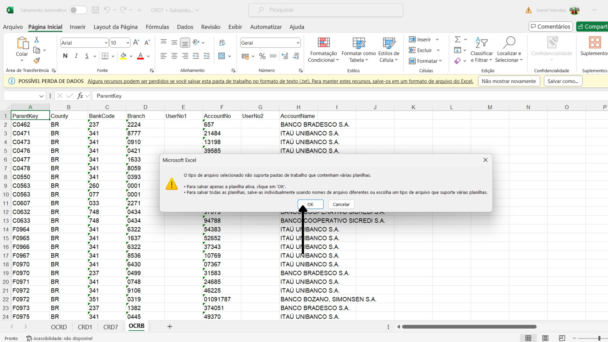
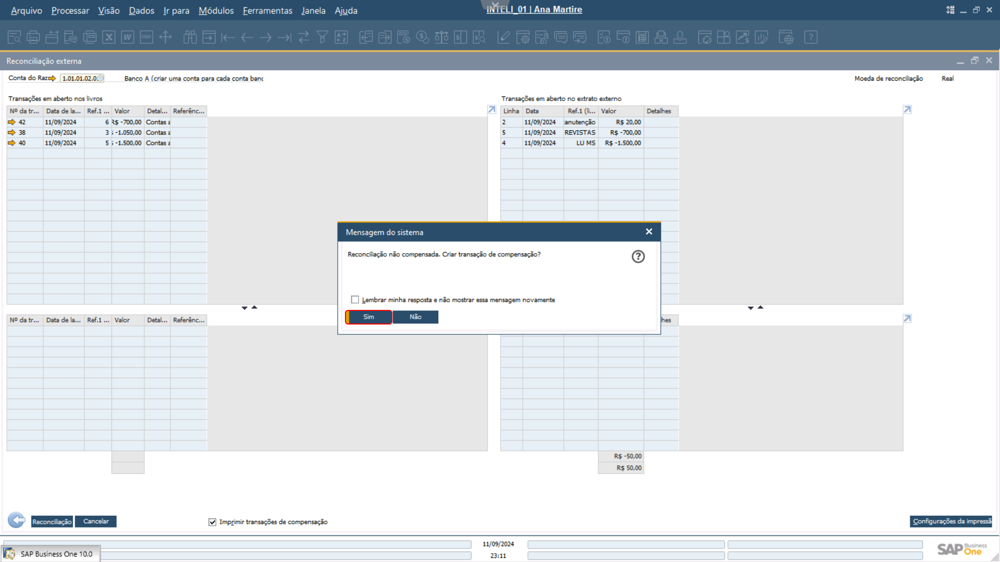

# Documentação - Módulo 7 - Inteli

## Grupo 2 - G2²

## Integrantes do grupo:

- <a href="https://www.linkedin.com/in/ana-carolina-cremonezi-martire-2a7335268/">Ana Carolina Cremonezi Martire</a>
- <a href="https://www.linkedin.com/in/daniel-a-mendez-571217251/">Daniel Augusto Rivas Mendez</a>
- <a href="https://www.linkedin.com/in/kaylanevasconcelos/">Kaylane de Cássia Vasconcelos de Brito</a>
- <a href="https://www.linkedin.com/in/lucasdasilvabarbosa/">Lucas da Silva Barbosa</a>
- <a href="https://www.linkedin.com/in/mateus-mar%C3%A7al/">Mateus Marçal Barbosa de Melo Góis</a>
- <a href="https://www.linkedin.com/in/matheusmeendes/">Matheus Ferreira Mendes</a>
- <a href="https://www.linkedin.com/in/yan-m-coutinho/">Yan Mendonça Coutinho</a>

## Índice

- [Documentação - Módulo 7 - Inteli](#documentação---módulo-7---inteli)
  - [Grupo 2 - G2²](#grupo-2---g2)
  - [Integrantes do grupo:](#integrantes-do-grupo)
  - [Índice](#índice)
  - [1. Introdução](#1-introdução)
  - [2. Problema](#2-problema)
    - [2.1 Proposta da Solução](#21-proposta-da-solução)
    - [2.2 Justificativa](#22-justificativa)
  - [3. Objetivos](#3-objetivos)
  - [4. Entendimento do Negócio](#4-entendimento-do-negócio)
    - [4.1 Value Proposition Canvas](#41-value-proposition-canvas)
      - [4.1.1 Produtos e Serviços](#411-produtos-e-serviços)
      - [4.1.2 Pain Relievers (Alívio de dores)](#412-pain-relievers-alívio-de-dores)
      - [4.1.3 Gain Creators (Geradores de Ganhos)](#413-gain-creators-geradores-de-ganhos)
      - [4.1.4 Tarefas do cliente](#414-tarefas-do-cliente)
      - [4.1.5 Pains (Dores)](#415-pains-dores)
      - [4.1.6 Gains (Ganhos)](#416-gains-ganhos)
    - [4.2 Matriz de Riscos](#42-matriz-de-riscos)
      - [Ameaças](#ameaças)
      - [Oportunidades](#oportunidades)
      - [Mitigação das ameaças](#mitigação-das-ameaças)
    - [4.3 Análise Financeira](#43-análise-financeira)
      - [4.3.1 Entrevistas com Stakeholders](#431-entrevistas-com-stakeholders)
      - [4.3.2 As Quatro Fases da Análise Financeira](#432-as-quatro-fases-da-análise-financeira)
        - [Etapa 1: O Investimento](#etapa-1-o-investimento)
        - [Etapa 2: Custo de Operação Durante Um Ano](#etapa-2-custo-de-operação-durante-um-ano)
        - [Etapa 3: Ganho de Operação](#etapa-3-ganho-de-operação)
        - [Etapa 4: ROI](#etapa-4-roi)
  - [5. Entendimento da Experiência do Usuário](#5-entendimento-da-experiência-do-usuário)
    - [5.1 Personas](#51-personas)
    - [5.2 User stories](#52-user-stories)
    - [5.3 Pesquisa Exploratória](#53-pesquisa-exploratória)
      - [5.3.1 Justificativa](#531-justificativa)
      - [5.3.2 Metodologia](#532-metodologia)
      - [5.3.3 Sumário dos Principais Dados](#533-sumário-dos-principais-dados)
    - [5.4 Pesquisa Desk](#54-pesquisa-desk)
      - [5.4.1 Justificativa](#541-justificativa)
      - [5.4.2 Metodologia](#542-metodologia)
      - [5.4.3 Exemplos de Empresas e Desempenho dos Sistemas](#543-exemplos-de-empresas-e-desempenho-dos-sistemas)
      - [5.4.4 Sumário dos Principais Dados](#544-sumário-dos-principais-dados)
      - [5.4.5 ERP - SAP (Business One)](#545-erp---sap-business-one)
    - [5.5 Jornada do Usuário](#55-jornada-do-usuário)
  - [6. Mapeamento de Macroprocessos e processos](#6-mapeamento-de-macroprocessos-e-processos)
    - [6.1 Processos](#61-processos)
      - [6.1.1 **Recebimento de Transações**](#611-recebimento-de-transações)
      - [**6.1.2 Pagamento de Notas Fiscais**](#612-pagamento-de-notas-fiscais)
      - [**6.1.3 Pagamento com Descontos ou Multas**](#613-pagamento-com-descontos-ou-multas)
      - [**6.1.4 Adiantamentos a Fornecedores**](#614-adiantamentos-a-fornecedores)
      - [**6.1.5 Compensação Bancária e Pagamento Automatizado**](#615-compensação-bancária-e-pagamento-automatizado)
      - [**6.1.6 Recebimento de Notas Fiscais de Saída**](#616-recebimento-de-notas-fiscais-de-saída)
      - [**6.1.7 Provisionamento de Pagamentos Futuros**](#617-provisionamento-de-pagamentos-futuros)
      - [**6.1.8 Conciliação Bancária**](#618-conciliação-bancária)
  - [7. Análise dos Dados Mestres](#7-análise-dos-dados-mestres)
    - [7.1 Cadastro de Itens](#71-cadastro-de-itens)
    - [7.2 Cadastro de PNs ( Parceiros de Negócio )](#72-cadastro-de-pns--parceiros-de-negócio-)
  - [8. Configurações Inicias](#8-configurações-inicias)
    - [8.1. Primeiras Configurações na Nova Base](#81-primeiras-configurações-na-nova-base)
      - [8.1.1 Marcar o Flag de Custo por Depósito](#811-marcar-o-flag-de-custo-por-depósito)
      - [8.1.2. Ativar Recurso de Múltiplas Filiais](#812-ativar-recurso-de-múltiplas-filiais)
      - [8.1.3 Ativar Determinação Avançada do Razão](#813-ativar-determinação-avançada-do-razão)
    - [8.2. Arquivo B1AIP Business Print (Configurações)](#82-arquivo-b1aip-business-print-configurações)
      - [8.2.1 Informações Básicas de Cadastro da Empresa](#821-informações-básicas-de-cadastro-da-empresa)
      - [8.2.2 Configuração de Moeda](#822-configuração-de-moeda)
      - [8.2.3 Inicialização Básica](#823-inicialização-básica)
      - [8.2.4 Configurações Gerais](#824-configurações-gerais)
    - [8.3. Informações de Bancos](#83-informações-de-bancos)
    - [8.4. Determinação de Conta Contábil](#84-determinação-de-conta-contábil)
    - [8.5. Configuração de Centro de Custo](#85-configuração-de-centro-de-custo)
    - [8.6. Configuração de Depósitos](#86-configuração-de-depósitos)
    - [8.7. Configuração de Grupo de Itens](#87-configuração-de-grupo-de-itens)
    - [8.8. Configuração de IRF ( Imposto Retido na Fonte )](#88-configuração-de-irf--imposto-retido-na-fonte-)
    - [8.9. Configurações de Pagamento](#89-configurações-de-pagamento)
    - [8.10. cartões de Crédito](#810-cartões-de-crédito)
    - [8.11. Cadastro de Usuário](#811-cadastro-de-usuário)
    - [8.12. Cadastro de Territórios](#812-cadastro-de-territórios)
    - [8.13. Vendedores / Compradores](#813-vendedores--compradores)
    - [8.14. Níveis de Venda](#814-níveis-de-venda)
    - [8.15. Grupos de Clientes](#815-grupos-de-clientes)
    - [8.16. Grupos de Fornecedores](#816-grupos-de-fornecedores)
    - [8.17. Tipos de Envio / Expedição](#817-tipos-de-envio--expedição)
    - [8.18. Configurações do Documento](#818-configurações-do-documento)
  - [9. Carga de Dados](#9-carga-de-dados)
      - [9.1. Introdução](#91-introdução)
      - [9.1.2. Conclusão](#912-conclusão)
      - [9.1.3. Bônus - Excel](#913-bônus---excel)
  - [10. Parametrização das Regras de Negócio](#10-parametrização-das-regras-de-negócio)
    - [10.1 Processamento dos dados cadastrais](#101-processamento-dos-dados-cadastrais)
      - [10.1.1 Análise e limpeza dos dados](#1011-análise-e-limpeza-dos-dados)
  - [11. Processos e Regras de Negócios](#11-processos-e-regras-de-negócios)
  - [12. Checklist de Atividades](#12-checklist-de-atividades)
  - [13. Testes Unitários](#13-testes-unitários)
    - [13.1 Análise das regras de negócios](#131-análise-das-regras-de-negócios)
      - [13.1.1 Atuais regras de negócios](#1311-atuais-regras-de-negócios)
      - [13.1.2. Funcionalidades do SAP B1 afetadas](#1312-funcionalidades-do-sap-b1-afetadas)
      - [13.1.3. Casos de Teste](#1313-casos-de-teste)
    - [13.2 Objetivo dos Testes](#132-objetivo-dos-testes)
    - [13.3 Escopo dos Testes](#133-escopo-dos-testes)
      - [13.3.1 Matriz RACI](#1331-matriz-raci)
    - [13.4 Resultado dos Testes](#134-resultado-dos-testes)
      - [13.4.1 T001 - Registro de NF de Saída em Contas a Receber](#1341-t001---registro-de-nf-de-saída-em-contas-a-receber)
      - [13.4.2 T002 - Registro de Pagamento de Nota Fiscal (NF) de Entrada em Contas a Pagar](#1342-t002---registro-de-pagamento-de-nota-fiscal-nf-de-entrada-em-contas-a-pagar)
      - [13.4.3 T003 - Registro de Pagamentos com Descontos ou Multas](#1343-t003---registro-de-pagamentos-com-descontos-ou-multas)
      - [13.4.4 T005 - Geração de Relatório de Vencimento de Contas a Pagar e a Receber](#1344-t005---geração-de-relatório-de-vencimento-de-contas-a-pagar-e-a-receber)
      - [13.4.5 T006 - Provisionamento de pagamentos (Fluxo de Caixa)](#1345-t006---provisionamento-de-pagamentos-fluxo-de-caixa)
      - [13.4.6 T007 - Importação de extrato bancário](#1346-t007---importação-de-extrato-bancário)
      - [13.4.7 T008 - Reconciliação Bancária](#1347-t008---reconciliação-bancária)
      - [13.4.8 T009 - Pagamento parcial de NF de entrada](#1348-t009---pagamento-parcial-de-nf-de-entrada)
    - [13.5 Conclusão](#135-conclusão)
  - [14. Testes Integrados](#14-testes-integrados)
    - [14.1. Casos de Teste](#141-casos-de-teste)
      - [14.1.1. Cenário 1](#1411-cenário-1)
      - [14.1.2. Cenário 2](#1412-cenário-2)
      - [14.1.3. Cenário 3](#1413-cenário-3)
      - [14.1.4. Cenário 4](#1414-cenário-4)
      - [14.1.5. Cenário 5](#1415-cenário-5)
    - [14.2. Escopo dos Testes Integrados](#142-escopo-dos-testes-integrados)
      - [14.2.1 Cenário 1](#1421-cenário-1)
      - [14.2.2 Cenário 2](#1422-cenário-2)
      - [14.2.3 Cenário 3](#1423-cenário-3)
      - [14.2.4 Cenário 4](#1424-cenário-4)
      - [14.2.5 Cenário 5](#1425-cenário-5)
    - [14.3. Resultado dos Testes](#143-resultado-dos-testes)
      - [14.3.1. Resultados Cenário 1](#1431-resultados-cenário-1)
      - [14.3.2. Resultados Cenário 2](#1432-resultados-cenário-2)
      - [14.3.3. Resultados Cenário 3](#1433-resultados-cenário-3)
      - [14.3.4. Resultados Cenário 4](#1434-resultados-cenário-4)
      - [14.3.5. Resultados Cenário 5](#1435-resultados-cenário-5)
    - [14.4. Evidências dos Testes](#144-evidências-dos-testes)
  - [15. Relatório Personalizado](#15-relatório-personalizado)
    - [15.1. Crystal Reports](#151-crystal-reports)
  - [16. Treinamento](#16-treinamento)
  - [17. Estratégia de Cutover](#17-estratégia-de-cutover)
    - [16.1 Plano de contingência](#161-plano-de-contingência)
    - [16.2 Equipe envolvida](#162-equipe-envolvida)
    - [16.3 Identificação de stakeholders](#163-identificação-de-stakeholders)
    - [16.4 Matriz Poder/Interesse](#164-matriz-poderinteresse)
    - [16.5 Cronograma de atividades de Cutover](#165-cronograma-de-atividades-de-cutover)
    - [16.6 Plano de comunicação](#166-plano-de-comunicação)
    - [16.7 Matriz de risco do Cutover](#167-matriz-de-risco-do-cutover)
  - [18. Referências](#18-referências)
  - [19. Anexos](#19-anexos)

 

## 1. Introdução

&emsp;&emsp;A G2 Tecnologia, uma empresa brasileira especializada na implementação do ERP (Enterprise Resource Planning) SAP Business One (B1) para diversas organizações, estabeleceu uma parceria com a faculdade Inteli. No âmbito dessa colaboração, os alunos desenvolveram um método inovador para implantar o SAP Business One na própria G2.

&emsp;&emsp;O grupo G2², formado por sete estudantes do Inteli, assumiu a responsabilidade por uma das cinco áreas cruciais da implementação, que abrangem os setores de Vendas, Compras, Estoque, Financeiro e Contábil. Especificamente, o grupo G2² focou na implantação do sistema no setor Financeiro, contribuindo para a modernização e eficiência dos processos internos da G2.

 

## 2. Problema

### 2.1 Proposta da Solução

&emsp;&emsp;A proposta da solução se concentra na implementação do sistema de gestão empresarial SAP Business One na G2 Tecnologia, utilizando a abordagem Fast Pack. Esse modelo visa fornecer uma implantação rápida e eficiente, otimizando os processos internos da empresa em áreas críticas como vendas, compras, estoque, finanças e contabilidade. A solução tem como principal objetivo simplificar e integrar os processos operacionais da G2, proporcionando maior eficiência, melhor controle dos recursos e uma base sólida para tomadas de decisão estratégicas.

### 2.2 Justificativa

&emsp;&emsp;A justificativa para a realização desse projeto está na necessidade da G2 Tecnologia de modernizar seus processos internos e melhorar a eficiência operacional. A adoção do SAP Business One permitirá à empresa unificar suas operações em uma única plataforma, eliminando a fragmentação de sistemas e melhorando a capacidade de análise e tomada de decisão. Além disso, a parceria com o Inteli oferece a oportunidade de desenvolver um método de trabalho inovador, alinhando as práticas da G2 com as mais recentes tendências tecnológicas e de gestão.

&emsp;&emsp;Além disso, a implementação desse ERP traz diversos benefícios para a empresa. O SAP Business One simplifica processos ao eliminar a necessidade de múltiplos sistemas e planilhas, tornando a operação mais eficiente. Ele também é adaptável, acompanhando o crescimento da empresa e suas mudanças. Suas ferramentas de análise de dados permitem decisões mais precisas e informadas, enquanto a integração dos processos de diferentes áreas promove uma visão unificada das operações. Esses fatores, em conjunto, contribuem para uma gestão mais eficiente e para a redução de custos.

 

## 3. Objetivos

&emsp;&emsp;Tendo em vista o problema apresentado, a equipe da G2 Tecnologia propôs a implantação do SAP Business One como solução. Esse sistema permitirá a unificação e simplificação dos processos empresariais, eliminando a fragmentação das operações e proporcionando uma plataforma integrada que suportará o crescimento e a adaptação da empresa às mudanças do mercado.

&emsp;&emsp;Os objetivos do projeto são a otimização dos processos internos da G2, visando aumentar a eficiência e reduzir tanto o tempo quanto os custos operacionais por meio da implantação do SAP Business One. Além disso, a empresa busca a integração de sistemas, consolidando as diferentes áreas operacionais da empresa em uma única plataforma, o que facilitará o fluxo de informações e a gestão integrada. Por fim, outro objetivo é o desenvolvimento de uma metodologia de implantação específica para a G2, que possa ser replicada em futuras implementações, tanto dentro da empresa quanto para outros clientes.

 

## 4. Entendimento do Negócio

### 4.1 Value Proposition Canvas

&emsp;&emsp;O projeto do grupo G2² utiliza a metodologia do Value Proposition Canvas (VPC) para mapear e testar a proposta de valor da solução. Segundo o grupo G4 educação, o VPC é uma ferramenta que permite aos empreendedores desenhar, testar e visualizar o valor do produto para os clientes de forma intuitiva. A relevância dessa abordagem para o projeto se dá na sua capacidade de identificar claramente as expectativas e necessidades do cliente, neste caso a G2 Tecnologia, transformando esses insights em características concretas do produto.

&emsp;&emsp;Ao lado direito da imagem do VPC abaixo, há o perfil do cliente, que detalha os ganhos esperados, as dores atuais e as tarefas relacionadas ao uso do produto. Ao lado esquerdo, o mapa de valor mostra como o produto proposto atende a essas necessidades, destacando seus criadores de ganho e o alívio das dores do cliente.

 

Figura 1 - VPC

Fonte: Material produzido pelos autores (2024)

 

#### 4.1.1 Produtos e Serviços

- Implementação do sistema ERP SAP Business One na modalidade Fast Pack: A implementação do SAP Business One na modalidade Fast Pack dá uma abordagem rápida e eficiente para implantar o sistema, que é focado em pequenas e médias empresas. Esta forma de implementação serve para acelerar o processo de implantação, que utiliza uma configuração pré-definida que permite que o sistema seja operacional em um curto período de tempo, o que reduz os custos e a dificuldade da implementação.
  
#### 4.1.2 Pain Relievers (Alívio de dores)

- Integração completa dos processos de negócio, eliminando a necessidade de múltiplos sistemas: A integração completa elimina a necessidade de manter vários sistemas que não se encaixam. Isso significa que todas as áreas da empresa, como financeiro, contábil, compras, vendas e estoque operam dentro de uma única plataforma, o que melhora o fluxo interno da empresa
  
- Redução da dificuldade operacional: Com a solução do Grupo G2², a complexidade operacional é muito reduzida. O sistema é pré-configurado para que se encaixe com os processos do cliente, ou seja, é eliminada a necessidade do cliente configurar o ambiente.
  
#### 4.1.3 Gain Creators (Geradores de Ganhos)

- Otimização dos processos empresariais: O SAP Business One ajuda a oferecer uma solução personalizada para otimizar os processos empresariais, já que ele automatiza tarefas, integra as áreas e simplifica operações. Ou seja, a empresa pode operar de maneira mais eficiente, reduzindo o tempo e os recursos necessários para concluir tarefas.

- Aumento da eficiência operacional e redução de custos: Como foi citado anteriormente, a implementação automatiza e deixa diversos processos mais eficientes, isso, por sua vez, leva à redução de custos operacionais, já que os recursos são utilizados de maneira mais eficaz, e os desperdícios são minimizados.
Sistema escalável e adaptável às necessidades futuras da empresa O SAP Business One é um sistema escalável, o que isso significa é, apesar de ser voltado inicialmente para pequenas e médias empresas, ele não é exclusivo para estas, ele pode crescer junto com a empresa. De acordo com a expansão da empresa ou com a entrada em novos mercados, o sistema pode ser ajustado para atender às novas necessidades, sem a necessidade de substituir ou redesenhar completamente a solução.

#### 4.1.4 Tarefas do cliente

- Integrar os processos de gestão empresarial de forma eficiente: Integrar os processos de gestão empresarial é muito importante para garantir que todas as áreas da empresa operem conforme imaginado. Com uma integração eficiente, as informações podem ser compartilhadas e acessadas em tempo real por todos os departamentos, o que ajuda na tomada de decisões, e melhora a coordenação, o que resulta em uma operação mais ágil, eficiente e barata.
  
- Melhorar a tomada de decisões através de análises precisas de dados: Decisões informadas e baseadas em dados são uma das partes mais importantes para o sucesso do projeto. Com o uso do SAP Business One, o cliente vai ter acesso a ferramentas de análise de dados, que ajudam na visualização e interpretação de grandes volumes de dados. Isso possibilita os gestores a tomarem decisões mais precisas, o que futuramente melhora os resultados da empresa

- Simplificar processos operacionais: A simplificação dos processos operacionais é uma das principais vantagens do SAP Business One. Como foi citado anteriormente, o SAP Business One, abre grandes oportunidades de automatização, mas cabe a empresa continuar utilizando os processos automatizados, automatizar seus futuros processos usando a plataforma
Reduzir custos operacionais: Reduzir os custos operacionais é uma prioridade para qualquer empresa que busca melhorar sua rentabilidade. Com a implementação do SAP Business One o grupo contribui para essa redução otimizando o uso dos recursos da empresa e identificando áreas onde esses recursos podem ser cortados sem comprometer a qualidade dos produtos ou serviços.

#### 4.1.5 Pains (Dores)
- Dificuldade na integração de sistemas legados: A integração de sistemas legados é uma dor de empresas que operam com tecnologias antigas e desconectadas. Esses sistemas normalmente não se comunicam bem entre si, o que resulta em em dados fragmentados, operações ineficientes e uma falta de visibilidade das operações. Essa dificuldade de integração pode atrasar a tomada de decisões e aumentar os custos operacionais devido à necessidade de manutenções e correções frequentes.
  
- Complexidade na gestão de múltiplas áreas (financeiro, contábil, compras, vendas, estoque) Gerenciar múltiplas áreas de negócios de forma isolada pode causar grandes problemas, por exemplo, quando cada departamento opera com seu próprio sistema ou processos, a coordenação se torna difícil, o que resultan em atrasos, erros,  inconsistências e muito retrabalho. 

- Alto custo com processos ineficientes: Processos ineficientes geram custos altos para a empresa, seja através de desperdícios, retrabalho ou a necessidade de contratar mais pessoal para lidar com a carga de trabalho. Esses custos reduzem as margens de lucro e limitam a capacidade da empresa de investir em outras áreas críticas, como inovação ou expansão de mercado. 

#### 4.1.6 Gains (Ganhos)

- Acesso a uma solução integrada que simplifica e otimiza processos: Uma solução integrada como o SAP Business One dá a empresa a capacidade de unir todos os seus processos de negócios em um único ambiente. O que simplifica as operações diárias, melhora a comunicação entre departamentos e a execução das tarefas, o que leva a um aumento de eficiência.
Redução significativa de custos operacionais Com os processos otimizados e uma operação mais eficiente, a empresa reduz significativamente seus custos operacionais. A automação de tarefas, a eliminação de retrabalho e a melhora na utilização dos recursos contribuem para essa redução de custos. O que ajuda a reduzir seus custos desnecessários, que podem ser alocados em áreas mais importantes de investimento etc.

- Decisões mais assertivas através de ferramentas de análise de dados: As ferramentas de análise de dados que estão disponíveis no SAP Business One ajudam a empresa a tomar decisões mais precisas e embasadas, o que reduz os riscos associados à tomada de decisões e melhora a capacidade da empresa de identificar e aproveitar oportunidades de mercado. Com informações precisas e em tempo real, os gestores podem tomar decisões mais informadas e estratégicas, impulsionando o crescimento da empresa.
Adaptação e escalabilidade do sistema conforme o crescimento da empresa O SAP Business One apesar de voltado a pequenas e médias empresas, é projetado para crescer junto com a empresa, ajudando na escalabilidade e adaptabilidade para as necessidades futuras. Com o aumento das operações, o sistema pode ser ajustado para suportar essas mudanças, sem a necessidade de substituições ou grandes reconfigurações. 

&emsp;&emsp;Em resumo, o Value Proposition Canvas desenvolvido pelo grupo G2² demonstra como o SAP Business One atende as necessidades e desafios do cliente, e oferece uma solução que integra processos, simplifica operações e melhora a gestão, deixando ela mais eficiente e estratégica.

### 4.2 Matriz de Riscos

&emsp;&emsp;Desenvolver uma matriz de riscos e oportunidades é uma etapa essencial na administração de um projeto, especialmente no contexto da implantação do ERP SAP Business One na G2, com o objetivo de melhorar a eficiência dos processos atuais. De acordo com PMI (Project Management Institute), essa matriz permite o controle detalhado dos obstáculos e benefícios associados ao desenvolvimento do projeto e à sua gestão estratégica. Ao mapear riscos, como possíveis problemas na implantação ou atrasos nos prazos, e identificar oportunidades, como a melhoria do sistema atual ou a inovação em processos específicos, essa ferramenta se torna uma base estratégica importante para promover melhorias ao longo das sprints e garantir a eficiência na entrega final. 

Figura 2 - Matriz de Risco 

Fonte: Material produzido pelos autores (2024)

#### Ameaças

**Artefato de entrega pouco detalhado:** Os itens entregáveis da sprint estão pouco detalhados, o que exigirá reuniões adicionais com os professores e a G2 para obter um entendimento mais claro. Além disso, será necessário dividir o trabalho de forma equilibrada entre os membros da equipe.

- *Impacto:* Moderado
- *Probabilidade:* 70%

    **Plano de contingência:** Criar um plano de divisão de trabalho preliminar baseado nas informações já disponíveis, ajustando-o conforme novos detalhes forem sendo fornecidos. Manter a comunicação constante será essencial para evitar dúvidas ao longo da sprint.
     

**Acúmulo de entregáveis para a última semana da sprint:** A sprint envolve a participação de várias partes, como G2, professores, vendas, compras e pesquisa com stakeholders. Cada uma dessas etapas necessita de validações que podem atrasar as entregas, causando um acúmulo na última semana.

- *Impacto:* Alto
- *Probabilidade:* 70%
  **Plano de contingência:** Para evitar o acúmulo de tarefas na última semana, o grupo deve priorizar as atividades de maior risco e implementar pontos de controle semanais para revisar o andamento das entregas. Definir prazos intermediários para cada etapa, garantindo que todas as partes realizem suas validações de forma contínua ao longo da sprint, evitando atrasos no final. Caso algum ponto atrase, redefinir imediatamente as prioridades para minimizar o impacto.

**Dependência de entregáveis de outros setores:** O grupo depende da emissão de notas fiscais dos setores de vendas e compras, que podem ser entregues com erros ou sofrer atrasos, prejudicando o setor financeiro.

- *Impacto:* Alto
- *Probabilidade:* 50%
**Plano de contingência:** Implementar um sistema de acompanhamento das notas fiscais, solicitando-as com antecedência e criando um canal de comunicação direto com os responsáveis pelos setores de vendas e compras para corrigir qualquer erro rapidamente. Caso haja atraso, considerar trabalhar com dados preliminares e realizar ajustes após a chegada das notas definitivas.

**Entrega tardia dos dados e informações para a análise financeira:** A análise financeira depende de dados como faturamento anual e custos específicos. A G2, sendo uma empresa privada, pode demorar a fornecer essas informações, atrasando o trabalho.

- *Impacto:* Muito alto
- *Probabilidade:* 50%
**Plano de contingência:** Solicitar formalmente todas as informações necessárias o mais cedo possível e manter um canal de comunicação constante com a empresa para acompanhar o progresso do envio dos dados. Caso os dados atrasem, desenvolver uma análise financeira preliminar baseada em estimativas ou benchmarks do setor para garantir o andamento do trabalho, com ajustes realizados posteriormente.

**Não realização de encontros com stakeholders:** As entrevistas com stakeholders, como usuários, concorrentes, fornecedores e clientes da G2, são cruciais para a validade das informações do projeto. Se esses encontros não forem realizados, a fundamentação do projeto ficará comprometida.

- *Impacto:* Muito alto
- *Probabilidade:* 10%
**Plano de contingência:** Agendar as entrevistas o quanto antes e ter um plano B para realizar chamadas online caso os encontros presenciais não sejam viáveis. Além disso, coletar dados secundários de outras fontes confiáveis (como relatórios de mercado e benchmarking) para complementar as informações caso algum stakeholder-chave não possa ser entrevistado.

#### Oportunidades

  <ul>
        <li><strong>Melhoria na aderência aos processos de negócio:</strong> A nova implantação pode alinhar melhor o sistema com as necessidades atuais do negócio, possibilitando aos membros da equipe uma oportunidade de melhorar os processos atuais da G2.</li>
        <li><strong>Desenvolvimento de habilidades técnicas:</strong> Os membros da equipe terão a oportunidade de aprimorar suas habilidades técnicas, especialmente na customização e integração de sistemas complexos como o SAP Business One, fortalecendo o conhecimento em áreas críticas de tecnologia.</li>
        <li><strong>Melhoria da colaboração e trabalho em equipe:</strong> O projeto oferece uma oportunidade para aprimorar a colaboração e o trabalho em equipe, à medida que os membros enfrentam juntos desafios técnicos e operacionais, fortalecendo a coesão do grupo.</li>
        <li><strong>Capacitação em metodologias ágeis:</strong> Ao utilizar metodologias ágeis durante a implantação, os membros da equipe poderão adquirir e consolidar conhecimentos práticos em gestão de projetos ágeis, como Scrum, melhorando sua capacidade de gerir futuros projetos.</li>
        <li><strong>Crescimento pessoal e profissional:</strong> A participação no projeto nessa primeira Sprint permitirá que cada membro da equipe desenvolva tanto competências técnicas quanto habilidades interpessoais, como comunicação, liderança, e resolução de problemas, resultando em crescimento pessoal e profissional desde o início do projeto.</li>
  </ul>

 

#### Mitigação das ameaças

<strong>Sobrecarga da equipe</strong>
    <ul>
        <li><strong>Redistribuição de tarefas:</strong> Realizar um refinamento regular da carga de trabalho e redistribuir tarefas durante as dailys conforme necessário para evitar sobrecarga de membros específicos.</li>
    </ul>
    
<strong>Falta de recursos adequados</strong>
    <ul>
        <li><strong>Treinamento contínuo:</strong> Planejar e realizar sessões de treinamento e capacitação com a G2 para os membros, garantindo que todos tenham o conhecimento técnico necessário para a implementação correta.</li>
        <li><strong>Reforço de suporte:</strong> Identificar a falta de recursos antecipadamente e solicitar suporte adicional, seja interno ou externo, antes que se tornem críticos para o andamento do projeto.</li>
    </ul>

<strong>Atraso na implementação</strong>
    <ul>
        <li><strong>Monitoramento contínuo:</strong> Seguir o sistema de monitoramento contínuo de progresso e prazos (Azure), com reuniões diárias para identificar e corrigir rapidamente possíveis atrasos.</li>
    </ul>

<strong>Integração complexa com personalizações existentes</strong>
    <ul>
        <li><strong>Prototipagem:</strong> Criar “protótipos” e realizar testes no ambiente de homologação antes de implementar as mudanças no sistema de produção.</li>
        <li><strong>Documentação completa:</strong> Manter uma documentação detalhada das integrações e customizações para facilitar a resolução de problemas.</li>
        <li><strong>Planejamento detalhado:</strong> Desenvolver um plano detalhado de integração, mapeando as personalizações existentes e as novas funcionalidades propostas, para antecipar possíveis desafios técnicos.</li>
    </ul>

<strong>Conflito entre processos atuais e novos processos</strong>
    <ul>
        <li><strong>Mapeamento de processos:</strong> Realizar um mapeamento detalhado dos processos atuais e dos novos processos propostos para identificar e resolver conflitos antes da implementação.</li>
        <li><strong>Workshops de alinhamento:</strong> Organizar workshops entre a equipe e representantes da G2 para discutir e alinhar os novos processos com as práticas estabelecidas, prevenindo conflitos.</li>
    </ul>

<strong>Falta de coordenação do projeto</strong>
    <ul>
        <li><strong>Nomeação de um gestor de projetos:</strong> Designar um P.O. e Scrum todas as Sprints para tomar decisões e garantir a coordenação do grupo.</li>
        <li><strong>Reuniões de sincronização regulares:</strong> Respeitar as reuniões diárias para alinhamento do grupo, resolver conflitos e ajustar o planejamento conforme necessário.</li>
        <li><strong>Comunicação clara:</strong> Desenvolver e seguir um plano de comunicação claro, incluindo canais, frequência e responsabilidades, para garantir que todos os envolvidos estejam informados e coordenados.</li>
    </ul>
    
<strong>Erros na base de dados:</strong>
    <ul>
        <li><strong>Acompanhamento e manutenção: </strong> Acompanhar o desenvolvimento da padronização da base de dados junto a um colaborador da G2 Tecnologia, além de realizar testes nos dados após mudanças importantes.</li> 
    </ul>
    
<strong>Falhas de comunicação entre a equipe e o cliente:</strong> 
    <ul>
        <li><strong>Utilizar os momentos compartilhados:</strong> Sabendo que a G2 Tecnologia está presente no ambiente de desenvolvimento, é muito importante que o grupo utilize do apoio dos colaboradores, para assim testar entendimento, e revisar qualquer tipo de erro ou falha de comunicação que tenha ocorrido.</li>
    </ul>

<strong>Problemas na divisão de tarefas:</strong> 
    <ul>
        <li><strong>Utilizar as cerimônias do grupo</strong> A melhor forma para resolver qualquer problema na divisão de tarefas é utilizar ao máximo as cerimônias que a equipe se reúne, desde o primeiro momento da sprint na planning, onde deve haver um grande esforço para entender as tarefas, separá-la em seus passos, e distribuir para o grupo, além disso, nos outros momentos, como na reunião diária (Daily), é necessário que o grupo apresente seus impedimentos, e suas dependências, para que assim o grupo possa agir para resolver cada um dos problemas </li>
    </ul>

&emsp;&emsp;Dessa forma, podemos concluir que uma matriz de riscos e oportunidades é importante para o gerenciamento eficiente de um projeto. Além da matriz auxiliar na identificação de possíveis ameaças que podem interferir na entrega, também mostra oportunidades que podem ser aproveitadas ao longo do desenvolvimento. Através da identificação antecipada das ameaças e o gerenciamento desses riscos, junto com o aproveitamento das oportunidades,  a matriz garante uma base para atingir os objetivos do projeto de implantação de SAP Business One na G2 de forma eficiente. 

 

### 4.3 Análise Financeira

&emsp;&emsp;A análise financeira é um componente essencial para a implementação de qualquer projeto, pois oferece uma visão clara dos custos, retornos e possíveis riscos envolvidos. No contexto do projeto de implementação do SAP Business One, essa análise se torna ainda mais crítica, pois envolve investimentos substanciais e impacto direto nas operações da G2. A partir de uma análise financeira bem estruturada, a empresa pode tomar decisões mais informadas e seguras, garantindo a viabilidade e sucesso do projeto (Celero, 2022).

&emsp;&emsp;A análise financeira proposta será composta por cinco etapas principais:

- **Entrevistas com Stakeholders:** As entrevistas com os principais stakeholders, como usuários, fornecedores, clientes e concorrentes da G2, são fundamentais para entender as expectativas e requisitos do projeto. Esses insights ajudarão a alinhar as decisões financeiras com as necessidades operacionais e garantirão que o projeto atenda aos objetivos de todos os envolvidos.
- **Investimento Inicial:** Será detalhado quanto a G2 precisará desembolsar para implementar o projeto, considerando custos de licenciamento, infraestrutura e treinamentos necessários. O investimento inicial é crucial para calcular o retorno financeiro e determinar a viabilidade econômica da implementação do SAP Business One.
- **Custo de Operação durante um Ano:** Esta etapa analisará o custo que a G2 terá para operar o sistema durante o primeiro ano, com foco nos gastos com licenças e manutenção. Além disso, serão apresentadas três hipóteses distintas de operação, que incluirão variações nos cenários de custos e desempenho.
- **ROI:** A análise de ROI (Retorno sobre o Investimento) ajudará a G2 a entender qual será o retorno financeiro obtido com o projeto. Esses indicador é essencial para medir a eficiência do investimento e orientar decisões estratégicas.
- **Ganho Operacional:** Além dos benefícios financeiros diretos, o ganho operacional incluirá melhorias nas atividades diárias da empresa, como automação de processos e gestão de vendas. O impacto positivo também se estenderá à imagem e reputação da G2 no mercado, reforçando sua credibilidade e presença no setor.

&emsp;&emsp;Dessa forma, a análise financeira será conduzida de maneira a fornecer uma visão ampla e detalhada dos custos e benefícios do projeto, tanto no curto quanto no longo prazo. A primeira etapa, focada nas entrevistas com stakeholders, será essencial para validar as necessidades e expectativas do projeto, garantindo que a implementação do SAP Business One seja estratégica e alinhada aos objetivos da G2.

#### 4.3.1 Entrevistas com Stakeholders

&emsp;&emsp;A realização de uma análise financeira sólida é fundamental para a tomada de decisões estratégicas em qualquer empresa. No entanto, para garantir que essa análise seja precisa e reflita as reais necessidades e objetivos da organização, é crucial entender os diferentes interesses em jogo. A pesquisa de stakeholders desempenha um papel essencial nesse processo, pois permite identificar e mapear as expectativas, preocupações e influências das diversas partes envolvidas, como investidores, fornecedores, clientes e funcionários. Compreender essas perspectivas ajuda a alinhar a análise financeira às expectativas de cada grupo, garantindo que as decisões tomadas sejam sustentáveis e tragam benefícios para todos os envolvidos (Tiago Reis, Suno, 2018).

&emsp;&emsp;Segue algumas informações valiosas coletadas a partir da pesquisa com stakeholders, que ajudaram a guiar a análise financeira de forma mais assertiva e estratégica. A pesquisa foi feita através de encontros presenciais com a empresa G2 e empresas concorrentes que pediram o anonimato. 

&emsp;&emsp;<i>Vale ressaltar, que todos os dados, números e informações apresentados para a elaboração da análise financeira foram concedidos nesses encontros.</i>

 

***Como a implementação do SAP Business One pode impactar positivamente o cenário da empresa cliente?***

- **Integração de Processos:** O SAP Business One automatiza e integra os principais processos da empresa, como vendas, finanças, compras, e controle de estoque, otimizando tempo e reduzindo erros manuais e operacionais.

- **Melhor Tomada de Decisão:** Com relatórios em tempo real e visibilidade completa das operações, a empresa tem acesso a dados que ajudam na tomada de decisão mais rápida e assertiva.

- **Crescimento Escalável:** O SAP Business One permite que a empresa cresça de forma sustentável, acompanhando as demandas de negócios.

- **Redução de Custos:** A integração de dados e processos diminui redundâncias e ineficiências, levando a uma operação mais enxuta e com custos menores.

- **Conformidade e Segurança:** Melhora o controle sobre regulamentações fiscais e garante a segurança dos dados empresariais.

 

***Quais são os principais riscos de contrato?***

- **Inadimplência:** O custo de inadimplência pode acatar na quebra do fluxo de caixa. Se o cliente não pagar, a G2 tem que arcar com os custos da Licença dele (G2 não pode ser inadimplente com SAP pois multas têm valor muito alto, e não pode cancelar os contratos pois tem período de vigência), entretanto desligam o ambiente de operações para diminuir os custos.

- **Subestimação de Custos e Tempo:** Projetos de ERP podem ser mais caros e demorados do que inicialmente previsto, especialmente se houver mudanças nos requisitos ao longo do caminho.

- **Falha na Adesão do Time:** A falta de envolvimento ou resistência da equipe interna pode comprometer a adoção do sistema e dificultar a transição, por esse motivo, sempre sugerimos em paralelo uma equipe de gestão de mudanças.

 

***Já houve casos nos quais clientes abandonaram o projeto de implementação? Se sim, quais foram os motivos?***

&emsp;&emsp; O projeto é baseado em planos, metodologia e pessoas. Tem um início e fim previstos, porém é possível ter mudanças de prioridades, aquisições com escopo não declarado e mudança de gestão que fazem com que o direcionamento para o investimento não faça mais sentido. A seguir estão alguns pontos que podem ocasionar tal feito:

- **Mudança de Prioridades:** Em alguns casos, as empresas decidiram redirecionar investimentos para outros projetos críticos, deixando a implementação do ERP em segundo plano.

- **Falhas no Gerenciamento do Projeto:** A falta de um gerenciamento claro e definido do projeto pode levar a atrasos e frustrações, resultando em abandono, esse cenário é tanto do lado da implementadora, quanto do lado do cliente, por isso a metodologia da SPS é robusta quando falamos de capacitação, desde o início do projeto, já preparamos o time e conduzimos em conjunto para que a gestão seja a vista, com papéis e objetivos claros.

- **Baixa Adesão do Time:** Quando os usuários não adotam a nova solução por falta de treinamento ou resistência às mudanças, o projeto pode ser comprometido.

- **Expectativas Não Alinhadas:** Projetos onde os resultados esperados não foram devidamente alinhados com as possibilidades reais da implementação também levam ao abandono.

&emsp;&emsp;A pesquisa com os stakeholders é o pilar fundamental para que a análise financeira ocorra, afinal, todos os dados, números e informações apresentados para a elaboração da análise financeira foram concedidos nesses encontros.

#### 4.3.2 As Quatro Fases da Análise Financeira
##### Etapa 1: O Investimento

&emsp;&emsp;Para realizar o investimento de implementação inicial do projeto, foi levado em consideração o preço das horas de trabalho dos alunos, consultores, gerente de projeto e as cinco licenças necessárias. Eles estão representados conforme a tabela abaixo: 

 

Tabela 1 - Investimento de Implementação Inicial

|  | Quantidade | Horas de Trabalho | Dias | Semanas | Preço | Total |   
|-----------|-----------|-----------|-----------|-----------|-----------|-----------|
|Aluno(s)| 34 | 2 | 5 | 10 | R$75,00 | R$ 255K |
|Consultore(s)| 3 | 2 | 5 | 10 | R$75,00 | R$ 22.5K |
|Gerente(s)| 1 | 2,5 | 1 | 10 | R$100,00 | R$ 2.5K |
|Licença(s)| 5 | - | - | - | R$740,00 | R$ 3.7K |
|Cloud Skyone| 5 | - | - | - | R$180,00 | R$ 900,00 |
|Valor Total| - | - | - | - | - | R$ 284.6K |

Fonte: Material produzido pelos autores (2024)

&emsp;&emsp;Para chegar no valor total de alunos, consultores e gerentes, basta multiplicar as colunas até chegar na coluna “Total”. O “Valor Total” é a soma de todos os valores constatados nas linhas acima.

&emsp;&emsp;Portanto, o valor de investimento inicial que a G2 teria que aplicar para contar com o serviço do SAP Business One seria de <b>R$284.600,00</b>.

##### Etapa 2: Custo de Operação Durante Um Ano

&emsp;&emsp; O montante atrelado ao custo de operação por doze meses leva em consideração algumas variáveis (treinamento, horas de suporte, novas features e etc) porém apenas uma delas pode ser considerada como uma cifra projetada, o custo das licenças. Qualquer licença que a G2 quiser adotar será cobrado <b>R$740,00</b>, então:

 

Tabela 2 - Custo de Operação

| | Quantidade| Preço | Meses | Valor Total |   
|-----------|-----------|-----------|-----------|-----------|
|Licenças Atuais| 5 | R$740,00 | 12 | R$ 44.4K |
|Licenças Potencias 1| 30 | R$740,00 | 12 | R$ 266.4K |
|Licenças Potenciais 2| 40 | R$740,00 | 12  | R$ 355.2K |
|Licenças Potenciais 3| 50 | R$740,00 | 12 | R$ 444K |

Fonte: Material produzido pelos autores (2024)

&emsp;&emsp;Em "Licenças Potenciais 1", "Licenças Potenciais 2" e "Licenças Potenciais 3" foram estipuladas três hipóteses de cenários que empresas de médio porte, como a G2, acabam utilizando ao seguir com o SAP Business One. As licenças estão atreladas aos números de funcionários que utilizam o sistema.

&emsp;&emsp;Levando em consideração o cenário de entrega da implementação do projeto, a empresa parceira já teria que ter pelo menos o capital de <b>R$44.4K</b> disponível para pagar as 5 licenças já implementadas.

&emsp;&emsp;*<i>Lembrando que todas as informações, números, valores e porcentagem constatadas até agora vieram da pesquisa de mercado feita com empresas especializadas na implantação do SAP Business One.</i>

##### Etapa 3: Ganho de Operação 

&emsp;&emsp;A partir das informações coletadas com os stakeholders, a solução gera uma economia de 2% sobre o faturamento anual da empresa. Dito isso, segue a planilha abaixo com as informações atreladas a G2:

 

Tabela 3 - Faturamento e Ganho Mensal e Anual - G2 Tecnologia

| Faturamento Mensal | Ganho Operacional Mensal | Faturamento Anual| Ganho Operacional Anual  
|---------------|-----------|-----------|-----------|
| R$2.917.000,00 | R$ 58.340,00 | R$35.000.000,00 | R$ 700.000,00

Fonte: Material produzido pelos autores (2024)

&emsp;&emsp;A seguir, está apresentado uma representação unificada de todas as tabelas anteriormente apresentadas para uma melhor vizualização geral.

Tabela 4 - Tabela da Análise Financeira Unificada - G2 Tecnologia

| Categoria                    | Quantidade | Horas de Trabalho | Dias | Semanas | Preço    | Total     | Meses | Valor Total  | Mensal               | Anual               | 
|------------------------------|------------|-------------------|------|---------|----------|-----------|-------|---------------|----------------------|---------------------|
| Aluno(s)                     | 34         | 2                 | 5    | 10      | R$75,00  | R$ 255K   |       |               |                      |                     |
| Consultore(s)                | 3          | 2                 | 5    | 10      | R$75,00  | R$ 22.5K  |       |               |                      |                     |
| Gerente(s)                   | 1          | 2,5               | 1    | 10      | R$100,00 | R$ 2.5K   |       |               |                      |                     |
| Licença(s)                   | 5          | -                 | -    | -       | R$740,00 | R$ 3.7K   | 12    | R$ 44.4K      |                      |                     |
| Cloud Skyone                 | 5          | -                 | -    | -       | R$180,00 | R$ 900,00 |       |               |                      |                     |
| Licenças Potenciais 1        | 30         | -                 | -    | -       | R$740,00 |           | 12    | R$ 266.4K     |                      |                     |
| Licenças Potenciais 2        | 40         | -                 | -    | -       | R$740,00 |           | 12    | R$ 355.2K     |                      |                     |
| Licenças Potenciais 3        | 50         | -                 | -    | -       | R$740,00 |           | 12    | R$ 444K       |                      |                     |
| **Faturamento**              | -          | -                 | -    | -       | -        | -         |       |               | R$2.917.000,00        | R$35.000.000,00      |
| **Ganho Operacional**        | -          | -                 | -    | -       | -        | -         |       |               | R$ 58.340,00          | R$ 700.000,00        |

Fonte: Material produzido pelos autores (2024)

&emsp;&emsp;Para realizar o cálculo do ROI, é necessário ter esses valores em mente e estabelecidos.

&emsp;&emsp;Além dos ganhos financeiros apontados previamente, a implementação do SAP Business One para a G2 resulta nos seguintes benefícios na rotina da empresa:

- **Automação dos Processos Financeiros:** A implementação do SAP Business One automatiza atividades repetitivas e complexas, como conciliações bancárias, contas a pagar e a receber, e fluxo de caixa. Isso reduz erros humanos e melhora a eficiência operacional. Com dados centralizados, a gestão financeira se torna mais ágil e precisa.

- **Gestão de Estoque:** O sistema ajuda a evitar tanto o excesso quanto a falta de estoque, otimizando o fluxo de capital. Além disso, a solução facilita o gerenciamento de múltiplos armazéns e a rastreabilidade de produtos.

- **Aprimoramento na Gestão de Vendas:** Ele ajuda a evitar tanto o excesso quanto a falta de estoque, otimizando o fluxo de capital. Além disso, a solução facilita o gerenciamento de múltiplos armazéns e a rastreabilidade de produtos.

- **Gestão de compras e Relacionamento com fornecedores:** A solução facilita a automação do processo de compras, desde a solicitação de cotação até o recebimento dos produtos. Isso melhora a comunicação com fornecedores e permite a negociação de melhores condições. Além disso, disponibiliza o histórico detalhado de transações e contratos, otimizando a gestão de fornecedores.

- **Relatório e Análise de Dados:** A plataforma permite a criação de dashboards intuitivos para monitorar KPIs importantes. Isso apoia a tomada de decisões baseadas em dados, proporcionando maior previsibilidade e controle - fornece insights sobre o desempenho da empresa em tempo real.

##### Etapa 4: ROI 

&emsp;&emsp;O ROI (Retorno sobre o Investimento) é uma métrica amplamente utilizada para avaliar a eficiência de um investimento ou comparar a rentabilidade de diferentes opções de investimento. Ele representa a relação entre o retorno obtido e o custo do investimento realizado, sendo expresso em forma de porcentagem (Vitor Torres, Contabilizei, 2024).

&emsp;&emsp;Na hora de elaborar uma análise financeira, o ROI fornece uma visão clara sobre a viabilidade de um investimento, permitindo comparações entre diferentes oportunidades de negócio e facilitando o alinhamento das decisões estratégicas com os objetivos de crescimento da organização (Vitor Torres, Contabilizei, 2024).

&emsp;&emsp;Para calcular o ROI, será utilizada a seguinte fórmula:

$$\text{ROI} = \left( \frac{\text{Ganho Operacional Anual} - \text{(Investimento + Despesas)}}{\text{(Investimento + Despesas)}} \right) \times 100$$

&emsp;&emsp;Substituindo os valores, conclui-se que o custo total do investimento e das despesas é de <b>R$639.800,00</b>, resultando em um ROI de 9,41% (aproximadamente). Para calcular as despesas, considerou-se que a G2 utilizaria 40 licenças no processo.

$$\text{ROI} = \left( \frac{700.000 - (284.600 + 355.200)}{(284.600 + 355.200)} \right) \times 100 = 9,41\%$$

&emsp;&emsp;Com base nesse cálculo, pode-se concluir que, se os ganhos operacionais projetados forem atingidos dentro de um ano, a empresa obterá um retorno superior ao investimento inicial, tornando o projeto financeiramente atrativo.

 

&emsp;&emsp;Todo investimento e alocação de recursos em uma empresa devem ser planejados com cautela e executados de forma estratégica. É fundamental adotar uma abordagem racional para maximizar o sucesso e minimizar riscos, garantindo um retorno positivo e sustentável.

&emsp;&emsp;Considerando o SAP Business One, um dos principais produtos da SAP — empresa responsável por gerenciar 70% do PIB mundial e referência global em ERPs —, sua implementação vai muito além dos benefícios operacionais e financeiros. A adoção desse sistema também tem um impacto significativo na reputação e imagem da empresa, fortalecendo sua posição no mercado e conferindo maior credibilidade frente a parceiros e clientes. Empresas de private equity, ao saberem que a organização utiliza sistemas SAP, já ganham uma vantagem no processo de avaliação.

&emsp;&emsp;Mesmo que o valor de <b>R$284.600,00</b> possa aparentar ser um investimento alto para a G2, a análise financeira deixa eminente que a adoção desse sistema impacta diretamente o cenário operacional, estabelece uma vantagem competitiva entre concorrentes e fortifica a sua imagem ao mercado.

&emsp;&emsp;Além disso, esse investimento pode ser visto de outra perspectiva: ele se pagará pela economia que irá gerar para a empresa, representando cerca de 2% do faturamento bruto. Embora cada projeto seja único, com mais de 70 mil empresas utilizando o SAP Business One, a tendência é que a G2 também atinja esses resultados. Em outras palavras, trata-se de um investimento que se justifica pela própria economia que proporcionará, tornando-se autossustentável ao longo do tempo.

&emsp;&emsp;Portanto, realizar um investimento como esse, que conta com casos de sucesso comprovados, deve ser considerado prioridade em comparação a investimentos mais incertos, como uma estratégia de marketing não testada previamente para captação de novos leads. A previsibilidade e segurança que esse tipo de investimento oferece tornam sua análise ainda mais relevante para a tomada de decisão.

 

## 5. Entendimento da Experiência do Usuário

### 5.1 Personas

&emsp;&emsp;Segundo o Nielsen Norman Group, uma persona é uma fictícia, mas ainda realista, descrição de um usuário comum ou usuário-alvo do produto. Ele é usado para promover empatia, priorizar funcionalidades, informar decisão de design e aumentar a noção e memorabilidade de quem são os usuários alvos (15; 2022). A partir dessa definição, é possível compreender a importância das personas nesse projeto e a necessidade em criá-las baseado em dados. Dado que essa implementação de ERP (<i>Enterprise Resource Planning</i>) será realizada na G2 Tecnologia, foi levantado dados estatíscos sobre os funcionários através do Linkedin (16.), entrevistas com os colaboradores, pesquisa exploratória, TAPI e o <i>kick-off</i> (Primeira reunião com o Cliente). A partir desse dados, concluiu-se que a maioria dos funcionários:

- Mora em São Paulo;
- Estudou em uma faculdade particular;
- Sabem utilizar o Microsoft Office.

&emsp;&emsp;A partir da pesquisa realizada no Linkedin, dos insights da pesquisa exploratória descrita na subseção 5.1 e do contexto em que será aplicado o módulo financeiro, criou-se a seguinte persona:

 

Figura 3 - Persona Diana Ferreira da Cruz

Fonte: Material produzido pelos autores (2024)

 

&emsp;&emsp;Diana Ferreira da Cruz é a Gerente Financeira na G2 Tecnologias, uma empresa de tecnologia localizada em São Paulo, SP. Com 32 anos, Diana é uma profissional analítica e focada em otimizar os processos financeiros da empresa. Ela é responsável por garantir que os processos de controle financeiro sejam eficientes e precisos. Entre suas principais dores, destacam-se a dificuldade em gerenciar processos com várias etapas manuais, o uso excessivo de planilhas de controle espalhadas e a complexidade de controlar o estado atual dos contratos.

&emsp;&emsp;Diana tem como objetivos principais a redução das etapas manuais dos processos, o envio de faturas e multas em menor tempo e a emissão de relatórios mais ágeis. Para alcançar esses objetivos, ela deseja mais agilidade na execução de processos rotineiros, a centralização dos processos financeiros em um único lugar e um maior controle sobre os contratos realizados.

&emsp;&emsp;Sua motivação é guiada por incentivos, crescimento profissional, poder e aspectos sociais, refletindo seu perfil ambicioso e orientado a resultados. Diana é usuária de ferramentas como SAP, TOTVS e Microsoft Excel, que a ajudam a alcançar seus objetivos no dia a dia. Em termos de personalidade, ela é mais introvertida, racional e julgadora, com uma forte inclinação para a análise detalhada e tomada de decisões baseadas em dados.

&emsp;&emsp;Baseado na definição de persona fornecida anteriormente, a criação de Diana Ferreira da Cruz como persona para a G2 Tecnologias destaca a importância de compreender profundamente os usuários-alvo para garantir que as soluções implementadas atendam às suas reais necessidades e objetivos.

&emsp;&emsp;A pesquisa de dados estatísticos e as entrevistas com os colaboradores da empresa foram cruciais para identificar características comuns entre os funcionários, permitindo a construção de uma persona que representa fielmente o perfil do público interno da G2. Assim, ao desenvolver funcionalidades, a equipe pode focar em características que atendem diretamente às "dores" e objetivos da Diana, como a criação de relatórios ágeis e a automação do envio de faturas.

&emsp;&emsp;Além disso, a persona contribui para a parametrização das regras de negócio e para o design do fluxo de uso, assegurando que a solução não só atenda aos requisitos técnicos, mas também seja intuitiva e eficiente para quem vai utilizá-la diariamente, refletindo um profundo entendimento das necessidades dos usuários finais e, assim, aumentando a adoção e a satisfação com o novo sistema.

 

### 5.2 User stories
  

&emsp;&emsp;De acordo com a empresa <i>Atlassian</i>, uma User Story é "uma explicação informal e geral de um recurso de software, escrita da perspectiva do usuário final ou cliente". E considerando o usuário como a Gerente Financeira, Diana Ferreira, foram criadas 4 User Stories, sendo cada uma delas desenhada para garantir que a soluções propostas seja eficaz, e que consiga atender as exigências do cliente.

&emsp;&emsp;Durante o processo de criação das User Stories foi necessário entender os desafios e as dores que são enfrentados pela persona e depois foram elaborados os desejos, para acabar com estas dores. Cada User Story foi elaborada utilizando a estrutura “Como [persona], eu quero [ação], para [benefício]”, o que garante uma visão clara e objetiva do alvo. Além disso cada uma das User Stories contém uma justificativa explicando como ela se inclui no método INVEST. Ou seja, se é uma User Story <b>Independente</b>, <b>Negociável</b>, <b>Valiosa</b>, <b>Estimável</b>, de <b>Tamanho Ideal (Sized Apropriately)</b> e <b>Testável</b>.

 

Tabela 5 - User Story 01

| Categoria | Funcionalidade |
| ---------------- | ------ |
| Número | 01 |
Título | Dashboard Centralizado de Faturas 
Persona | Gerente Financeira
História | Como Gerente Financeira, eu quero um dashboard centralizado que mostre a situação atual de todas as faturas, para que eu possa acompanhar o status sem precisar verificar várias fontes.
| Critérios de Avaliação |  **CR01** - O sistema deve exibir um dashboard centralizado;    **CR02** - O dashboard deve atualizar as informações em tempo real.
| Critérios de Aceitação |  **CR01** - Dashboard exibe todas as faturas corretamente;    **CR02** - Atualização em tempo real funcionando corretamente. |
| Teste de Aceitação: |  **CR01** - Todas as informações corretas no dashboard: correto.   &emsp;&emsp;&emsp;- Informações faltando ou incorretas: errado, deve ser corrigido.     **CR02** - Atualização em tempo real correta: correto.   &emsp;&emsp;&emsp; - Atualização com atraso ou falha: errado, deve ser corrigido.|

Fonte: Material produzido pelos autores (2024)

 

&emsp;&emsp;A User Story 01 é <b>Independente</b>, pois a criação de um dashboard centralizado de faturas não depende de outras funcionalidades para ser desenvolvida e implementada. É <b>Negociável</b>, porque o escopo e os detalhes específicos do dashboard podem ser ajustados conforme as necessidades da Gerente Financeira, permitindo a discussão sobre as funcionalidades mais relevantes. A história é <b>Valiosa</b>, já que um dashboard centralizado agrega valor ao permitir um acompanhamento mais eficiente das faturas e melhora o controle financeiro. É <b>Estimável</b>, pois a equipe de desenvolvimento pode prever com clareza o tempo e os recursos necessários para implementar a funcionalidade. A história tem um <b>Tamanho Ideal</b>, sendo suficientemente pequena para ser realizada dentro de um sprint, garantindo que o desenvolvimento seja ágil. Finalmente, é <b>Testável</b>, pois possui critérios de aceitação bem definidos, que permitem verificar tanto a exibição correta das faturas no dashboard quanto a atualização das informações em tempo real.

 

Tabela 6 - User Story 02

| Categoria | Funcionalidade |
| ---------------- | ------ |
| Número | 02 |
Título | Centralização e Integração de Processos Financeiros
Persona | Gerente Financeira
História | Como Gerente Financeira, eu quero um sistema em que seja possível a centralização e integração de todos os processos financeiros, e que garanta que as informações sejam consistentes de forma eficiente sem depender de múltiplas ferramentas e planilhas.
| Critérios de Avaliação |  **CR01** - O sistema deve permitir a integração de todas as ferramentas financeiras;    **CR02** - O sistema deve garantir a consistência dos dados e evitar dados e informações repetidas.
| Critérios de Aceitação |  **CR01** - Ferramentas integradas corretamente;    **CR02** -  Dados duplicados eliminados e processos funcionando de forma eficiente. |
| Teste de Aceitação: |  **CR01** -Ferramentas integradas sem falhas: correto.  &emsp;&emsp;&emsp;-Integração não eficiente ou com problemas: errado, deve ser corrigido.     **CR02**  - Dados duplicados eliminados: correto.   &emsp;&emsp;&emsp; -  Dados duplicados presentes: errado, deve ser corrigido|

Fonte: Material produzido pelos autores (2024)

 

&emsp;&emsp;A User Story 02 é <b>Independente</b>, pois o desenvolvimento da centralização e integração dos processos financeiros pode ser feito separadamente de outras funcionalidades do sistema. A história é <b>Negociável</b>, já que as especificações para a centralização e a integração podem ser ajustadas com base nas necessidades do cliente e na arquitetura existente, permitindo flexibilidade em sua definição. É <b>Valiosa</b>, pois a centralização e integração dos processos financeiros simplificam as operações, garantindo dados consistentes e melhorando a eficiência operacional. Esta User Story é <b>Estimável</b>, apesar da sua complexidade, pois a equipe de desenvolvimento consegue avaliar o esforço necessário para sua implementação, considerando possíveis integrações com sistemas externos. Tem também um <b>Tamanho Ideal</b> — é pequena o suficiente para ser dividida em partes menores (se necessário), garantindo que possa ser completada dentro de um Sprint. Por fim, é <b>Testável</b>, com critérios de aceitação claros que incluem a verificação da integração das ferramentas e a consistência dos dados, facilitando a validação da funcionalidade.

 

Tabela 7 - User Story 03

| Categoria | Funcionalidade |
| ---------------- | ------ |
| Número | 03 |
Título | Emissão Automática de Faturas
Persona | Gerente Financeira
História | Como Gerente Financeira, eu quero que o sistema faça a emissão automática de faturas de acordo com os contratos aprovados, para conseguir mais eficiência.
| Critérios de Avaliação |  **CR01** - O sistema deve emitir faturas automaticamente após a aprovação do contrato;    **CR02** - As faturas devem conter todas as informações necessárias.
| Critérios de Aceitação |  **CR01** - Faturas emitidas automaticamente;    **CR02** -  Faturas com todas as informações necessárias e corretas. |
| Teste de Aceitação: | **CR01** Faturas emitidas corretamente: correto.  &emsp;&emsp;&emsp;- Faturas não emitidas ou com erros: errado, deve ser corrigido.     **CR02** - Faturas com informações certas: correto.   &emsp;&emsp;&emsp;  -  Informações faltando ou incorretas: errado, deve ser corrigido.

Fonte: Material produzido pelos autores (2024)

 

&emsp;&emsp;A User Story 03 é <b>Independente</b>, assumindo que o sistema de contratos já esteja implementado, permitindo o desenvolvimento focado exclusivamente na automação da emissão de faturas. A história é <b>Negociável</b>, pois os detalhes sobre quando e como as faturas serão emitidas automaticamente podem ser ajustados conforme as necessidades e preferências do usuário. A história é <b>Valiosa</b>, proporcionando um ganho significativo de eficiência e reduzindo o tempo necessário para a emissão de faturas, o que é um benefício direto para a Gerente Financeira. É <b>Estimável</b>, pois os desenvolvedores podem prever o esforço e o tempo necessários para a implementação da automação com base nos requisitos especificados. Além disso, a história tem um <b>Tamanho Ideal</b> — é pequena, concentrando-se em uma funcionalidade específica que pode ser concluída dentro de um sprint. Finalmente, é <b>Testável</b>, com critérios de aceitação claros que permitem verificar se as faturas são emitidas automaticamente e se contêm todas as informações necessárias, garantindo a eficácia da funcionalidade.

 

Tabela 8 - User Story 04

| Categoria | Funcionalidade |
| ---------------- | ------ |
| Número | 04 |
Título | Automação de Relatórios Financeiros
Persona | Gerente Financeira
História | Como Gerente Financeira, eu quero que o sistema automatize a geração dos relatórios financeiros, para que eu possa conseguir as informações financeiras atualizadas sem depender de processos manuais demorados.
| Critérios de Avaliação |  **CR01** - O sistema deve permitir a criação de relatórios financeiros automaticamente em intervalos predefinidos;    **CR02** - Os relatórios devem ser gerados com todas as informações necessárias e de forma eficiente.
| Critérios de Aceitação |  **CR01** - Relatórios são gerados automaticamente nos intervalos definidos;    **CR02** -  Relatórios contêm todas as informações necessárias e estão nos formatos certos. |
| Teste de Aceitação: | **CR01** - Relatórios gerados nos intervalos certos: correto.  &emsp;&emsp;&emsp;- Relatórios não gerados ou gerados de forma errada: errado, deve ser corrigido.     **CR02** -  Relatórios contêm todas as informações e estão no formato certo: correto.   &emsp;&emsp;&emsp;  -  Relatórios faltando informações ou no formato errado: errado, deve ser corrigido.

Fonte: Material produzido pelos autores (2024)

 

&emsp;&emsp;A User Story 04 é <b>Independente</b>, pois a automação da geração de relatórios financeiros pode ser desenvolvida separadamente das outras funcionalidades do sistema. A história é <b>Negociável</b>, uma vez que os detalhes sobre os intervalos de geração dos relatórios e o formato destes podem ser ajustados de acordo com as preferências do usuário e as necessidades do negócio. A história é <b>Valiosa</b>, eliminando a necessidade de processos manuais demorados e garantindo que a Gerente Financeira tenha acesso a informações financeiras atualizadas de forma eficiente. É <b>Estimável</b>, pois a equipe de desenvolvimento consegue prever o esforço necessário para implementar a automação dos relatórios financeiros. A história tem um <b>Tamanho Ideal</b>, pois é pequena o suficiente para ser executada dentro de um sprint, focando na automatização de um processo específico. Finalmente, é <b>Testável</b>, com critérios de aceitação que permitem verificar se os relatórios são gerados automaticamente nos intervalos definidos e se contêm todas as informações necessárias no formato correto, assegurando que a funcionalidade atenda aos requisitos do usuário.

&emsp;&emsp;As User Stories que foram apresentadas mostram uma visão objetiva das necessidades da Gerente Financeira dentro da G2 Tecnologia. Elas abordam automação, centralização e controle dos processos financeiros, que ajudam o grupo, servindo como um roteiro, no momento de criação de soluções que irão melhorar a eficiência nas operações financeiras. Cada User Story contribui para a construção de um sistema que não só atende, mas também supera as expectativas do usuário, o que ajuda a garantir uma implementação bem sucedida.

 

### 5.3 Pesquisa Exploratória

&emsp;&emsp;A pesquisa exploratória realizada teve como objetivo entender as necessidades específicas do cliente em relação à implantação do SAP Business One, além de identificar os benefícios esperados e os desafios potenciais. A justificativa para a realização desta pesquisa baseia-se na necessidade de adaptar a solução SAP Business One às particularidades do negócio do cliente, visando a melhoria dos processos operacionais e de tomada de decisão.

#### 5.3.1 Justificativa

&emsp;&emsp;A implantação de um sistema de gestão empresarial como o SAP Business One representa um investimento significativo em termos de tempo, recursos financeiros e esforço organizacional. Para justificar tal investimento, é essencial realizar uma pesquisa exploratória detalhada que permita alinhar a solução tecnológica às necessidades específicas do cliente. Abaixo, são apresentados os pontos-chave que fundamentam a necessidade desta pesquisa:

1. **Alinhamento com os Objetivos Estratégicos da Organização:** O SAP Business One deve ser implementado de forma a suportar os objetivos estratégicos da organização, como o aumento da eficiência operacional, a melhoria da tomada de decisões e a promoção da inovação. A pesquisa exploratória permite identificar como o sistema pode ser configurado para melhor suportar esses objetivos.

2. **Identificação de Processos Críticos e Áreas de Melhoria**: A pesquisa exploratória permite mapear os processos críticos da organização, identificando pontos de estrangulamento, ineficiências e áreas de melhoria. Por exemplo, no caso do cadastro de dados mestres, é importante entender quem são os responsáveis pelo cadastro, quais informações são necessárias e como essas informações serão utilizadas dentro do sistema. Dessa forma, pode-se garantir que o SAP Business One será configurado para facilitar esses processos, evitando retrabalho e erros.

3. **Entendimento das Especificidades do Negócio**: A G2 possui necessidades específicas relacionadas à gestão de licenças, precificação, e gerenciamento de leads. A pesquisa exploratória permite captar essas particularidades, garantindo que o sistema será adaptado de forma a atender essas necessidades específicas. Isto inclui, por exemplo, a necessidade de desenvolver dashboards personalizados que ofereçam métricas de vendas semanais e visões claras de gerenciamento de leads.

4. **Planejamento e Mitigação de Riscos**: A pesquisa exploratória ajuda a identificar e planejar a mitigação de riscos de forma antecipada. Por exemplo, ao compreender a complexidade envolvida na gestão de contratos e licenças, a equipe pode planejar estratégias para tratar essas questões de maneira eficaz durante a implementação.

5. **Maximização dos Benefícios do Investimento**: Por fim, a pesquisa exploratória é crucial para garantir que a implantação do SAP Business One traga o máximo retorno sobre o investimento. Ao adaptar a solução às necessidades específicas do cliente e planejar cuidadosamente a implementação, a equipe G2² pode assegurar que o sistema proporcionará os benefícios esperados, como a redução de custos operacionais, a melhoria na gestão de informações e o suporte à tomada de decisões estratégicas.

#### 5.3.2 Metodologia

&emsp;&emsp;A pesquisa exploratória foi conduzida através de dois métodos principais: a coleta de dados em campo e o kick-off meeting com o parceiro do projeto. Além disso, foram analisados materiais fornecidos pelo cliente, como o TAPI e o plano de trabalho do projeto.

&emsp;&emsp;A coleta de dados em campo envolveu entrevistas com o parceiro e observações diretas dos processos operacionais atuais. Esta etapa foi essencial para identificar as áreas de melhoria e as expectativas em relação ao novo sistema.

&emsp;&emsp;Durante o kick-off meeting, foram discutidos os principais pontos relacionados à implementação do projeto. As discussões foram divididas em grupos, cada um focando em aspectos específicos das áreas, como cadastro de dados mestres, precificação, gestão de leads, avaliação de inadimplência, gestão de contratos e gestão de licenças.

&emsp;&emsp;O plano de trabalho detalhou as etapas planejadas para a implementação, os entregáveis esperados e os cronogramas definidos. Ele também destacou os principais desafios esperados, como a complexidade na gestão de contratos e a necessidade de uma codificação eficiente dos itens. A partir dessa análise foi estruturada uma abordagem mais precisa para atender às especificidades do projeto, garantindo que todos os aspectos críticos fossem considerados na configuração do SAP Business One.

#### 5.3.3 Sumário dos Principais Dados

- **Cadastro de Dados Mestres:** Foi identificado que o cadastro deve ser realizado por especialistas, com apoio na validação dos dados. As informações dos dados mestres serão fornecidas em BBTs e templates. Além disso, há uma necessidade de desenvolver dashboards funcionais que incluam métricas de vendas semanais e um gerenciamento claro de leads.

- **Fluxo de Caixa e Inadimplência:** A avaliação de inadimplência e a gestão de contas a pagar e a receber foram destacadas como essenciais para o funcionamento do fluxo de caixa. Há uma alta complexidade na divisão de contratos que envolvem múltiplos licenciamentos. Identificar e mitigar riscos nesse cenário garante a estabilidade financeira e o suporte às operações diárias.

- **Gestão de Licenças e Economia:** Foi observado que a gestão de licenças apresenta grandes desafios, incluindo a necessidade de uma nova licença para cada usuário adicional, o que gera custos substanciais. A última implantação do SAP na G2 ocorreu há 10 anos, indicando a necessidade de atualização dos processos. A gestão de licenças é uma área com particularidades que exigem uma solução personalizada. A necessidade de criar novas licenças para cada usuário adicional implica em um controle rigoroso e eficiente para evitar desperdícios e garantir que todos os usuários autorizados tenham acesso.

- **Codificação de Itens e Gestão de Informações:** A G2 precisa entender melhor as informações das licenças em estoque e realizar a codificação dos itens para diferenciá-los adequadamente, o que aumentará a quantidade e a qualidade das informações disponíveis. A codificação de itens e a gestão adequada das informações são essenciais para mitigar riscos associados a erros de cadastro e gestão de licenças. Um sistema bem estruturado diminui a possibilidade de inconsistências e falhas, proporcionando uma base sólida para a tomada de decisões informadas e a gestão eficiente dos recursos.

&emsp;&emsp;A pesquisa exploratória identificou a necessidade de treinamentos específicos para os usuários, abordando desde o uso básico do sistema até funções avançadas relacionadas às suas áreas de atuação. Além disso, a comunicação constante e transparente durante todo o processo de implementação é vital para assegurar a aceitação e o engajamento dos colaboradores.

### 5.4 Pesquisa Desk

&emsp;&emsp;Esta pesquisa foi elaborada com o objetivo de analisar a eficiência e os benefícios gerados pela implementação de sistemas de ERP (Enterprise Resource Planning), CRM (Customer Relationship Management), SCM (Supply Chain Management), WMS (Warehouse Management System), MES (Manufacturing Execution System) e PLM (Product Lifecycle Management) nas empresas. Adicionalmente, a pesquisa visa identificar as dificuldades enfrentadas na implementação desses sistemas, com um foco especial nos desafios de implantação do ERP, que serão discutidos mais detalhadamente devido ao vínculo deste projeto com o sistema SAP - Business One. Entender esses aspectos é crucial para que as empresas possam tomar decisões informadas sobre seus investimentos em tecnologia, especialmente em um cenário de crescente complexidade operacional e digitalização.

#### 5.4.1 Justificativa

&emsp;&emsp;A crescente complexidade das operações empresariais e a necessidade de integrar diferentes áreas da organização têm levado as empresas a adotarem sistemas de gestão integrados. Com a transformação digital e a globalização, a eficiência operacional tornou-se um fator crítico para o sucesso. Portanto, entender os impactos positivos desses sistemas é essencial para que as empresas possam tomar decisões informadas sobre seus investimentos em tecnologia. Essa pesquisa se justifica pela necessidade de proporcionar uma compreensão mais profunda sobre como esses sistemas podem contribuir para a competitividade e sustentabilidade das organizações no mercado global.

#### 5.4.2 Metodologia

&emsp;&emsp;A pesquisa foi conduzida utilizando-se de métodos exploratórios e descritivos, baseados em dados secundários obtidos de fontes confiáveis como relatórios, pesquisas e artigos de empresas renomadas e dados extraídos de bases como SAP, Oracle, AmericanExpress, Markets&Markets, Factry e Medium - todas elas tem ao menos algum link, referência e pesquisa de outros estudos quem embasam suas análises. O objetivo foi mapear o impacto da implementação de sistemas de gestão integrados em empresas de diferentes setores, identificando padrões e tendências nos resultados obtidos após a adoção dessas tecnologias.

#### 5.4.3 Exemplos de Empresas e Desempenho dos Sistemas

&emsp;&emsp;Abaixo estão apresentados exemplos de empresas líderes de mercado que utilizam sistemas de ERP, CRM, SCM, WMS, MES e PLM. Cada exemplo descreve brevemente a funcionalidade do sistema e sua contribuição para o desempenho organizacional.

&emsp;&emsp; Observação: É de extrema importância a visualização dos casos de sucessos nos quais os sistemas tiveram com instituições.

**ERP (Enterprise Resource Planning)**

- **SAP ERP:** Sistema de gestão integrada de processos empresariais. Oferece módulos para finanças, gestão de recursos humanos, compras, vendas, produção e mais, integrando todos os dados em uma única plataforma.
- **Oracle NetSuite:** NetSuite é uma solução ERP em nuvem que suporta a automação de negócios e oferece uma visão integrada de finanças, CRM, e-commerce e inventário. É particularmente popular entre pequenas e médias empresas que buscam uma solução flexível e escalável.

**CRM (Customer Relationship Management)**

- **Salesforce CRM:** Líder mundial em CRM, conhecido por sua capacidade de personalizar o relacionamento com os clientes através de automação de marketing, análise de dados e ferramentas de vendas.
- **HubSpot:** CRM focado em pequenas e médias empresas que desejam melhorar a gestão de leads e clientes sem grandes custos iniciais. Integra ferramentas de marketing, vendas e atendimento ao cliente, ajudando as empresas a melhorar o engajamento do cliente e aumentar as vendas de maneira eficaz.

**SCM (Supply Chain Management)**

- **JDA Software (agora Blue Yonder):** Oferece soluções abrangentes para gestão da cadeia de suprimentos, incluindo planejamento, execução e logística.
- **SAP SCM:** Solução robusta para o gerenciamento da cadeia de suprimentos, abrangendo desde o planejamento até a execução e monitoramento.

**WMS (Warehouse Management System)**

- **Manhattan Associates:** Líder em gerenciamento de armazéns, oferecendo funcionalidades como controle de inventário, otimização de espaço e automação de processos.
- **HighJump (agora parte da Körber Supply Chain):** Solução flexível e escalável para a gestão de armazéns, especialmente popular entre empresas de varejo e distribuição. Oferece integração fácil com outros sistemas de gestão e permite que as empresas otimizem suas operações de armazém para responder rapidamente às mudanças nas demandas do mercado.

**MES (Manufacturing Execution System)**

- **Siemens SIMATIC IT:** Solução avançada para o gerenciamento da produção em tempo real, permitindo que as empresas acompanhem o andamento da produção, identifiquem gargalos e otimizem os processos de fabricação.
- **Rockwell Automation (FactoryTalk):** Plataforma que ajuda a gerenciar e controlar a produção em tempo real. Integra-se com os sistemas de automação da fábrica para fornecer dados precisos e imediatos, permitindo que os gestores tomem decisões informadas para melhorar a eficiência e reduzir desperdícios.

**PLM (Product Lifecycle Management)**

- **Dassault Systèmes (ENOVIA):** Permite que empresas gerenciem o ciclo de vida completo de um produto, desde o conceito até a descontinuação.
- **PTC Windchill:** Plataforma centralizada para gerenciar todas as informações do produto, facilitando a conformidade regulatória e a inovação.

#### 5.4.4 Sumário dos Principais Dados

**Métodos de Coleta e Análise:**

&emsp;&emsp;Os dados foram coletados a partir de bases de dados reconhecidas, incluindo SAP, Oracle, AmericanExpress, Markets&Markets, Factry e Medium - todas elas tem ao menos algum link, referência e pesquisa de outros dados quem embasam suas análises. A análise dos dados focou em identificar padrões, tendências e resultados mensuráveis após a implementação dos sistemas estudados. Foram utilizados métodos de análise comparativa para avaliar o impacto desses sistemas nas operações e nos resultados financeiros das empresas.

&emsp;&emsp; Observação: É de extrema importância a visualização dos casos de sucessos nos quais os sistemas tiveram com instituições.

**Dados Obtidos:**

- **ERP (Enterprise Resource Planning):** Empresas que implementam sistemas ERP reportam uma média de 50% de redução no custo de implementação e 40%-60% de rapidez sobre o ROI. A integração de dados em uma única plataforma reduz redundâncias e erros, proporcionando uma visão unificada e em tempo real das operações.
- **CRM (Customer Relationship Management):** O uso de CRM leva a um aumento de até 25% nas taxas de retenção de clientes e a um incremento médio de 15% na receita. Esses sistemas permitem uma melhor gestão do relacionamento com o cliente, personalização das ofertas e maior eficiência nas campanhas de marketing.
- **SCM (Supply Chain Management):** A implementação de SCM resulta em uma redução de até 50% nos tempos de ciclo da cadeia de suprimentos e em uma diminuição de 20% nos custos de transporte e armazenagem. O SCM melhora a visibilidade de ponta a ponta da cadeia, facilitando a tomada de decisões e a resposta rápida a mudanças na demanda.
- **WMS (Warehouse Management System):** Empresas que adotam WMS observam uma redução de 40% nos custos de armazenagem e uma melhoria de 35% na precisão do inventário. A automação e otimização dos processos de armazenagem levam a uma utilização mais eficiente do espaço e dos recursos.
- **MES (Manufacturing Execution System):** Com o MES, as empresas obtêm uma redução de 25% nos tempos de inatividade e um aumento de 20% na produtividade das linhas de produção. O MES fornece uma gestão em tempo real do chão de fábrica, permitindo uma resposta rápida a problemas e otimização contínua dos processos.
- **PLM (Product Lifecycle Management):** A implementação do PLM resulta em uma redução de até 30% no tempo de desenvolvimento de novos produtos e uma melhoria de 15% na colaboração entre equipes de desenvolvimento e produção. O PLM centraliza todas as informações relacionadas ao ciclo de vida do produto, facilitando a inovação e a conformidade com normas regulatórias.

&emsp;&emsp;A adoção de sistemas como ERP, CRM, SCM, WMS, MES e PLM, fornecidos por empresas líderes de mercado, traz ganhos significativos em termos de eficiência, redução de custos e competitividade para as organizações. Cada sistema desempenha um papel vital na integração e otimização dos processos de negócios, permitindo que as empresas naveguem com sucesso em um ambiente de negócios cada vez mais complexo e dinâmico.

#### 5.4.5 ERP - SAP (Business One)

&emsp;&emsp;A SAP (Sistemas, Aplicativos e Produtos para Processamento de Dados) foi fundada em 1972, na cidade de Walldorf, Alemanha. O sistema surgiu a partir de uma aplicação desenvolvida para integrar os processos empresariais e suportar a escrituração contábil das empresas.

&emsp;&emsp;O SAP Business One, por sua vez, é o ERP voltado especificamente para o gerenciamento e suporte de pequenas e médias empresas. Para garantir uma implementação consistente e satisfatória, são utilizadas metodologias adaptáveis ao tipo e dinâmica da empresa, ao tempo esperado de implementação, entre outros fatores. Essas metodologias incluem:

- **Summit;**
- **ASAP;**
- **Method Blue.**

**Desafios e Dificuldades na Implementação do SAP Business One:**

- **Complexidade do Sistema:** O SAP Business One, embora projetado para pequenas e médias empresas, ainda pode ser complexo, especialmente para empresas que não têm experiência prévia com sistemas ERP. A complexidade aumenta a curva de aprendizado e pode resultar em maior tempo de implementação.
- **Resistência à Mudança:** A resistência dos funcionários à mudança é um dos maiores desafios durante a implementação de qualquer sistema ERP. A introdução de novos processos e tecnologias pode gerar insegurança e resistência, o que pode comprometer o sucesso da implementação.
- **Custos de Implementação:** Embora o SAP Business One seja mais acessível do que outras soluções SAP, os custos de implementação podem ser significativos, incluindo custos de licenciamento, consultoria, treinamento e customização. Esses custos podem exceder o orçamento inicialmente planejado, especialmente se a implementação enfrentar atrasos.
- **Integração com Sistemas Legados:** A integração do SAP Business One com sistemas legados existentes pode ser um desafio técnico, exigindo tempo e recursos adicionais para garantir que todos os sistemas funcionem de maneira integrada e eficiente.
- **Parametrização e Customização:** A parametrização e customização do SAP Business One para atender às necessidades específicas da empresa podem ser complexas e exigir um conhecimento profundo do sistema. Falhas nesta etapa podem resultar em um sistema que não atende plenamente às necessidades da organização.

**Boas Práticas para a Implementação do SAP Business One:**

- **Criação de um Time de Trabalho Experiente:** Formar um time de implementação que inclua os melhores profissionais da empresa, com uma mistura de conhecimentos técnicos e de negócios, é essencial. Esse time deve incluir representantes de todas as áreas afetadas pela implementação, garantindo que as necessidades de cada departamento sejam consideradas.
- **Treinamento Adequado dos Funcionários:** Investir em treinamento adequado para todos os usuários do sistema é crucial. O treinamento deve ser contínuo e adaptado às diferentes necessidades dos usuários, desde o básico até o avançado.
- **Gestão Eficaz de Mudanças:** Implementar uma estratégia robusta de gestão de mudanças para lidar com a resistência e garantir que todos os funcionários entendam os benefícios do novo sistema. Comunicações claras, envolvimento precoce dos stakeholders e sessões de feedback podem ajudar a mitigar a resistência.
- **Planejamento Detalhado e Gestão de Projetos:** Adotar uma abordagem estruturada de gestão de projetos, com um plano detalhado de implementação, metas claras, cronogramas e orçamentos bem definidos. Acompanhamento contínuo e ajustes conforme necessário são fundamentais para manter o projeto dentro do prazo e do orçamento.
- **Testes Exaustivos Antes do Go-Live:** Realizar testes exaustivos em todas as funcionalidades do sistema antes de colocá-lo em operação é fundamental para identificar e corrigir problemas antes que afetem as operações diárias da empresa.

&emsp;&emsp;Embora a implementação do SAP Business One traga desafios significativos, esses podem ser mitigados por meio da adoção de boas práticas, como a criação de um time de implementação experiente, treinamento adequado, gestão eficaz de mudanças, planejamento detalhado e testes rigorosos. Essas práticas ajudam a garantir que o sistema atenda às necessidades da empresa e seja adotado com sucesso.

 

### 5.6 Jornada de Múltiplos Usuários

&emsp;&emsp;A utilização de múltiplas personas em um único Customer Journey Map (mapa de jornada do cliente) foi, inicialmente, considerada excessiva. Havia a crença de que cada jornada deveria estar vinculada a apenas uma persona, já que a jornada é do cliente e não de clientes. No entanto, com o tempo e após interações com a comunidade, foi observado que incluir mais de uma persona em um mesmo mapa poderia fornecer uma compreensão mais profunda das diferenças de padrões comportamentais e das necessidades específicas de cada persona. Essa abordagem permite projetar serviços mais eficazes e personalizados, especialmente em casos onde as jornadas de diferentes personas se cruzam ou apresentam objetivos distintos em etapas semelhantes (UXPressia, 2021).

&emsp;&emsp;A jornada de múltiplos usuários no contexto de sistemas ERP, como o SAP Business One, segue o mesmo princípio. Ao mapear diversas personas dentro do processo empresarial — como gerentes de estoque, compras e financeiro — é possível identificar pontos de dor e oportunidades que afetam diretamente o desempenho e a experiência dos usuários no sistema. Essa metodologia permite uma visão abrangente dos processos e das interações entre os diferentes departamentos, contribuindo para a otimização do fluxo de trabalho e a melhoria da eficiência organizacional. 

**Elementos da Jornada:**

- **Fases**: As fases dividem o processo em grandes categorias como **Preparação e Registro**, **Logística e Compras**, **Entrada de Estoque e Contabilização**, e **Pagamento e Reconciliamento**.
- **Passos**: Representam as atividades executadas pelos usuários em cada fase, como "Registrar o novo depósito" ou "Cotar preço de 20 licenças".
- **Módulo Ativo**: Mostra os módulos do SAP B1 envolvidos em cada passo, como **Estoque**, **Compras**, e **Financeiro**.
- **Persona Operante**: Indica os usuários responsáveis por realizar ou validar os passos, como **Gerente de Compras** ou **Gerente Financeiro**.
- **Sentimentos**: Expõem o estado emocional dos usuários ao realizar cada tarefa, como satisfação, frustração ou indiferença.
- **Pontos de Dor**: Destacam os problemas que podem ocorrer durante o processo, como "Preocupação com divergências no estoque".
- **Oportunidades**: Sugerem melhorias para otimizar o processo, como automação ou melhor integração entre departamentos.

&emsp;&emsp;A jornada de múltiplos usuários do grupo G2² foi elaborada como parte de uma atividade em sala durante a aula de User Experience (UX), onde exploramos as interações e os fluxos operacionais de diferentes personas dentro de um sistema ERP, no caso, o SAP Business One. O desenvolvimento da jornada tomou como base o arquivo que contém os cenários dos testes integrados do cutover do projeto. Esse arquivo apresenta detalhadamente os processos e validações necessários para garantir a execução correta do sistema, incluindo etapas críticas como o registro de novos depósitos, controle de estoque, validação de fornecedores, emissão de notas fiscais e reconciliação bancária. Os cenários descritos no documento serviram de referência para mapear os pontos de dor, as oportunidades de melhoria e o fluxo completo de trabalho presentes na figura abaixo, garantindo que o mapeamento da jornada refletisse de maneira precisa as necessidades e os desafios operacionais enfrentados.

 

Figura 4 - Jornada de Múltiplos Usuários

Fonte: Material produzido pelos autores (2024)

 

Tabela 9 - Jornada de Múltiplos Usuários

| Fases                      | Passos                                                                      | Módulo Ativo | Persona Operante   | Sentimentos                                                                                             | Pontos de Dor                                                                                          | Oportunidades                                                                                            |
|----------------------------|-----------------------------------------------------------------------------|--------------|--------------------|---------------------------------------------------------------------------------------------------------|----------------------------------------------------------------------------------------------------------|----------------------------------------------------------------------------------------------------------|
| Preparação e Registro       | Registrar o novo depósito e criar uma posição no sistema                    | Estoque      | Gerente de Estoque  | Satisfação por estruturar melhor o controle de estoque                                                   | Falta de clareza na alocação de posições no sistema                                                      | Automação para alocação inteligente de posições                                                           |
| Preparação e Registro       | Cotar preço de 20 licenças para solução fiscal e informar o cliente          | Vendas       | Gerente de Vendas   | Entusiasmo por oferecer uma solução competitiva                                                          | Dificuldade em obter cotações rapidamente de múltiplos fornecedores                                       | Utilizar ferramentas automatizadas para cotação                                                           |
| Preparação e Registro       | Cliente confirma a compra e solicita o fornecimento das licenças            | Vendas       | Gerente de Vendas   | Satisfação por fechar a venda                                                                            | Comunicação ineficiente entre vendas e logística                                                          | Automatizar fluxo de informações entre vendas e logística                                                 |
| Logística e Compras         | Setor logístico verifica disponibilidade de estoque e se planeja para atender| Estoque      | Gerente de Estoque  | Alívio ao saber que o controle está em ordem                                                             | Falta de atualização em tempo real do estoque                                                            | Implementar atualização em tempo real                                                                     |
| Logística e Compras         | Realizar compra após cotações com dois fornecedores e escolher o melhor      | Compras      | Gerente de Compras  | Confiança ao negociar boas cotações                                                                      | Processo manual e demorado para comparar fornecedores                                                    | Comparação automática de cotações                                                                         |
| Logística e Compras         | Gestor de compras valida o fornecedor no SAP e decide pela melhor oferta     | Compras      | Gerente de Compras  | Tranquilidade ao validar o fornecedor                                                                    | Validação de fornecedores pouco automatizada                                                             | Automação no processo de validação de fornecedores                                                        |
| Entrada de Estoque e Contabilização | Contador altera regra de contabilização para um grupo de itens específico     | Contábil     | Gerente Contábil    | Satisfação por otimizar a contabilização                                                                 | Falta de padronização nas regras de contabilização                                                       | Aplicar regras automáticas de contabilização                                                             |
| Entrada de Estoque e Contabilização | Registrar a entrada das licenças no sistema via Nota Fiscal, apurando impostos | Contábil     | Gerente Contábil    | Satisfação ao ver a integração eficiente                                                                 | Erros manuais na apuração de impostos                                                                    | Utilização de OCR e sistemas integrados para apuração de impostos                                          |
| Pagamento ao Fornecedor     | Registrar o pagamento ao fornecedor, considerando desconto por antecipação  | Financeiro   | Gerente Financeiro  | Alívio ao obter o desconto por pagamento antecipado                                                      | Falta de automação para garantir descontos por antecipação                                               | Automatizar pagamentos antecipados                                                                       |
| Envio e Faturamento         | Enviar as licenças ao cliente e registrar a entrega e o faturamento simultaneamente | Vendas       | Gerente de Vendas   | Satisfação ao concluir entrega e faturamento                                                             | Dificuldade de sincronizar entrega física e faturamento                                                  | Integração entre logística e faturamento                                                                  |
| Recebimento e Reconciliamento | Registrar o recebimento do pagamento do cliente no sistema                      | Financeiro   | Gerente Financeiro  | Tranquilidade ao organizar finanças                                                                      | Processo manual de conciliação                                                                           | Automatizar conciliação de recebimentos                                                                   |
| Recebimento e Reconciliamento | Reconciliar os dados do sistema com o extrato bancário                         | Financeiro   | Gerente Financeiro  | Alívio ao concluir a reconciliação                                                                       | Reconciliação manual gerando inconsistências                                                             | Introduzir automação no processo de reconciliação                                                         |

 

&emsp;&emsp;Nesta jornada, a G2 gerencia desde o recebimento de pedidos de licenças até a reconciliação financeira, passando por etapas como cotação de preços, validação de fornecedores, apuração de impostos e entrega ao cliente. 

&emsp;&emsp;Cada etapa envolve módulos específicos do SAP, como o módulo de estoque para controlar a posição de novos depósitos, o módulo de compras para selecionar os melhores fornecedores, e o módulo financeiro para realizar a conciliação bancária.

&emsp;&emsp;As personas operantes, como o "Gerente de Compras" e o "Gerente Financeiro", são responsáveis por validar e executar as etapas do processo, garantindo que cada tarefa seja completada corretamente.

&emsp;&emsp;A inclusão dos sentimentos ao longo da jornada ilustra o impacto emocional de cada atividade nos usuários, destacando momentos de satisfação por processos bem estruturados, mas também frustrações quando ocorrem atrasos ou erros no sistema.

&emsp;&emsp;Os pontos de dor identificam problemas específicos, como a falta de automação em processos manuais, enquanto as oportunidades sugerem melhorias, como a automação para reduzir erros e aumentar a eficiência.

**Insights da Jornada**

- **Automação** é uma oportunidade recorrente ao longo da jornada. Processos como cotações, validação de fornecedores, apuração de impostos e conciliação financeira poderiam ser automatizados para reduzir o tempo de execução e os erros manuais.
- A **integração entre departamentos** é fundamental para o sucesso do processo. Em diversas etapas, problemas de comunicação entre os setores de vendas, logística e financeiro geram atrasos e insatisfações.
- A **padronização de processos** contábeis e financeiros é outra área de melhoria, garantindo consistência na aplicação de regras e apuração de impostos.

&emsp;&emsp;A jornada de múltiplos usuários no SAP B1 mapeia todo o ciclo de um pedido, desde a criação de uma posição de estoque até a reconciliação financeira. A análise revela diversos pontos de dor, muitos relacionados à ausência de automação e integração entre departamentos. A implementação de melhorias nestas áreas poderia otimizar o processo resultando em maior satisfação dos usuários e melhor desempenho operacional.
=======
### 5.5 Jornada do usuário

&emsp;&emsp;A Jornada do Usuário é uma ferramenta importante para compreender as interações dos usuários durante a implementação do SAP Business One no módulo financeiro. Neste caso, a jornada detalha o papel de "Diana", uma diretora financeira que busca utilizar o ERP para otimizar e automatizar processos financeiros da empresa. Através da análise de cada fase do processo, é possível identificar pontos de interações, emoções, desafios, e oportunidades de melhoria que auxiliam no sucesso da implantação do sistema e na satisfação do usuário.

 

Figura 5 - Jornada da Diana

Fonte: Material produzido pelos autores (2024)

 

&emsp;&emsp;A jornada é dividida em cinco fases principais, cada uma representando um estágio específico da gestão financeira no contexto do SAP B1:

- **Fase 1 - Recebimento da ordem de ompra:** Este é o momento em que a ordem de compra ou pagamento é recebida. As atividades incluem ler, compreender os detalhes, e inserir essas informações no ERP, despertando sentimentos de confiança e atenção. Entretanto, erros manuais na inserção dos dados podem gerar ansiedade e desafios como falta de clareza nas informações.

- **Fase 2 - Provisionamento do Caixa:** Nesta fase, Diana analisa a disponibilidade de caixa para provisionar o valor necessário ao pagamento. A preocupação é um sentimento comum aqui, devido à necessidade de análise precisa e rápida. Oportunidades surgem para automatizar a alocação de recursos e integrar o ERP ao fluxo financeiro.

- **Fase 3 - Planejamento do Pagamento:** Após o provisionamento, é necessário planejar as datas de pagamento e registrá-las no ERP. Isso traz sentimentos de alívio e segurança, mas também ansiedade devido à dependência de sistemas externos e a dificuldades na adaptação a mudanças. Um sistema flexível para ajustar datas e integrar informações é crucial.

- **Fase 4 - Execução do Pagamento:** Executar o pagamento na data planejada e confirmar a transação no ERP são passos fundamentais. A satisfação ao realizar esses processos é acompanhada pelo medo de possíveis falhas e atrasos. Ferramentas que notificam automaticamente a confirmação e asseguram execução sem erros são essenciais.

- **Fase 5 - Comunicação com o Contábil:** A última fase envolve informar o departamento contábil sobre a movimentação financeira e registrar essa comunicação no ERP. O receio de perder informações e a complexidade dos sistemas financeiros são desafios. Há espaço para criar relatórios automáticos para simplificar e assegurar a clareza das transações.

&emsp;&emsp;A Jornada do Usuário demonstra o papel do SAP B1 na otimização de processos financeiros. Entender as emoções, desafios e oportunidades de cada fase permite que a implementação do ERP seja mais direcionada e eficiente, gerando valor para a área financeira e facilitando a vida dos usuários como a Diana. Dessa forma, a jornada contribui para tornar a experiência do usuário mais fluida, reduzindo riscos e aprimorando a tomada de decisão dentro da organização.

&emsp;&emsp;

## 6. Mapeamento de Macroprocessos e processos

&emsp;&emsp;"Os macroprocessos podem ser entendidos como agrupamentos de processos necessários para
a produção de uma ação ou desempenho de uma atribuição da organização ou ainda como grandes
conjuntos de atividades pelos quais a organização cumpre sua missão, gerando valor para o
cliente/cidadão/usuário." (11, 2015).

&emsp;&emsp;Dado isso, para esse projeto foi acordado entre a instituição acadêmica e o parceiro envolvido que os macroprocessos serão representados pelas seguintes áreas: compras, vendas, estoque, financeiro e contábil. Suas funções estão representados na figura abaixo:

 

Figura 6 - Macroprocessos

Fonte: Material produzido pelos autores (2024)

 
 

### 6.1 Processos

&emsp;&emsp;"Um processo organizacional é o conjunto de atividades que evoluem de forma interdependente, envolvendo recursos humanos, materiais e financeiros, procedimentos e informações. É muito importante que a empresa se preocupe em fazer o mapeamento e a modelagem dos seus processos organizacionais, pois é por meio deles que a empresa vai entregar valor ao cliente, seja interno ou externo — que é o objetivo central da organização.

&emsp;&emsp;Entender a empresa toda como um grande processo, com foco em resultado específico (gerar valor ao cliente), permite um melhor alinha-mento entre as atividades e os objetivos estratégicos globais, o que, naturalmente, melhora a performance e torna a empresa mais competitiva. Além disso, amplia-se a capacidade de controle e gestão de uma maneira geral, trazendo melhorias imediatas e, também, de longo prazo.

&emsp;&emsp;Nesse contexto, as empresas utilizam técnicas específicas, como downsizing e outsourcing, configurando uma estratégia voltada para a maior especialização das suas atividades: terceiriza atividades de apoio e suporte para focar os seus esforços e a sua energia na atividade, que efetivamente agrega valor ao cliente. Porém, com atividades sendo realizadas fora da empresa, o controle e a gestão de processos se tornam ainda mais importantes, reforçando a importância do gerenciamento de processos — demanda em que a notação BMPN oferece relevante colaboração." (12, pg. 7 a pg. 8).

&emsp;&emsp;A partir desse conceito, foi realizado uma entrevista com a parceira do projeto com enfoque nas responsabilidades e processos que a área do financeiro realiza e após elencar esses processos, desenvolvemos as regras de negócios específicas no módulo financeiro, envolvendo contas a pagar e a receber, na qual se baseiam os BPMNs contruídos.

&emsp;&emsp;Utilizou-se o, supracitado, modelo de notação <a href="https://www.bpmnquickguide.com/">BPMN</a> (<i>Business Process Model and Notation</i>) para detalhar e explicitar cada uma das possíveis instâncias de atuação da área. Para a geração destas imagens, a ferramenta utilizada foi o ARIS</a>.
 

#### 6.1.1 **Recebimento de Transações**

&emsp;&emsp;O processo de Recebimento de Transações lida com o recebimento de pagamentos de clientes e a atualização das contas de caixa no SAP B1. 

- **FI001**: O sistema verifica se a transação de recebimento realmente ocorreu.
- **FI002**: Atualiza o caixa com o valor da transação confirmada.

&emsp;&emsp;No SAP B1, o recebimento de transações é automatizado por meio do módulo financeiro. Ao registrar um pagamento de um cliente, o sistema verifica automaticamente a conformidade do valor recebido com o valor faturado. Se tudo estiver correto, o sistema atualiza as contas do cliente e do caixa, garantindo que as transações sejam contabilizadas de forma automática.

 

Figura 7 - BPMN Recebimento de Transações

Fonte: Material produzido pelos autores (2024)

 

- Entradas: Pagamento de clientes, nota fiscal emitida.
- Saídas: Atualização de contas a receber, atualização do saldo de caixa.
- Atores envolvidos: Departamento financeiro.

&emsp;&emsp;Este processo garante que o ciclo de vendas se complete de maneira eficiente, assegurando que a empresa tenha controle sobre os valores devidos e recebidos, o que reflete diretamente na saúde do fluxo de caixa.

#### **6.1.2 Pagamento de Notas Fiscais**

&emsp;&emsp;Este processo gerencia o pagamento de notas fiscais de entrada e despesas gerais da G2 Tecnologia, além de atualizar automaticamente o saldo de fornecedores e o caixa.

- **FI003**: Registra o pagamento de Notas Fiscais de entrada, atualizando "Fornecedores" e o caixa.
- **FI004**: Registra pagamentos de despesas gerais diretamente nas contas contábeis.

&emsp;&emsp;No SAP B1, o pagamento de notas fiscais de entrada segue um fluxo que começa com a aprovação da fatura do fornecedor. Após a aprovação, o sistema permite a geração do pagamento e, automaticamente, cria os lançamentos contábeis necessários para atualizar as contas de fornecedores e o saldo de caixa. Isso assegura que todos os pagamentos estejam devidamente documentados e contabilizados.

 

Figura 8 - BPMN Pagamento de Notas Fiscais

Fonte: Material produzido pelos autores (2024)

 

- Entradas: Nota fiscal do fornecedor, aprovação de pagamento.
- Saídas: Registro de pagamento, atualização de saldo de fornecedores, atualização de caixa.
- Atores envolvidos: Departamento de contas a pagar.

&emsp;&emsp;O controle adequado dos pagamentos é essencial para evitar multas por atraso e garantir que os fornecedores mantenham um bom relacionamento com a empresa. Além disso, o pagamento de notas fiscais afeta diretamente o fluxo de caixa, que deve ser monitorado constantemente.

#### **6.1.3 Pagamento com Descontos ou Multas**

&emsp;&emsp;Este processo gerencia o registro de descontos por pagamento antecipado ou a aplicação de multas por atrasos no pagamento, de acordo com as condições de pagamento estabelecidas no SAP B1.

- **FI005**: Registra descontos por pagamento antecipado ou multas por atraso, com os devidos lançamentos contábeis.

&emsp;&emsp;No SAP B1, as condições de pagamento podem ser configuradas de forma automatizada. O sistema ajusta o valor do pagamento de acordo com a data de vencimento e as condições acordadas. Se o pagamento for realizado antes do vencimento, o sistema aplica automaticamente um desconto. Da mesma forma, se o pagamento for realizado após o vencimento, o sistema calcula e aplica a multa correspondente.

 

Figura 9 - BPMN Pagamento com Descontos ou Multas

Fonte: Material produzido pelos autores (2024)

 

- Entradas: Condições de pagamento, data de vencimento.
- Saídas: Pagamento ajustado com desconto ou multa.
- Atores envolvidos: Departamento financeiro.

&emsp;&emsp;A correta aplicação de descontos e multas pode gerar economia para a empresa, garantindo que as condições acordadas com fornecedores ou clientes sejam respeitadas.

#### **6.1.4 Adiantamentos a Fornecedores**

&emsp;&emsp;Este processo gerencia o registro e o processamento de adiantamentos a fornecedores no SAP B1.

- **FI006**: Cria documentos de adiantamento para fornecedores.

&emsp;&emsp;No SAP B1, os adiantamentos são registrados como transações separadas das faturas regulares. Eles são conciliados com a fatura final, quando o fornecedor entrega a mercadoria ou o serviço. Este processo garante que o controle financeiro sobre o pagamento antecipado seja transparente e rastreável.

 

Figura 10 - BPMN Adiantamentos a Fornecedores

Fonte: Material produzido pelos autores (2024)

 

- Entradas: Pedido de compra, solicitação de adiantamento.
- Saídas: Adiantamento registrado e pago.
- Atores envolvidos: Departamento financeiro, fornecedores.

&emsp;&emsp;O controle adequado dos adiantamentos evita que a empresa perca o controle sobre os pagamentos realizados antecipadamente, garantindo que eles sejam devidamente conciliados com as entregas e faturamentos subsequentes.

#### **6.1.5 Compensação Bancária e Pagamento Automatizado**

&emsp;&emsp;Este processo cobre a compensação de partidas em aberto e a geração de arquivos de pagamento que podem ser enviados ao banco para processamento.

- **FI007**: Compensa partidas em aberto, gera arquivos de pagamento e simula o envio ao banco.

&emsp;&emsp;O SAP B1 permite a geração automática de arquivos de pagamento que podem ser enviados eletronicamente para o banco. Esses arquivos contêm todas as informações necessárias para a execução dos pagamentos. Após o envio e processamento pelo banco, o sistema realiza a compensação das partidas em aberto e atualiza os saldos contábeis.

 

Figura 11 - BPMN Compensação Bancária e Pagamento Automatizado

Fonte: Material produzido pelos autores (2024)

 

- Entradas: Partidas em aberto, dados bancários.
- Saídas: Arquivo de pagamento gerado, partidas compensadas.
- Atores envolvidos: Departamento Financeiro, banco.

&emsp;&emsp;A automação desse processo reduz significativamente o risco de erro humano e aumenta a eficiência operacional, garantindo que os pagamentos sejam realizados de forma segura e dentro dos prazos estabelecidos.

#### **6.1.6 Recebimento de Notas Fiscais de Saída**

&emsp;&emsp;Este processo gerencia o registro de recebimento de notas fiscais de saída e a atualização automática das contas de clientes no SAP B1.

- **FI008**: Registra o recebimento de Notas Fiscais de saída, atualizando "Clientes".

&emsp;&emsp;No SAP B1, ao emitir uma nota fiscal de saída, o sistema gera automaticamente o valor a ser cobrado do cliente. Quando o pagamento é recebido, o sistema atualiza as contas de caixa e de clientes, garantindo que a transação esteja registrada e que as contas estejam em equilíbrio.

 

Figura 12 - BPMN Recebimento de Notas Fiscais de Saída

Fonte: Material produzido pelos autores (2024)

 

- Entradas: Nota fiscal de saída, pagamento de cliente.
- Saídas: Atualização de contas de cliente e caixa.
- Atores envolvidos: Departamento de vendas, Departamento Financeiro.

&emsp;&emsp;A correta emissão e registro das notas fiscais de saída é essencial para o controle financeiro da empresa, garantindo que todos os valores devidos sejam recebidos e contabilizados.

#### **6.1.7 Provisionamento de Pagamentos Futuros**

&emsp;&emsp;Este processo lida com o provisionamento de pagamentos futuros, permitindo à empresa planejar o fluxo de caixa com base em compras realizadas.

- **FI009**: Registra pagamentos futuros, permitindo o planejamento do fluxo de caixa.

&emsp;&emsp;No SAP B1, os pagamentos futuros são registrados como compromissos, permitindo que a empresa planeje seu fluxo de caixa. Esses provisionamentos aparecem nos relatórios de fluxo de caixa, permitindo que a equipe financeira monitore as futuras saídas de caixa e ajuste as operações financeiras conforme necessário.

 

Figura 13 - BPMN Provisionamento de Pagamentos Futuros

Fonte: Material produzido pelos autores (2024)

 

- Entradas: Pedidos de compra, contratos.
- Saídas: Registro de provisão de pagamento futuro.
- Atores envolvidos: Departamento financeiro.

&emsp;&emsp;O provisionamento de pagamentos futuros ajuda a empresa a evitar surpresas financeiras, permitindo um planejamento adequado e assegurando que o caixa esteja disponível no momento do pagamento.

#### **6.1.8 Conciliação Bancária**

&emsp;&emsp;Este processo descreve como os extratos bancários são importados e como as transações são conciliadas automaticamente no SAP B1.

- **FI010**: Permite importar extratos bancários eletronicamente (OFX, CSV).
- **FI011**: Concilia as transações bancárias importadas com os lançamentos contábeis.

&emsp;&emsp;No SAP B1, a conciliação bancária é feita automaticamente ou de forma manual, dependendo das preferências da empresa. O sistema permite a importação de extratos bancários em formato eletrônico (OFX, CSV), e os compara com os lançamentos contábeis. Qualquer divergência pode ser ajustada, garantindo que os registros contábeis estejam corretos.

 

Figura 14 - BPMN Conciliação Bancária

Fonte: Material produzido pelos autores (2024)

 

- Entradas: Extrato bancário, registros contábeis.
- Saídas: Registros conciliados.
- Atores envolvidos: Departamento Financeiro, contabilidade.

&emsp;&emsp;A conciliação bancária é fundamental para garantir a precisão dos registros financeiros da empresa, assegurando que todas as transações estejam documentadas e que o saldo bancário esteja correto.

&emsp;&emsp;O desenvolvimento dos BPMNs é crucial para a implementação do SAP Business One porque proporciona uma visão clara e padronizada dos processos, facilita a identificação de gargalos e oportunidades de automação, garante o alinhamento entre as necessidades de negócio e a tecnologia, e melhora a comunicação entre as equipes envolvidas no projeto. Além disso, os BPMNs ajudam a mitigar riscos ao documentar detalhadamente os fluxos de trabalho, servindo como uma base sólida para futuras otimizações e a melhoria contínua dos processos após a implementação do sistema.

&emsp;&emsp;Ao integrar os processos financeiros de forma clara e organizada, a empresa não apenas assegura uma transição suave para o novo sistema, mas também estabelece uma base para a excelência operacional a longo prazo.

## 7. Análise dos Dados Mestres

&emsp;&emsp;De antemão, pode-se definir dados mestres como informações básicas e necessárias de cada área para que a empresa funcione corretamente. Eles representam as informações fundamentais para uma operação eficiente dos processos empresariais da aplicação, como dados de cadastro de itens, fornecedores, clientes, materiais, contas financeiras, entre outros. Além disso, os dados mestres dentro de uma aplicação SAP trabalham como base para as transações diárias e para a melhoria da eficiência operacional.

&emsp;&emsp;Os dados analisados dentro deste tópico foram retirados de duas tabelas enviadas pela G2: “Template_Cadastro de PNs" e "Template_Cadastro de Itens“. Além disso, foram feitas análises com mapeamento de processo, com a finalidade de entender como esses dados afetam o funcionamento do sistema.

### 7.1 Cadastro de Itens

&emsp;&emsp;Inicialmente, foi feita a análise dos dados de cadastro de um produto. As informações de cadastro de produto são muito importantes para ter um bom controle de estoque, que por sua vez influencia em pedidos de venda e compra para a reposição do estoque de forma automática. Sob essa ótica, a tabela contém 33 colunas e os seguintes principais campos de preenchimento:

- **ItemCode:** Código único do item, fundamental para identificação no sistema.

- **ItemName:** Nome do item, importante para a descrição e identificação.

- **ItemsGroupCode:** Grupo ao qual o item pertence, necessário para categorização.

- **PurchaseItem, SalesItem, InventoryItem:** Indicadores booleanos que definem se o item é de compra, venda ou estoque, essenciais para processos de controle e movimentação. As categorias de item controlam se um item pode ser comprado, vendido ou armazenado em estoque.

- **Manufacturer:** Fabricante do item, útil para rastreamento e relacionamento com fornecedores.

- **ItemClass:** Classifica o item em serviço ou material dentro do sistema, necessário para categorização e gestão do item.

&emsp;&emsp;A partir da compreensão estrutural da tabela de cadastro de produtos é possível entender como esses dados se relacionam com áreas empresariais a partir de processos, como o financeiro. O registro de itens abrange tanto produtos diretos quanto indiretos relacionados à empresa. Por isso, os dados mestres associados aos itens são fundamentais para facilitar o mapeamento do estoque. É de suma importância que esses dados estejam preenchidos com precisão e que os dados faltantes sejam tratados da melhor maneira possível para facilitar a etiquetagem de itens já registrados no estoque.

### 7.2 Cadastro de PNs ( Parceiros de Negócio )

&emsp;&emsp;Em seguida destaca-se a tabela de Parceiros de Negócio que tem o registro de três grupos diferentes de PNs: fornecedor, lead e cliente. Essa tabela é importante para gerir as informações de fornecedores e de empresas do funil de vendas da G2. A tabela conta com 16 colunas de informações sobre os PNs e com as sguintes informações:

- **CardCode:** Um código único para cada parceiro de negócios. Isso serve como identificador principal no SAP B1.

- **CardName:** A razão social do parceiro de negócios, que é o nome oficial registrado da empresa ou indivíduo.

- **CardForeignName:** Nome fantasia ou outro nome comercial que o parceiro pode usar.

- **CardType:** Tipo de parceiro de negócios (por exemplo, Cliente, Fornecedor). Este campo é crucial para determinar a função do parceiro dentro da empresa.

- **GroupCode:** Código ou nome do grupo ao qual o parceiro pertence, ajudando na segmentação e categorização dos parceiros.

- **Phone1, Phone2, Cellular:** Números de telefone para contato com o parceiro.

- **Fax:** Número de fax, se aplicável.

- **Notes:** Qualquer anotação adicional sobre o parceiro de negócios.

- **FreeText:** Observações gerais que podem ser relevantes, mas que não se encaixam em outros campos específicos.

- **SalesPersonCode:** Código ou nome do vendedor ou comprador associado ao parceiro, importante para a gestão de relacionamentos e responsabilidades.

- **EmailAddress:** Endereço de e-mail do parceiro, essencial para comunicação.

- **ShippingType:** Tipo de transporte preferido ou utilizado para entregas.

- **Website:** Endereço do site do parceiro, se disponível.

- **CompanyPrivate:** Indicação se o parceiro é uma empresa privada ou outro tipo de entidade.

&emsp;&emsp;No âmbito das vendas, as informações sobre clientes e leads permitem a geração de cotações, a emissão de pedidos e a organização da logística de entrega, garantindo que os produtos sejam entregues corretamente. Além disso, na gestão financeira, os dados da tabela são utilizados para o controle de contas a pagar e a receber, auxiliando na avaliação de crédito e na integração com relatórios financeiros. Por fim, a segmentação e o detalhamento dos parceiros são essenciais para personalizar o atendimento e melhorar a gestão do relacionamento, contribuindo para uma comunicação eficiente e estratégica com cada parceiro. Dessa forma, a precisão e a consistência desses dados são indispensáveis para suportar tanto a operação diária quanto a tomada de decisões estratégicas da G2.

 

## 8. Configurações Inicias

&emsp;&emsp;O desenvolvimento de uma aplicação SAP exige a realização de configurações iniciais essenciais no SAP Business One (SAP B1). Essas configurações são importantes para que o sistema opere de maneira eficaz, alinhado aos processos específicos da empresa. Sob essa ótica, este tópico documenta todas as configurações iniciais realizadas no projeto, garantindo a adequação e o correto funcionamento do sistema dentro do ambiente empresarial. É importante ressaltar que todas as configurações foram baseadas e feitas de acordo com o slide de configurações iniciais da G2 Consultoria.

&emsp;&emsp;A seguir estão as Configurações Iniciais do projeto.

 

### 8.1. Primeiras Configurações na Nova Base

#### 8.1.1 Marcar o Flag de Custo por Depósito

&emsp;&emsp; A configuração "administrar custo de item por depósito" no SAP Business One permite que a empresa controle e avalie o custo dos itens de forma individualizada para cada depósito. Isso significa que o sistema registra o custo do mesmo item separadamente em diferentes depósitos. Para realizar essa configuração é necessário acessar duas páginas diferentes, primeiramente entre em Módulos - Administração - Inicialização do Sistema - Detalhes da Empresa - Aba de Inicialização Básica.

 

Figura 15 - Configuração 1.1

Fonte: Material produzido pelos autores (2024)

 

Figura 16 - Configuração 1.1 Demonstração da Configuração

Fonte: Material produzido pelos autores (2024)

 

&emsp;&emsp; Após o término da primeira configuração, é necessário entrar em Módulos - Administração - Inicialização do Sistema - Configurações do Documento - Aba Geral. É importante que a primeira parametrização seja de administrar custo de item por depósito.

 

Figura 17 - Configuração 1.1 Segundo Passo

Fonte: Material produzido pelos autores (2024)

 

Figura 18 - Configuração 1.1 Demonstração da Configuração

Fonte: Material produzido pelos autores (2024)

 

#### 8.1.2. Ativar Recurso de Múltiplas Filiais 

&emsp;&emsp;A configuração "ativar o recurso de múltiplas filiais" no SAP <i>Business One</i> permite que a empresa gerencie diversas filiais dentro de uma única base de dados. Com esse recurso, é possível separar transações, relatórios e operações por filial, garantindo que cada unidade opere de forma independente, mas dentro de um ambiente centralizado. Nesse contexto, é importante ressaltar que este item sempre deve ser marcado, mesmo se não forem configurados mais de um CNPJ. Além disso, é necessário que a configuração do tópico 1.1 seja feita antes desta configuração, caso tal ação não seja feita o SAP vai retornar um erro indicando que é necessário realizar as configurações de "Administrar estoque por depósito". Para realizar essa configuração é necessário entrar em Módulos - Administração - Inicialização do Sistema - Detalhes da Empresa - Aba de Inicialização Básica.

 

Figura 19 - Configuração 1.2

Fonte: Material produzido pelos autores (2024)

 

Figura 20 - Configuração 1.2 Demonstração da Configuração

Fonte: Material produzido pelos autores (2024)

 

#### 8.1.3 Ativar Determinação Avançada do Razão

&emsp;&emsp;A configuração "ativar determinação avançada de conta do Razão" no SAP <i>Business One</i> permite que a empresa defina regras complexas e detalhadas para a contabilização automática de transações financeiras. Com esse recurso, é possível configurar critérios específicos, como grupos de itens, parceiros de negócios ou centros de custo, para determinar quais contas do Razão serão utilizadas em cada situação. Para realizar essa configuração é necessário acessar Módulos - Administração - Inicialização do Sistema - Detalhes da Empresa - Aba de Inicialização Básica.

 

Figura 21 - Configuração 1.3

Fonte: Material produzido pelos autores (2024)

 

Figura 22 - Configuração 1.3 Demonstração de Configurações

Fonte: Material produzido pelos autores (2024)

 

### 8.2. Arquivo B1AIP Business Print (Configurações) 

&emsp;&emsp;As configurações dessa etapa variam de acordo com o cenário de cada empresa ou setor. Por isso, a organização deve ter estabelecido tais informações para o preenchimento de forma correta e congruente. Nesse tópico serão mostradas configurações básicas de acordo com as informações disponibilizadas pela G2 Consultoria para o preenchimento das mesmas.

#### 8.2.1 Informações Básicas de Cadastro da Empresa

&emsp;&emsp;Configuração que permite a empresa cadastrar suas diferentes filiais dentro do sistema. Para realizar esse cadastro é necessário entrar em Módulos - Definição - Finanças - Filiais e configurar as filiais vinculadas a empresa.

 

Figura 23 - Configuração 2.1

Fonte: Material produzido pelos autores (2024)

 

#### 8.2.2 Configuração de Moeda

&emsp;&emsp;Configuração feita para indicar ao sistema que tipo de moeda é utilizada para registrar as transações diárias, como vendas, compras e pagamentos de serviços. Para realizar essa configuração siga para Módulos - Administração - Inicialização do Sistema - Configurações do Documento.

 

Figura 24 - Configuração 2.2 Cadastro das Moedas Utilizadas no Sistema

Fonte: Material produzido pelos autores (2024)

 

Figura 25 - Configuração 2.2

Fonte: Material produzido pelos autores (2024)

 

#### 8.2.3 Inicialização Básica

&emsp;&emsp;Configuração que permite a empresa utilizar o sistema em diferentes idiomas, conforme a necessidade dos usuários. Para realizar essa configuração vá para Módulos - Administração - Inicialização do Sistema - Configurações do Documento.

 

Figura 26 - Configuração 2.3

Fonte: Material produzido pelos autores (2024)

 

Figura 27 - Configuração 2.3 Demonstração do Campo de Preenchimento

Fonte: Material produzido pelos autores (2024)

 

&emsp;&emsp;Configuração feita com intuito de permitir que a empresa defina um critério padrão para calcular o custo dos itens dentro de um grupo específico de itens. Para realizar essa configuração vá para Módulos - Administração - Inicialização do Sistema - Detalhes da Empresa.

 

Figura 28 - Configuração 2.3

Fonte: Material produzido pelos autores (2024)

 

Figura 29 - Configuração 2.3 Demonstração do Campo de Preenchimento

Fonte: Material produzido pelos autores (2024)

 

#### 8.2.4 Configurações Gerais

&emsp;&emsp;Dentro desse tópico serão realizadas configurações gerais que apoiam os processos que ocorrem dentro do sistema. É importante definir e preencher as configurações para não ocorrer nenhum erro ao executar um processo dentro da plataforma. Tal configuração permite que a empresa defina o número de casas decimais a serem exibidas para valores numéricos no sistema, como preços, quantidades e valores monetários. Para realizar essa configuração é necessário acessar Módulos - Administração - Inicialização do Sistema - Configurações Gerais.

 

Figura 30 - Configuração 2.4

Fonte: Material produzido pelos autores (2024)

 

Figura 31 - Configuração 2.4 Demonstração dos Campos de Preenchimento

Fonte: Material produzido pelos autores (2024)

 

&emsp;&emsp;Configuração que faz com que o sistema adicione automaticamente todos os depósitos ao cadastrar novos itens ou ao atualizar itens existentes. Para realizar essa configuração entrar em Módulos - Administração - Inicialização do Sistema - Configurações Gerais e marcar as opções de acordo com a organização da empresa.

 

Figura 32 - Configuração 2.4

Fonte: Material produzido pelos autores (2024)

 

Figura 33 - Configuração 2.4 Demonstração dos Campos de Preenchimento

Fonte: Material produzido pelos autores (2024)

 

### 8.3. Informações de Bancos

&emsp;&emsp;Já essa tela mostra a configuração referente às contas bancárias que a empresa utiliza para suas transações financeiras. Esse registro inclui informações detalhadas sobre cada conta, como o nome do banco, número da conta, tipo de conta e outras informações relevantes. Para conseguir fazer o registro é necessário acessar Módulos - Administração - Definição - Banco - Contas Bancárias da Empresa.

 

Figura 34 - Configuração 3

Fonte: Material produzido pelos autores (2024)

 

### 8.4. Determinação de Conta Contábil

&emsp;&emsp;Essa próxima tela é a configuração de unidade ou departamento da empresa onde os custos são atribuídos e gerenciados, serve para monitorar gastos e desempenho financeiro. Essa determinação pode ser configurada de forma padrão ou avançada, permitindo a definição de regras específicas para a alocação de contas do Razão com base em critérios como tipo de transação e grupo de itens. Para realizar esta configuração é necessário acessar Módulos - Administração - Definição - Finanças - Determinação de conta do Razão - Determinação de Conta do Razão.

 

Figura 35 - Configuração 4

Fonte: Material produzido pelos autores (2024)

 

Figura 36 - Configuração 4 Demonstração dos Campos de Preenchimento

Fonte: Material produzido pelos autores (2024)

 

### 8.5. Configuração de Centro de Custo

&emsp;&emsp;Esta configuração se trata de unidades ou departamentos dentro da empresa onde os custos são atribuídos e gerenciados, eles permitem alocação detalhada dos custos das operações e atividades, facilitando a análise financeira e a tomada de decisões. Para realizá-la é necessário entrar na barra superior em "Módulos" - "Finanças" - "Contabilidade de Custos" - "Centros de Custo".

 

Figura 37 - Configuração 5

Fonte: Material produzido pelos autores (2024)

 

Figura 38 - Configuração 5 Demonstração dos Campos de Preenchimento

Fonte: Material produzido pelos autores (2024)

 

### 8.6. Configuração de Depósitos 

&emsp;&emsp;A próxima configuração se refere aos locais físicos ou virtuais onde o inventário é armazenado. Para realizar essa configuração é necessário acessar na barra superior Módulos - Definição - Estoque - Depósitos.

 

Figura 39 - Configuração 6

Fonte: Material produzido pelos autores (2024)

 

### 8.7. Configuração de Grupo de Itens

&emsp;&emsp;Aqui é feita a configuração de categorias usadas para organizar e classificar os itens de inventário em conjuntos com características semelhantes. Esta configuração permite que a empresa defina e gerencie categorias de produtos de maneira estruturada, facilitando a aplicação de regras específicas, como métodos de avaliação de estoque e estratégias de precificação. Para realizar esta configuração é necessário entrar, na barra superior, em Módulo - Administração - Definição - Estoque - Grupo de Itens, como demonstrado na imagem.

 

Figura 40 - Configuração 7

Fonte: Material produzido pelos autores (2024)

 

### 8.8. Configuração de IRF ( Imposto Retido na Fonte )

&emsp;&emsp;No SAP <i>Business One</i>, "imposto retido na fonte" refere-se à configuração que permite o gerenciamento de impostos que são deduzidos diretamente no momento do pagamento a fornecedores ou prestadores de serviços. Esses impostos, como o IRRF (Imposto de Renda Retido na Fonte) e o INSS, são obrigatoriamente retidos pela empresa pagadora e posteriormente recolhidos ao governo. Portanto, esta configuração auxiliam no cumprimento das obrigações fiscais de uma organização. Para fazer o cadastro destes impostos é necessário clicar em Módulos - Administração - Finanças - Imposto - Imposto Retido na Fonte

 

Figura 41 - Configuração 8

Fonte: Material produzido pelos autores (2024)

 

### 8.9. Configurações de Pagamento

&emsp;&emsp;No SAP <i>Business One</i>, as "configurações de pagamento" referem-se à parametrização das condições e métodos de pagamento utilizados pela empresa em suas transações financeiras. Os campos presentes dentro dessa configuração são preenchidos de acordo com as informações de pagamento da empresa. Para realizar o preenchimento é necessário ir em Módulos - Administração - Definição - Parceiros de Negócio - Condições de Pagamento.

 

Figura 42 - Configuração 9

Fonte: Material produzido pelos autores (2024)

 

### 8.10. cartões de Crédito

&emsp;&emsp;Nesta configuração é feito o cadastro das informações dos cartões de crédito utilizados para transações financeiras da organização. Para realizar o cadastro dessas informações é necessário entrar em Módulos - Administração - Bancos - Cartões de Crédito.

 

Figura 43 - Configuração 10

Fonte: Material produzido pelos autores (2024)

 

### 8.11. Cadastro de Usuário

&emsp;&emsp;Nesta configuração é feito o registro dos usuários que poderão ter acesso ao SAP B1 dentro da organização. Para conseguir fazer o registro desses usuários é necessário clicar em Módulos - Definição - Geral - Usuários.

 

Figura 44 - Configuração 11

Fonte: Material produzido pelos autores (2024)

 

### 8.12. Cadastro de Territórios

&emsp;&emsp;No SAP <i>Business One</i>, o "cadastro de território" permite que a empresa defina e organize áreas geográficas específicas, como regiões, estados ou países, para segmentar suas operações comerciais. Para realizar este cadastro clica-se em Módulos - Administração - Definição - Geral - Territórios.

 

Figura 45 - Configuração 12

Fonte: Material produzido pelos autores (2024)

 

### 8.13. Vendedores / Compradores 

&emsp;&emsp; No SAP <i>Business One</i>, a configuração de "vendedores/compradores" permite o cadastro e a gestão dos funcionários responsáveis pelas atividades de vendas e compras na empresa. Para vendedores, o sistema possibilita o registro de informações detalhadas, como metas de vendas, comissões e territórios de atuação. Para realizar a configuração é necessário clicar em Módulos - Administração - Definição - Geral - Vendedores/Compradores.

 

Figura 46 - Configuração 13

Fonte: Material produzido pelos autores (2024)

 

### 8.14. Níveis de Venda

&emsp;&emsp; Esta configuração refere-se referem-se à categorização de diferentes faixas de volume ou valor de vendas, que podem ser usadas para segmentar clientes, definir políticas de preços, ou estabelecer metas de vendas. Para fazer essa configuração é feita a partir de Módulos - Administração - Definição - Oportunidades - Níveis de Oportunidade.

 

Figura 47 - Configuração 14

Fonte: Material produzido pelos autores (2024)

 

### 8.15. Grupos de Clientes 

&emsp;&emsp;No SAP <i>Business One</i>, "grupos de clientes" são categorias utilizadas para organizar e classificar os clientes com base em características comuns, como setor de atuação, volume de compras ou localização geográfica. Essa configuração permite que a empresa aplique condições comerciais específicas, como políticas de preços, descontos, e termos de pagamento, para cada grupo de clientes. Para realizar essa configuração é necessário ir para Módulos - Administração - Definição - Parceiros de Negócios - Grupos de Itens.

 

Figura 48 - Configuração 15

Fonte: Material produzido pelos autores (2024)

 

### 8.16. Grupos de Fornecedores

&emsp;&emsp;Esta configuração representa as categorias utilizadas para organizar e classificar os fornecedores com base em características comuns, como tipo de produto fornecido, localização, ou condições de pagamento. Essa configuração permite que a empresa gerencie as relações com os fornecedores de maneira mais estruturada, aplicando políticas de compra, termos contratuais e descontos específicos para cada grupo. Para realizar essa configuração é necessário entrar em Administração - Definição - Parceiros de Negócio - Grupos de Fornecedores.

 

Figura 49 - Configuração 9

Fonte: Material produzido pelos autores (2024)

 

### 8.17. Tipos de Envio / Expedição

&emsp;&emsp;referem-se à configuração das diferentes modalidades de transporte e entrega utilizadas pela empresa para enviar mercadorias aos clientes ou receber produtos de fornecedores. Para realizar essa configuração é preciso clicar em Módulos - Administração - Estoque - Tipos de Envio.

 

Figura 50 - Configuração 9

Fonte: Material produzido pelos autores (2024)

 

### 8.18. Configurações do Documento

&emsp;&emsp; No SAP B1 a Aba Geral das Configurações do Documento é onde se definem as configurações padrão para os documentos de vendas, compras e estoque. Basicamente esta aba inclui diversas opções que afetam a criação do documento de vendas, compra e estoque de alguma forma. Para realizar essa configuração vá para Módulos - Inicialização do Sistema - Configurações do Documento.

 

Figura 51 - Configuração 9

Fonte: Material produzido pelos autores (2024)

 
 

## 9. Carga de Dados
#### 9.1. Introdução

&emsp;&emsp;Nesta etapa do projeto, juntamente com a equipe da G2, foi necessário realizar uma carga de dados atreladas as planilhas de Excel: OCRD, OCRB, CRD1, CRD7 e Templates itens para o sistema SAP Business One.

&emsp;&emsp;É de extrema importância que tenha o acompanhamento de um profissional habituado com os sistemas SAP Business One, pois ele facilitará o processo de encontrar as info. armazenadas nos bancos de dados e saberá identificar qual é o tipo de falha de maneira mais rápida, caso esteja ocorrendo uma, nas simulações para importar os arquivos ao sistema.

 

&emsp;&emsp;Vale ressaltar que, para esse passo a passo dar certo, deve-se:

- Ter uma conta criada e cadastrada em https://us.autosky.cloud/;
- Estar conectado a plataforma "Autosky";
- Ter um código de acesso provido pela a SAP seguindo essa estrutura: SAPABO\cfe1****-****-****, neste caso para fazer o login;
- Possuir acesso ao Excel (mais indicado) ou ao Sheets para realizar as mudanças necessárias nas planilhas formatadas em texto;
- Seguir o passo-a-passo exatamente como demonstrado nas imagens abaixo. 

 

Figura 52 - Etapa 1 - Carga de Dados

Fonte: Material produzido pelos autores (2024)

 

&emsp;&emsp; Quando estiver logado e conectado com a " Auto Sky Platform", selecione a opção "DTW" como indicado pela seta acima.

 

Figura 53 - Etapa 2 - Carga de Dados

Fonte: Material produzido pelos autores (2024)

 

&emsp;&emsp;Clique no botão "Import", como indicado pela seta, após abrir a página "SAP Business One Data Transfer Workbreach".

 

Figura 54 - Etapa 3 - Carga de Dados

Fonte: Material produzido pelos autores (2024)

 

&emsp;&emsp; Em seguida, um pop up aparecerá. Ao terminar a leitura do mesmo, clique em "Next" como indicado pela seta.

 

Figura 55 - Etapa 4 - Carga de Dados

Fonte: Material produzido pelos autores (2024)

 

&emsp;&emsp; Selecione a opção "Master Data" e em seguida clique em "Next".

 

Figura 56 - Etapa 5 - Carga de Dados

Fonte: Material produzido pelos autores (2024)

 

&emsp;&emsp; Clique na opção "Add New Data" e em seguida selecione a tecla "Next".

 

Figura 57 - Etapa 6 - Carga de Dados

Fonte: Material produzido pelos autores (2024)

 

&emsp;&emsp; Nesta etapa, clique no toggle "Business Partners" e selecione a opção "Business Partner Master Data". Em seguida, clique na opção "Next".

 

Figura 58 - Etapa 7 - Carga de Dados

Fonte: Material produzido pelos autores (2024)

 

&emsp;&emsp; A etapa "Step 4: Select Data Source", é uma das mais importantes:

&emsp;&emsp;A planilha OCRD contém os dados dos clientes (nome, profissão e etc) e deve estar posicionada em "BusinessPartners". A planilha "CRD1" contém os dados de endereço e deve estar posicionada em "BPAddresses". A planilha "CRD7" contém a informação que difere se o dado é de cobrança ou de entrega e deve estar posicionada em "BPBranchAssigment". A planilha "OCRB" contém os dados dos bancos (instituições financeiras) e deve ser posicionada em "BPBankAccounts". A planilha Template itens (mostra as infos. dos itens) se econtra mais abaixo, baste ecnontrar a palavra "itens" e realizar o mesmo prcesso como os demais.

&emsp;&emsp;Faça isso, clicando nas três bolinhas, como indicado acima, e, uma vez as planilhas formatads em texto estiverem posicionadas conform descrito acima, clique em "Next".

 

Figura 59 - Etapa 8 - Carga de Dados

Fonte: Material produzido pelos autores (2024)

 

&emsp;&emsp; A "Step 5: Map Object Fields" mostrará se exites uma lacuna em branco em alguma das planilhas fornecidas anteriormente. Se esta etpa estiver confuse, teste com uma planilha de cada vez. Após a verificação, selecione "Next".

 

Figura 60 - Etapa 9 - Carga de Dados

Fonte: Material produzido pelos autores (2024)

 

&emsp;&emsp; A etapa "Step 6: Define Error Handling" também é uma das mais vitais do processo. Nela, deve-se selecionar primeiramente a opção "Ignore All Errors and Process Valid Records" e em seguida selecionar a tecla "Run Simulations". Uma vez que a simulação for finalizada, ela pode seguir dois caminhos, encontrou "errors" (como indicado na imagem abaixo) ou não. Neste caso, a simulação mostrou que obteve-se sucesso em todos os casos testados. Após isso, clique em "Next".

 

Figura 61 - Etapa 9.1 - Carga de Dados

Fonte: Material produzido pelos autores (2024)

 

&emsp;&emsp; Essa é a imagem que aparecerá, caso algum "error" ocorrer. É nessa fase que entra o especialista em SAP Business One, pois ele te ajudará a corrigir o erro mais rápido e de forma mais acertiva. Nessa simulação, 491 erros foram identificados e teve apenas um caso de sucesso, podemos obervar isso em "Loading Summary". Após observar os erros, clique em "Close" e faça as alterações necessárias no Excel (mais indicado) ou no Sheets para que não se repita novamente. Realize o número de simulações necessárias até que o teste por completo de 100% de acertividade.

 

Figura 62 - Etapa 10 - Carga de Dados

Fonte: Material produzido pelos autores (2024)

 

&emsp;&emsp; Agora com as simulações feitas com uma acertividade de 100%, clique na tecla "import" e importe todos os dados para o SAP Business One.

 

Figura 63 - Etapa 10.1 - Carga de Dados

Fonte: Material produzido pelos autores (2024)

 

&emsp;&emsp;Ao clicar em "import", aparecerá a imagem acima mostrando o progresso. Caso haja algum outro erro, que não é para acontecer pois existe a simulação para isso, também será pontuado.

 

Figura 64 - Etapa 10.2 - Carga de Dados

Fonte: Material produzido pelos autores (2024)

 

&emsp;&emsp; Uma vez que o o processo de importação estiver finalizado, clique em "Finish" e em seguida faça o Log Off caso não for utilzar a plataforma para mais alguma outra finaliade. 

#### 9.1.2. Conclusão

&emsp;&emsp; Realizar a carga de dados apesar de ser simples, é uma tarefa trabalhosa que deve ser feita acompanhada de um especialista em SAP Business One e com calma. Como dito anteriormente, o passo a passo deve ser feito da mesma forma como foi apresentado pelas etapas acima.

#### 9.1.3. Bônus - Excel 
<b>Como abrir os aquivos (OCRD, OCRB, CRD1, CRD7 e Templates itens) e exportar eles para a SAP Business One pela Sky Platform </b>

- Acessando as Planilhas no Excel

 

Figura 65 - Etapa 1 - Carga de Dados (Excel.Acc)

Fonte: Material produzido pelos autores (2024)

 

&emsp;&emsp; Primeiramente, para abrir as planilhas fornecidas, deve-se copiar o mesmo conteúdo que está com o triângulo laranja. Uma vez que isso foi verificado, clique em "Avançar".

 

Figura 66 - Etapa 2 - Carga de Dados (Excel.Acc)

Fonte: Material produzido pelos autores (2024)

 

&emsp;&emsp; Confira mais uma vez se, onde têm os triângulos em laranja, está com a mesmas informações. Feito isso, clique em "avançar".

 

Figura 67 - Etapa 3 - Carga de Dados (Excel.Acc)

Fonte: Material produzido pelos autores (2024)

 

&emsp;&emsp; Se as informaçõs estão condizentes com aquelas que está com os triângulos laranjas, clique em "concluir".

 

Figura 68 - Etapa 4 - Carga de Dados (Excel.Acc)

Fonte: Material produzido pelos autores (2024)

 

&emsp;&emsp;Clique em "OK" e  poderá fazer as alterações necessárias nas plhanilhas fornecidas.

 

Figura 69 - Etapa 5 - Carga de Dados (Excel.Acc)

Fonte: Material produzido pelos autores (2024)

 

&emsp;&emsp; Fique atento com a "linha 1" e veja se as informações contidads nas colunas condizem com aquilo que o título pontua.

 

- Exportando as Planilhas

 

Figura 70 - Etapa 1 - Carga de Dados (Excel.Ex)

Fonte: Material produzido pelos autores (2024)

 

&emsp;&emsp; Para exportar as planilhas, no Excel, selecione a opção "Arquivo". Em seguida, cliquem em "Exportar" na coluna da esquerda, selecione as opções em que pode se observar os triângulos em laranja. Por fim, selecione a opção "Salvar como".

 

Figura 71 - Etapa 2 - Carga de Dados (Excel.Ex)

Fonte: Material produzido pelos autores (2024)

 

&emsp;&emsp; Ao clicar em "Salvar como", abre-se esse pop up. Atribua um nome desejado à planilha, e coloque o tipo: "Texto (separado por tabulações). Feito isso, selecione "Salvar" e pronto, sua planilha está pronta para realizar os testes de simualção e/ou a importação na SAP Business One.

 

## 10. Parametrização das Regras de Negócio

### 10.1 Processamento dos dados cadastrais

&emsp;&emsp;Para garantir a integridade e a qualidade dos dados ao subir as cargas para o SAP B1, foram realizadas diversas limpezas nas planilhas de cadastro PN e na de cadastro de itens. Cada aba dessas planilhas possuia necessidades específicas de processamento, sendo necessário abordagens distintas para o tratamento das inconsistências, padronização e formatação adequada. Em grande parte dos casos, foram desenvolvidos pipelines automatizados, disponíveis na pasta 'src', com o auxílio do ChatGPT, que permitiram realizar essas transformações de maneira eficiente e consistente. Entretanto, para situações mais complexas e que demandavam atenção específica, as alterações foram feitas manualmente, garantindo que todos os dados estivessem em conformidade com os requisitos do SAP B1.

#### 10.1.1 Análise e limpeza dos dados

<b>Planilha de Cadastros PN - OCRD</b>

&emsp;&emsp;Na limpeza de dados realizada na aba OCRD da planilha de cadastro PN, foi implementado um conjunto de tranformações específicas para garantir que os dados estivessem em conformidade com os padrões necessários para a subida de carga no SAP B1. Para facilitar a visualização dos tratamentos realizados, foi feita a seguinte tabela:

 

Tabela 10 - Análise de Dados OCRD

| Coluna | Alterado? (Sim/Não) | Tipo de Alteração | Descrição |
|--------|-----------------|-------------------|-----------|
|CardCode|Não|N/A|Permaneceu inalterada|
|CardName|Sim|Automática|Remoção de pontuações e conversão para letras maiúsculas|
|CardForeignName|Sim|Automática|Remoção de pontuações e conversão para letras maiúsculas|
|CardType|Sim|Automática|Substituição dos valores: "Fornecedor" para 'cSupplier', "Cliente" para 'cCostumer', "Lead" para 'cLid'|
|GroupCode|Sim|Manual|Alterada completamente para indicadores numéricos manualmente|
|Phone1|Sim|Automática|Formatação do número de telefone, armazenamento do DDD, remoção de letras e adição de hífen|
|Phone2|Sim|Automática|Armazenamento do DDD estraído de 'Phone 1' e formatação para apenas dois números|
|Cellular|Não|N/A|Permaneceu inalterada|
|Fax|Não|N/A|Permaneceu inalterada|
|EmailAddress|Não|N/A|Permaneceu inalterada|
|ShippingType|Não|N/A|Permaneceu inalterada|
|Website|Não|N/A|Permaneceu inalterada|
|CompanyPrivate|Não|N/A|Permaneceu inalterada|

Fonte: Material produzido pelos autores (2024)

 

<b>Planilha de Cadastros PN - CRD1</b>

&emsp;&emsp;Durante o processamento de dados da aba CDR1 da planilha de cadastros PN, também foram realizadas várias limpezas e transformações para garantir a consistência e integridade das informações antes da migração para o SAP B1. As alterações realizadas estão descritas na tabela abaixo:

 

Tabela 11 - Análise de Dados CRD1

| Coluna | Alterado? (Sim/Não) | Tipo de Alteração | Descrição |
|--------|-----------------|-------------------|-----------|
|ParentKey|Não|N/A|Permaneceu inalterada|
|AddressType|Não|N/A|Permaneceu inalterada|
|AddressName|Sim|Automática|Substituição de valores com base no 'CardCode', ex: "Ship com inicial C" AddressType igual a "Pagar a", e enumeração de endereços repetidos|
|TypeOfAddress|Sim|Ambas|Remoção de tipos de logradouro se 'AddrType' estiver vazio e ajustes manuais em alguns casos|
|Street|Sim|Ambas|Remoção de tipos de logradouro se 'AddrType' estiver vazio e ajustes manuais em alguns casos|
|StreetNo|Sim|Ambas|Extração de números de 'Street', conversão para string e troca de informações em campos errados|
|Block|Sim|Automática|Substituição de abreviações como "Jd" para "JARDIM" e padronização|
|City|Sim|Automática|Substituição de abreviações como "Vl" para "VILA" e padronização|
|County|Sim|Automática|Substituição de códigos numéricos por nomes de municípios com base na planilha MUNICÍPIOS.xlsx (dada pela G2) e normalização do texto|
|State|Não|N/A|Permaneceu inalterada|
|ZipCode|Sim|Automática|Padronização do CEP para 8 dígitos, adicionando '0' quando necessário|
|Country|Não|N/A|Permaneceu inalterada|
|BuildingFloorRoom|Não|N/A|Permaneceu inalterada|
|Indicador de IE|Sim|Automática|Coluna foi removida|

Fonte: Material produzido pelos autores (2024)

 

<b>Planilha de Cadastros PN - CRD7</b>

&emsp;&emsp;Na aba CRD7 da planilha de cadastros PN, foi realizado um processamento específico para garantir que cada ParentKey estivesse associado a três linhas distintas, correspondendo aos tipos de endereço: COBRANCA, ENTREGA, e uma linha em branco para a inicialização. Além disso, todas as colunas de identificação tributária (TaxId0 a TaxId8) foram padronizadas, assegurando que os valores fossem replicados corretamente em cada uma dessas linhas, mesmo com valores nulos. As alterações realizadas estão descritas na tabela abaixo de forma mais visual:

 

Tabela 12 - Análise de Dados CRD7

| Coluna | Alterado? (Sim/Não) | Tipo de Alteração | Descrição |
|--------|-----------------|-------------------|-----------|
|ParentKey|Não|N/A|Permaneceu inalterada|
|LineNum|Sim|Automática|Criadas três linhas para cada 'ParentKey' com valores '0', '1' e '2'|
|Address|Sim|Automática|Linhas geradas com valores em branco para 'LineNum = 0', 'COBRANCA' para 'LineNum = 1' e 'ENTREGA' para 'LineNum = 2'|
|CNAECode|Não|N/A|Permaneceu inalterada|
|TaxId0|Sim|Automática|Valores replicados em todas as três linhas geradas para cada 'ParentyKey'|
|TaxId1|Sim|Automática|Valores replicados em todas as três linhas geradas para cada 'ParentyKey'|
|TaxId2|Sim|Automática|Valores replicados em todas as três linhas geradas para cada 'ParentyKey'|
|TaxId3|Sim|Automática|Valores replicados em todas as três linhas geradas para cada 'ParentyKey'|
|TaxId4|Sim|Automática|Valores replicados em todas as três linhas geradas para cada 'ParentyKey'|
|TaxId5|Sim|Automática|Valores replicados em todas as três linhas geradas para cada 'ParentyKey'|
|TaxId6|Sim|Automática|Valores replicados em todas as três linhas geradas para cada 'ParentyKey'|
|TaxId7|Sim|Automática|Valores replicados em todas as três linhas geradas para cada 'ParentyKey'|
|TaxId8|Sim|Automática|Valores replicados em todas as três linhas geradas para cada 'ParentyKey'|

Fonte: Material produzido pelos autores (2024)

 

<b>Planilha de Cadastros PN - OCRB</b>

&emsp;&emsp;Na aba OCRB da planilha de cadastros PN, também foi realizado um processo de revisão e validação dos dados. No geral, os dados estavam em conformidade com os requisitos, com exceção de um pequeno ajuste na linha 70, onde a coluna AccountName continha um número, o que não é permitido. Essa inconsistência foi corrigida manualmente, garantindo que todos os campos de AccountName contenham apenas caracteres alfabéticos.

 

Tabela 13 - Análise de Dados OCRB

| Coluna | Alterado? (Sim/Não) | Tipo de Alteração | Descrição |
|--------|-----------------|-------------------|-----------|
|ParentKey|Não|N/A|Permaneceu inalterada|
|County|Não|N/A|Permaneceu inalterada|
|BankCode|Não|N/A|Permaneceu inalterada|
|Branch|Não|N/A|Permaneceu inalterada|
|UserNo1|Não|N/A|Permaneceu inalterada|
|AccountNo|Não|N/A|Permaneceu inalterada|
|UserNo2|Não|N/A|Permaneceu inalterada|
|AccountName|Sim|Manual|Remoção do número presente na linha 70|

Fonte: Material produzido pelos autores (2024)

 

<b>Planilha de Cadastros de Itens</b>

&emsp;&emsp;Na planilha de cadastros de itens, também foi realizado um processo de limpeza e transformação dos dados, sendo a última planilha a passar por um tratamento. As alterações realizadas estão descritas na tabela abaixo de forma visual:

 

Tabela 14 - Análise de Dados do Cadastro de Itens

| Coluna | Alterado? (Sim/Não) | Tipo de Alteração | Descrição |
|--------|-----------------|-------------------|-----------|
|ItemCode|Não|N/A||Permaneceu inalterada|
|ItemName|Sim|Automática|Convertida para letras maiúsculas|
|ForeignName|Não|N/A|Permaneceu inalterada|
|ItemsGroupCode|Sim|Manual|Alterada para conter valores numéricos manualmente|
|PurchaseItem|Sim|Automática|Valores "Sim" convertidos para "Y" e "Não" para "N"|
|SalesItem|Sim|Automática|Valores "Sim" convertidos para "Y" e "Não" para "N"|
|InventoryItem|Sim|Automática|Valores "Sim" convertidos para "Y" e "Não" para "N"|
|ShipType|Não|N/A|Permaneceu inalterada|
|ManageSerialNumbers|Sim|Automática|Valores "Sim" convertidos para "Y" e "Não" para "N"|
|ManageBatchNumbers|Sim|Automática|Valores "Sim" convertidos para "Y" e "Não" para "N"|
|IsPhantom|Sim|Automática|Valores "Sim" convertidos para "Y" e "Não" para "N"|
|ItemClass|Sim|Automática|Convertida de texto para valores numéricos de acordo com mapeamento|
|MaterialType|Sim|Automática|Convertida de texto para valores numéricos de acordo com mapeamento|
|NCMCode|Não|N/A|Permaneceu inalterada|
|ProductSource|Sim|Automática|Convertida de texto para valores numéricos de acordo com mapeamento|
|PurchaseUnit|Não|N/A|Permaneceu inalterada|
|PurchaseItemsPerUnit|Não|N/A|Permaneceu inalterada|
|SalesUnit|Não|N/A|Permaneceu inalterada|
|SalesItemsPerUnit|Não|N/A|Permaneceu inalterada|
|InventoryUOM|Não|N/A|Permaneceu inalterada|
|MinInventory|Não|N/A|Permaneceu inalterada|
|MaxInventory|Não|N/A|Permaneceu inalterada|
|PlanningSystem|Não|N/A|Permaneceu inalterada|
|ProcurementMethod|Não|N/A|Permaneceu inalterada|
|OrderMultiple|Não|N/A|Permaneceu inalterada|
|MinOrderQuantity|Não|N/A|Permaneceu inalterada|
|LeadTime|Não|N/A|Permaneceu inalterada|
|User_Text|Não|N/A|Permaneceu inalterada|
|U_SKILL_CEST|Sim|Removida|Coluna foi removida|
|U_SKILL_LisSer|Sim|Removida|Coluna foi removida|
|U_SKILL_SerMun|Sim|Removida|Coluna foi removida|
|Manufacturer|Sim|Removida|Coluna foi removida|

Fonte: Material produzido pelos autores (2024)

 

&emsp;&emsp;Após o processamento dos dados cadastrais, todas as planilhas foram exportadas para o formato CSV, assegurando que as transformações aplicadas estivessem corretamente em cada arquivo. Em seguida, os arquivos CSV foram convertidos para o formato TXT utilizando o Excel, garantindo a compatibilidade necessária para a importação dos dados no SAP B1. Com esses passos finais, as cargas de dados foram devidamente preparadas e prontas para serem integradas ao sistema, garantindo a integridade das informações ao longo de todo o processo.

 
  
## 11. Processos e Regras de Negócios
  

&emsp;&emsp;De acordo com a Allura, "Uma regra (de negócio) define uma diretriz para cada contexto específico de um negócio, sobre qual deve ser o resultado esperado para cada ação ou decisão." Ela traduz uma necessidade do negócio em regras lógicas, fazendo com que o desenvolvimento de uma empresa se alinhe com essas necessidades.

&emsp;&emsp;Seguindo essa definição, cada integrante do grupo G2² desenvolveu 5 diferentes Regras de Negócio que se encaixam no projeto do Inteli. As regras escolhidas para serem usadas como referência ao decorrer do módulo são as seguintes:

 

Tabela 15 - Regras de Negócio - Time Financeiro

| Número | Descrição | Critérios de Aplicação | Ações | Responsável |
| ------ | ------ | ------ | ------ | ------ |
**FI001** | Pedido de transação for recebido de saída de caixa. | Ter um pedido de transação recebido. | Verificar se há orçamento disponível para a área solicitante. | Equipe Financeira. | 
**FI002** | Pedido de transação for recebido de entrada de caixa. | Ter um pedido de transação recebido. | Verificar se a transação ocorreu. | Equipe Financeira. |
**FI003** | Falta de orçamento na área que pediu uma transação. | Não ter orçamento. | Informar a área que o pedido foi recusado. | Equipe Financeira. |
**FI004** | Tansação de entrada de caixa efetuada. | Ter um pedido de transação efetuado. | Atualizar o caixa com a transação. | Equipe Financeira. |
**FI005** |  Transação for uma entrada de caixa não efetuada. | Ter um pedido de transação não efetuado. | Adicionar a previsão ao caixa. | Equipe Financeira. |

Fonte: Material produzido pelos autores (2024)

 

&emsp;&emsp;Para ilustrar o funcionamento dessas regras de negócio, foi desenvolvido um diagrama DMN (Decision Model Notation), que apresenta o fluxo de decisões baseado nas regras mencionadas na tabela 13. No diagrama (figura X), temos dois pontos de partida principais: o recebimento de um pedido de transação de saída de caixa e o recebimento de um pedido de transação de entrada de caixa. A partir desses pontos, o diagrama detalha o processo de verificação de orçamento, confirmação de transações, atualização de registros financeiros e comunicação de recusas, conforme necessário.

Figura 72 - Diagrama DMN

Fonte: Material produzido pelos autores (2024)

 

- **Elementos de Decisão:** Estes são representados por retângulos e indicam um ponto onde uma decisão deve ser tomada. Cada elemento de decisão tem um título que descreve a ação que será tomada se as condições forem satisfeitas.

- **Setas:** Representam o fluxo de informações ou dependência entre decisões. Por exemplo, após verificar se há orçamento disponível (Decisão 1), pode ser necessário verificar se a transação ocorreu (Decisão 3).

- **Entradas de Dados:** Representadas por círculos, indicam eventos ou informações que iniciam um processo de decisão, como "Pedido de transação de saída de caixa for recebido" ou "Pedido de transação de entrada de caixa for recebido".

&emsp;&emsp;Dentro das Decisões 1, 3, 4, 5 e 6 há uma *decision table*, onde estão inseridas as Regras de Negócio já estipuladas. Elas podem ser vistas nas imagens a seguir.
 
 

Figura 73 - Diagrama DMN - Decision Table 1

Fonte: Material produzido pelos autores (2024)

 

&emsp;&emsp;Na figura acima, pode-se ver a tabela de decisão da decisão 1. Ela tem relação direta com a Regra de Negócio de nomenclatura FI001. Sendo formada pelos seguintes aspectos:

- **Colunas 'When' (Condições):** A coluna "When" especifica as condições sob as quais a decisão deve ser avaliada. Aqui, é necessário que um pedido de transação para saída de caixa tenha sido recebido.

- **Coluna 'And' (Condições Adicionais):** Esta coluna adiciona uma condição suplementar que deve ser atendida simultaneamente, ou seja, que um pedido de transação foi recebido.

- **Coluna 'Then' (Ação):** Define a ação que deve ser executada se todas as condições forem verdadeiras. No caso, a ação é verificar se há orçamento disponível para a área solicitante.

 

Figura 74 - Diagrama DMN - Decision Table 3

Fonte: Material produzido pelos autores (2024)

 

&emsp;&emsp;Na figura apresentada acima, é possível observar a tabela de decisão referente à decisão 3, que está diretamente relacionada à Regra de Negócio de nomenclatura FI002.

- **Colunas 'When' e 'And':** Semelhante à Decisão 1, estas colunas especificam as condições para a decisão. Neste caso, elas verificam se o pedido de transação é para entrada de caixa e se tal pedido foi recebido.

- **Coluna 'Then':** Indica que, se ambas as condições forem atendidas, a ação é verificar se a transação ocorreu.

 

Figura 75 - Diagrama DMN - Decision Table 4

Fonte: Material produzido pelos autores (2024)

 

&emsp;&emsp;A imagem acima refere-se à tabela de decisão correspondente à decisão 4, que está diretamente vinculada à Regra de Negócio FI003.

- **Coluna 'When':** Define a condição como a falta de orçamento na área solicitante. Não há uma coluna "And" aqui, o que significa que esta é a única condição necessária.

- **Coluna 'Then':** A ação especificada é informar à área que o pedido foi recusado.

 

Figura 76 - Diagrama DMN - Decision Table 5

Fonte: Material produzido pelos autores (2024)

 

&emsp;&emsp;Na figura 76, pode-se visualizar a tabela de decisão da decisão 5: atualizar o caixa da transação. Ela tem relação direta com a Regra de Negócio de nomenclatura FI004.

- **Colunas 'When' e 'And':** As condições aqui são que uma transação de entrada de caixa foi efetuada e que há um pedido de transação realizado.

- **Coluna 'Then':** A ação é atualizar o caixa com a transação, refletindo a execução da transação financeira.

 

Figura 77 - Diagrama DMN - Decision Table 6

Fonte: Material produzido pelos autores (2024)

 

&emsp;&emsp;Por fim, na figura acima, está a tabela de decisão da decisão 6, cuja qual tem relação direta com a Regra de Negócio de nome FI005.

- **Colunas 'When' e 'And':** As condições especificam que a transação é uma entrada de caixa que não foi efetuada e que existe um pedido de transação não realizado.

- **Coluna 'Then':** A ação correspondente é adicionar a previsão ao caixa, o que implica um planejamento financeiro baseado em transações futuras esperadas.

&emsp;&emsp;A estrutura clara das tabelas permite que a equipe financeira tome decisões informadas, minimizando o risco de erros e aumentando a transparência no processo de aprovação e monitoramento de transações. Por exemplo, ao verificar se há orçamento disponível antes de aprovar uma saída de caixa, a empresa evita comprometimentos financeiros que poderiam afetar sua saúde financeira. Da mesma forma, a atualização imediata do caixa após uma transação ou a adição de previsões para entradas não efetuadas assegura que o planejamento financeiro esteja sempre alinhado com a realidade das operações.

&emsp;&emsp;Além disso, essas decisões automatizadas ajudam a reduzir o tempo necessário para processar transações e melhorar a comunicação interna, garantindo que todas as áreas estejam cientes do status de seus pedidos. Em última análise, a aplicação rigorosa dessas regras de negócio contribui para uma gestão financeira mais robusta e eficaz, alinhada com os objetivos estratégicos da G2 Tecnologia, promovendo um ambiente de trabalho mais ágil e responsivo às necessidades financeiras.

## 12. Checklist de Atividades

&emsp;&emsp;No presente tópico, encontra-se um checklist desenvolvido pelo grupo G2², destinado ao acompanhamento do desenvolvimento do projeto. Este checklist foi estruturado em sprints, onde são listadas as atividades realizadas, as datas de execução, o tipo de tarefa, os responsáveis, o status de conclusão, o produto final entregue e eventuais observações relevantes para cada etapa.

 

Tabela 16 - Checklist de Atividades

| Fase      | Atividade                        | Data Realização da Atividade | Tipo           | Responsável         | Status         | Produto Final                                     | Obs                                                                                                       |
|-----------|----------------------------------|-----------------------------|----------------|---------------------|----------------|---------------------------------------------------|------------------------------------------------------------------------------------------------------------|
| Sprint 1  | Configurações Iniciais           | 19/08                       | Configuração   | Mateus Marçal        | Feito          | Configurações iniciais e levantamento do BBP.     | Validar se as configurações iniciais foram feitas de forma correta                                         |
| Sprint 1  | Documentação das Configurações   | 28/08                       | Documentação   | Mateus Marçal        | Feito          | Documentação sobre funções e passo a passo das configurações iniciais |                                                                                                            |
| Sprint 2  | Limpeza dos Dados Mestres        |                             | Procedimento   | Matheus M. e Kakau   | Feito          | Dados Mestres limpos e tratados                   |                                                                                                            |
| Sprint 2  | Importação Dados Mestres (DTW)   | 29/08                       | Configuração   | Daniel Mendez        | Feito e Validado | Dados importados dentro da SAP                    |                                                                                                            |
| Sprint 2  | Configurações Específicas        |                             |                |                     | Não Feito      | Configurações específicas dos módulos             | As configurações específicas não foram feitas, pois as configurações iniciais já contemplam as necessidades dentro de finanças (Validado com Consultor SAP - Valquíria) |

Fonte: Material produzido pelos autores (2024)

 

&emsp;&emsp;Este checklist detalha o progresso do projeto, assegurando que cada fase seja devidamente registrada e validada. Através dele, é possível identificar tanto as tarefas realizadas com sucesso quanto aquelas que requerem atenção, contribuindo para um controle eficiente e transparente do desenvolvimento das atividades.

## 13. Testes Unitários

### 13.1 Análise das regras de negócios

&emsp;&emsp;A análise das regras de negócios é uma etapa importante para garantir que as funcionalidades do SAP B1 estejam em conformidade com os processos financeiros da G2. Esse processo envolve a identificação, refinamento e validação das regras que orientam as operações críticas, como pagamentos, recebimentos, conciliações bancárias e provisões financeiras.

&emsp;&emsp;Ao longo deste tópico, são detalhados três pilares principais: as regras de negócios que norteiam o funcionamento das funcionalidades, as funcionalidades impactadas e os casos de teste desenvolvidos para validar a aplicação dessas regras no sistema. Cada um desses elementos foi estudado e testado, assegurando que os fluxos financeiros da G2 sejam executados de maneira eficiente e segura. Além disso, durante a execução dos testes, ajustes e refinamentos nos fluxos foram identificados e documentados nas seções subsequentes, promovendo uma melhoria contínua no sistema. 

#### 13.1.1 Atuais regras de negócios

&emsp;&emsp;Após a identificação inicial das principais regras de negócios que abrangem o módulo financeiro, foi realizado um refinamento dessas regras, com o objetivo de garantir a cobertura dos cenários no desenvolvimento de testes unitários. Esse processo envolveu ajustes contínuos nas definições das regras e na criação de casos de teste, garantindo que os testes refletissem o comportamento esperado do sistema em situações reais.

&emsp;&emsp;Durante todo o ciclo de refinamento, as regras e os testes descritos neste tópico (13) foram validados em colaboração com a G2, assegurando que cada etapa estivesse alinhada com as necessidades e peculiaridades do ambiente empresarial. A seguir, é apresentada uma tabela com as regras de negócios utilizadas como base para o desenvolvimento dos testes, destacando suas respectivas ações e critérios de aplicação.

 

Tabela 17 - Checklist de Atividades

| **Regra de negócio**    | **Descrição**                                                                                   | **Critério de Aplicação**                                                               | **Ação**                                                                                     |
|-----------|-------------------------------------------------------------------------------------------------|-----------------------------------------------------------------------------------------|----------------------------------------------------------------------------------------------|
| FI001     | O sistema verifica se a transação de recebimento realmente ocorreu.                              | Acionada sempre que um novo pedido de transação de entrada de caixa é registrado.        | A equipe financeira confirma a efetivação da transação (ex: conciliação bancária).            |
| FI002     | Atualiza o caixa com o valor da transação confirmada.                                             | Acionada após a confirmação de uma transação de entrada de caixa.                        | O valor da transação é registrado, aumentando o saldo disponível.                            |
| FI003     | Registra o pagamento de Notas Fiscais de entrada, atualizando "Fornecedores" e o caixa.           | Quando há pagamento de fornecedores com base em Notas Fiscais.                           | O pagamento é registrado, o lançamento contábil gerado, e o saldo de "Fornecedores" atualizado.|
| FI004     | Registra pagamentos de despesas gerais diretamente nas contas contábeis, gerando Contas a Pagar.  | Quando há despesas não vinculadas a NF, como administrativas.                            | O pagamento é registrado e o lançamento contábil é gerado.                                   |
| FI005     | Registra descontos por pagamento antecipado ou multas por atraso, com os devidos lançamentos contábeis. | Aplicável em pagamentos com descontos/multas.                                           | O sistema calcula o valor final do pagamento, gera o Contas a Pagar e os lançamentos contábeis.|
| FI006     | Cria documentos de adiantamento para fornecedores.                                                | Quando há adiantamentos a fornecedores.                                                  | O sistema registra o Contas a Pagar para o adiantamento.                                     |
| FI007     | Compensa partidas em aberto, gera arquivos de pagamento e simula o envio ao banco.                | Usado para compensação bancária e pagamentos automatizados.                              | O sistema identifica partidas em aberto e gera o arquivo de pagamento.                       |
| FI008     | Registra o recebimento de Notas Fiscais de saída, atualizando "Clientes".                         | Quando há confirmação de pagamento de cliente.                                           | Registro do recebimento, lançamento contábil e atualização do saldo de "Clientes".            |
| FI009     | Registra pagamentos futuros, permitindo o planejamento do fluxo de caixa.                         | Usado para provisionamento de pagamentos futuros com base nas compras realizadas.        | O sistema registra o provisionamento no Contas a Pagar.                                      |
| FI010     | Permite importar extratos bancários eletronicamente (OFX, CSV).                                   | Conforme a frequência de recebimento dos extratos bancários.                             | O sistema processa o arquivo importado e registra as transações bancárias.                   |
| FI011     | Concilia as transações bancárias importadas com os lançamentos contábeis.                         | Após a importação do extrato bancário.                                                   | O sistema concilia automaticamente as transações, permitindo conciliações manuais de divergências.|

Fonte: Material produzido pelos autores (2024)

 

&emsp;&emsp;Essa versão destaca a importância do refinamento contínuo e validação colaborativa, além de fornecer uma visão mais clara sobre o propósito e impacto das regras de negócios no desenvolvimento dos testes.

#### 13.1.2. Funcionalidades do SAP B1 afetadas

&emsp;&emsp;Nesta seção, serão detalhadas as funcionalidades específicas do SAP B1 que foram diretamente impactadas pelas regras de negócios estabelecidas e pelos testes realizados. O entendimento claro dessas funcionalidades é fundamental para garantir que os processos financeiros sejam executados corretamente dentro do sistema, e que as modificações feitas durante o refinamento das regras de negócios atendam às necessidades operacionais da G2. A seguir, é apresentada uma visão detalhada das principais funcionalidades do SAP B1 que foram ajustadas ou que exigem atenção especial durante a implementação dos testes unitários.

 

Tabela 18 - Checklist de Atividades

| **Regra de negócio**    | **Funcionalidades**                                                                                              |
|-----------|-------------------------------------------------------------------------------------------------------------------|
| **FI001** | **Contas a Receber:** Registro de pedidos de recebimento. **Conciliação Bancária:** Confirmação de transações e verificação manual de recebimentos. |
| **FI002** | **Conciliação Bancária:** Confirmação de transações. **Caixa:** Atualização do saldo de caixa após confirmação. |
| **FI003** | **Contas a Pagar:** Registro de pagamentos de Notas Fiscais, geração de lançamentos contábeis. **Contabilidade:** Lançamentos contábeis automáticos e atualização dos saldos de contas de fornecedores. |
| **FI004** | **Contas a Pagar:** Registro de pagamentos de despesas gerais. **Contabilidade:** Geração de lançamentos contábeis automáticos. |
| **FI005** | **Contas a Pagar:** Registro de pagamentos com descontos ou multas, cálculo do valor final. **Contabilidade:** Lançamentos contábeis para ajustes de desconto/multa. |
| **FI006** | **Contas a Pagar:** Criação de documentos de adiantamento a fornecedores.                                           |
| **FI007** | **Contas a Pagar:** Compensação de partidas em aberto, geração de arquivos de pagamento. **Integração Bancária:** Simulação e comunicação com o banco. |
| **FI008** | **Contas a Receber:** Registro de recebimentos de Notas Fiscais, lançamentos contábeis. **Contabilidade:** Atualização dos saldos de clientes e geração de lançamentos contábeis. |
| **FI009** | **Contas a Pagar:** Registro de pagamentos futuros (provisionamento). **Fluxo de Caixa:** Acompanhamento de pagamentos futuros e planejamento de caixa. |
| **FI010** | **Conciliação Bancária:** Importação de extratos em formato eletrônico e processamento de transações bancárias.     |
| **FI011** | **Conciliação Bancária:** Casamento de transações bancárias importadas com lançamentos contábeis, revisão manual de divergências. |

Fonte: Material produzido pelos autores (2024)

 

&emsp;&emsp;Dessa forma, é possível concluir que as funcionalidades do SAP B1 impactadas pelas regras de negócios analisadas desempenham um papel importante na automatização e no controle dos processos financeiros da G2. Através da aplicação das regras às funcionalidades, como contas a pagar, contas a receber, conciliação bancária e provisionamento de pagamentos, foi possível garantir que as operações financeiras sejam registradas de forma precisa e eficiente. O entendimento detalhado dessas interações permite a criação de testes, capazes de validar não apenas a integridade dos dados, mas também o correto fluxo de trabalho dentro do sistema. Assim, o alinhamento entre regras de negócios e funcionalidades reforça a confiabilidade do SAP B1, assegurando a consistência e segurança das operações financeiras.

#### 13.1.3. Casos de Teste

&emsp;&emsp;Os casos de teste são importantes na validação das funcionalidades do SAP B1 e na verificação da conformidade com as regras de negócios previamente definidas. Cada caso de teste foi desenvolvido com o objetivo de simular cenários reais do ambiente financeiro da G2, abrangendo desde transações simples até situações complexas, como pagamentos com descontos e conciliações bancárias. Através desses testes, garantimos que o sistema não apenas funcione corretamente, mas também atenda aos requisitos específicos do cliente. A seguir, é detalhado os principais casos de teste utilizados para avaliar o comportamento do sistema em diferentes cenários, assegurando a integridade e a eficiência dos processos financeiros.

 

Tabela 19 - Casos de Teste

| **FI**    | **Cenário**  | **Dados de Entrada**                                                                                   | **Ações**                                                                                     | **Resultado Esperado**                                                                                        |
|-----------|--------------|--------------------------------------------------------------------------------------------------------|------------------------------------------------------------------------------------------------|--------------------------------------------------------------------------------------------------------------|
| FI001     | Positivo      | Pedido de recebimento com valor X, lançamento bancário correspondente no extrato.                      | Realizar a conciliação bancária no sistema.                                                    | Recebimento registrado, lançamento contábil gerado, saldo de "Clientes" atualizado.                            |
| FI001     | Negativo      | Pedido de recebimento com valor Y, nenhum lançamento correspondente no extrato.                        | Realizar a conciliação bancária no sistema.                                                    | Recebimento não registrado, notificação enviada à equipe financeira para investigação.                         |
| FI002     | Positivo      | Pedido de recebimento com valor X, lançamento bancário correspondente no extrato.                      | Realizar a conciliação bancária, confirmando o recebimento.                                    | Saldo do caixa atualizado com o valor X.                                                                      |
| FI003     | Positivo      | NF de entrada com valor X, saldo em caixa maior que X.                                                 | Registrar o pagamento da NF.                                                                   | Pagamento registrado, lançamento contábil gerado, saldo de "Fornecedores" e caixa atualizados.                |
| FI003     | Negativo      | NF de entrada com valor Y, saldo em caixa menor que Y.                                                 | Tentar registrar o pagamento da NF.                                                            | Pagamento bloqueado, mensagem de erro indicando saldo insuficiente.                                           |
| FI004     | Positivo      | Valor da despesa e conta contábil de destino.                                                         | Registrar o pagamento manualmente na conta contábil.                                           | Pagamento registrado, lançamento contábil gerado, Contas a Pagar criado.                                      |
| FI005     | Positivo      | NF com valor X, desconto de Y% por pagamento antecipado, pagamento antes do vencimento.                | Registrar o pagamento com desconto.                                                            | Pagamento com valor X - (X * Y%), lançamentos contábeis corretos, saldos atualizados.                          |
| FI005     | Positivo      | NF com valor X, multa de Z% por atraso, pagamento após o vencimento.                                   | Registrar o pagamento com multa.                                                               | Pagamento com valor X + (X * Z%), lançamentos contábeis corretos, saldos atualizados.                          |
| FI006     | Positivo      | Fornecedor, valor, data de pagamento.                                                                 | Criar documento de adiantamento.                                                               | Documento criado, Contas a Pagar registrado, lançamento contábil gerado.                                       |
| FI007     | Positivo      | Partidas em aberto.                                                                                   | Realizar compensação, gerar arquivo e simular envio.                                            | Partidas compensadas, arquivo gerado, simulação OK.                                                           |
| FI008     | Positivo      | NF de saída com valor X, confirmação de pagamento do cliente.                                          | Registrar o recebimento no sistema.                                                            | Contas a Receber gerado, lançamento contábil realizado, saldo de "Clientes" atualizado.                        |
| FI008     | Negativo      | NF de saída com valor Y, sem confirmação de pagamento do cliente.                                      | Tentar registrar o recebimento no sistema.                                                     | Registro bloqueado, notificação enviada para equipe de cobrança.                                              |
| FI009     | Positivo      | Compras realizadas, vencimentos futuros.                                                              | Registrar as contas a pagar provisionadas.                                                     | Pagamentos futuros provisionados, fluxo de caixa atualizado.                                                  |
| FI010     | Positivo      | Arquivo de extrato bancário (OFX, CSV) com transações.                                                | Importar extrato bancário no SAP.                                                              | Transações importadas e registradas no sistema.                                                               |
| FI010     | Negativo      | Arquivo de extrato com formatação incorreta.                                                          | Tentar importar o extrato.                                                                     | Importação bloqueada, mensagem de erro solicitando correção do formato.                                       |
| FI011     | Positivo      | Extrato bancário importado, lançamentos contábeis correspondentes.                                     | Realizar conciliação automática.                                                               | Transações conciliadas automaticamente, divergências inexistentes.                                            |
| FI011     | Negativo      | Extrato bancário importado, lançamentos contábeis com divergências.                                   | Tentar conciliar transações manualmente.                                                       | Divergências identificadas e pendentes de conciliação manual.                                                 |

Fonte: Material produzido pelos autores (2024)

 

&emsp;&emsp;A definição dos casos de teste forneceu uma visão abrangente dos principais cenários que devem ser validados para garantir o correto funcionamento das funcionalidades do SAP B1 no ambiente financeiro da G2. Esses testes asseguram que o sistema esteja alinhado às regras de negócios estabelecidas e que as operações sejam executadas com precisão e segurança. No entanto, durante a execução dos testes, é possível que ajustes e refinamentos nos fluxos identificados sejam necessários, à medida que a G2 descreve melhor o funcionamento do sistema financeiro em si. Esses possíveis ajustes e atualizações serão documentados e detalhados nas seções a seguir, garantindo a evolução contínua da solução e sua aderência às necessidades da G2.

### 13.2 Objetivo dos Testes

&emsp;&emsp;O principal objetivo dos testes unitários realizados no SAP Business One é garantir que os componentes do sistema financeiro funcionem corretamente de acordo com as regras de negócios da G2 Tecnologia. Esses testes são cruciais para validar o comportamento de cada funcionalidade em cenários isolados, garantindo que erros potenciais sejam detectados e corrigidos antes do go-live da aplicação. Especificamente, os testes têm como objetivo:

1. **Validação de Processos Contábeis Automatizados:** Testar o registro automático de transações financeiras, como contas a pagar, contas a receber, descontos e multas, verificando se os lançamentos contábeis são gerados corretamente e de acordo com as regras estabelecidas.

2. **Correta Implementação das Regras de Negócios:** Garantir que as regras de negócios definidas para operações financeiras, como conciliações bancárias, provisionamento de pagamentos e gestão de fluxo de caixa, sejam aplicadas corretamente nas funcionalidades do SAP B1.

3. **Verificação de Consistência dos Dados:** Assegurar que, ao longo das diversas funcionalidades testadas, o sistema mantenha a integridade dos dados, com atualização precisa de saldos de contas bancárias, caixa, clientes e fornecedores, evitando discrepâncias contábeis.

4. **Conciliação Bancária:** Validar que o processo de conciliação bancária seja capaz de comparar com precisão os extratos bancários importados e as transações internas registradas no sistema, identificando e resolvendo discrepâncias automaticamente ou permitindo ajustes manuais.

5. **Importação de Extratos Bancários:** Testar a funcionalidade de importação de extratos bancários em diferentes formatos (OFX, CSV), verificando se o sistema processa corretamente os arquivos e registra as transações no módulo de contabilidade.

6. **Geração de Relatórios Financeiros:** Assegurar que o sistema gera relatórios precisos de vencimentos de contas a pagar e a receber, permitindo o planejamento eficiente do fluxo de caixa e ajudando na tomada de decisões financeiras estratégicas.

7. **Gerenciamento de Fluxo de Caixa:** Verificar a capacidade do sistema de realizar o provisionamento correto de pagamentos futuros e ajustar automaticamente o fluxo de caixa, com base nas transações registradas.

8. **Resiliência a Cenários de Erro:** Testar como o sistema lida com cenários adversos, como tentativas de pagamentos sem saldo suficiente, transações com arquivos de extratos mal formatados ou discrepâncias durante a conciliação bancária, assegurando que mensagens de erro claras sejam fornecidas e que o sistema não permita transações incorretas.

&emsp;&emsp;Esses testes unitários são de extrema importância porque isolam e validam cada funcionalidade crítica do sistema, garantindo que o SAP B1 seja capaz de lidar com as operações financeiras da G2 Tecnologia de forma robusta, confiável e eficiente. Eles também ajudam a identificar possíveis falhas no código ou processos, proporcionando a oportunidade de refinar e ajustar o sistema antes de sua implantação definitiva.

### 13.3 Escopo dos Testes

&emsp;&emsp;A seção de <b>Escopo dos Testes</b> tem como objetivo detalhar os principais cenários que serão avaliados durante o processo de validação do sistema. Cada teste foi definido com base nas funcionalidades críticas do módulo de Contas a Pagar e a Receber, garantindo que todos os processos sejam corretamente executados, desde o recebimento de pagamentos até a compensação de partidas e provisionamento de valores futuros. Os testes descritos abaixo incluem suas pré-condições, as entradas necessárias e os resultados esperados, proporcionando uma visão clara das validações a serem realizadas para assegurar a integridade e o correto funcionamento do sistema.

 

Tabela 20 - Testes

| ID do Teste | Descrição                                                    | Pré-condições                           | Entradas                           | Saídas Esperadas                                                   | Resultado  | Status |
|-------------|--------------------------------------------------------------|-----------------------------------------|------------------------------------|--------------------------------------------------------------------|------------|--------|
| T001        | Registro de NF de saída em contas a receber                  | NF de saída criada                      | Registrar o pedido de recebimento e método de pagamento             | NF de entrada registrada dentro de contas a receber                 | Concluído com êxito | Aprovado por consultor da G2 ( Valquíria ) |
| T002        | Registro de pagamento de Nota Fiscal (NF) de Entrada em contas a pagar | NF de entrada registrada (pedido de compra) | Registrar NF em contas a pagar e definir método de pagamento        | Lançamento contábil gerado e registro dentro de contas a pagar      | Concluído com êxito | Aprovado por consultor da G2 ( Valquíria ) |
| T003        | Registro de pagamentos com descontos ou multas               | NF registrada, aplicação de desconto ou multa | Selecionar fornecedor, aplicar desconto/multa e registrar o pagamento | Desconto/multa registrado, lançamentos contábeis gerados            | Concluído com êxito | Aprovado por consultor da G2 ( Lucas Batista ) |
| T005        | Geração relatório de vencimento de contas a pagar e a receber | Contas a pagar ou a receber já registradas | Selecionar datas de transações ou parceiro de negócio e gerar relatório de vencimento do pagamento das transações | Relatório de vencimento com os dias de atraso do pagamento          | Concluído com êxito | Aprovado por consultor da G2 ( Valquíria ) |
| T006        | Provisionamento de pagamentos (Fluxo de Caixa)               | Compras registradas e datas de vencimento dos pagamentos | Registrar contas a pagar provisionadas                              | Pagamentos futuros provisionados e fluxo de caixa ajustado          | Concluído com êxito | Aprovado por consultor da G2 ( Valquíria e Lucas Batista ) |
| T007        | Importação de extrato bancário                               | Arquivo de extrato bancário disponível em formato compatível | Importar arquivo de extrato bancário                                | Transações importadas corretamente ou erro de importação identificado | Concluído com êxito | Aprovado por consultor da G2 ( Valquíria ) |
| T008        | Reconciliação bancária                                       | Extratos bancários e registros internos disponíveis | Comparar extratos bancários com registros internos, ajustando discrepâncias | Reconciliação bancária realizada corretamente, discrepâncias ajustadas | Concluído com êxito | Aprovado por consultor da G2 ( Lucas Batista ) |
| T009        | Pagamento parcial de NF de entrada                           | NF de entrada registrada e saldo disponível para pagamento parcial | Selecionar NF, registrar pagamento parcial alterando a NF (Pagamento Total) | Lançamento contábil gerado e transação registrada com pagamento parcial | Concluído com êxito | Aprovado por consultor da G2 ( Valquíria ) |

Fonte: Material produzido pelos autores (2024)

*<i>Existia um teste T004, porém ele foi removido por ter mais relação com o módulo de compras.</i>

#### 13.3.1 Matriz RACI

&emsp;&emsp;A Matriz RACI é uma ferramenta essencial para definir as responsabilidades de cada participante nas tarefas e entregas do projeto, consolidando as funções de execução, consulta, aprovação e comunicação, conforme demonstrado a seguir. De acordo com o blog da PUCPR, sua função é “reunir em um só lugar as informações mais importantes para a execução das tarefas, de forma concisa e didática, e assim facilitar a comunicação.”<b>³º</b>. A matriz, apresentada em formato de tabela, atribui quatro papéis principais:

- **R (Responsável)**: Executa a tarefa.
- **A (Aprovador)**: Autoriza o trabalho final.
- **C (Consultado)**: Fornece conselhos ou informações.
- **I (Informado)**: É notificado sobre os resultados.

&emsp;&emsp;Cada projeto deve ter um profissional responsável pela execução (R), que pode consultar especialistas (C) e obter a aprovação necessária (A) antes de informar os envolvidos sobre a conclusão (I).

&emsp;&emsp;O grupo G2² desenvolveu uma matriz RACI para os testes unitários em colaboração com a G2 Tecnologia. A tabela a seguir demonstra as responsabilidades de cada membro da equipe em diversas atividades do projeto.

 

Tabela 21 - Matriz RACI

| Atividade                                         | Gerente de Projeto | Supervisores dos testes | Aprovadores | Testador | Cliente |
|---------------------------------------------------|:------------------:|:-------------:|:--------:|:--------:|:-------:|
| Pedido de Transação de entrada de caixa           |         C          |       A       |    A     |    R     |    I     |
| Pagamento de NF de Entrada                        |         C          |       A       |    A     |    R     |    I     |
| Pagamento por Conta Contábil (Despesas Gerais)    |         C          |       A       |    A     |    R     |    I     |
| Pagamentos com Descontos/Multas                   |         C          |       A       |    A     |    R     |    I     |
| Criação de Documentos de Adiantamento             |         C          |       A       |    A     |    R     |    I     |
| Compensação de Pagamentos                         |         C          |       A       |    A     |    R     |    I     |
| Recebimento de NF de Saída (continuação)          |         C          |       A       |    A     |    R     |    I     |
| Provisionamento de Pagamentos ( Fluxo de Caixa )  |         C          |       A       |    A     |    R     |    I     |
| Importação de Extrato Bancário                    |         C          |       A       |    A     |    R     |    I     |

Fonte: Material produzido pelos autores (2024)

**Legenda:**

**Gerente de Projeto**: Eduarda Santos, da G2 Tecnologia.
**Supervisores do Teste**: Yan Mendonça Coutinho e Mateus Marçal Barbosa de Melo Góis.
**Aprovadores do Teste**: Ana Carolina Cremonezi Martire, Daniel Augusto Rivas Mendez, Kaylane de Cássia Vasconcelos de Brito, Matheus Ferreira Mendes, Lucas da Silva Barbosa.
**Testador**: Lucas Batista, da G2 Tecnologia.
**Cliente**: G2 Tecnologia.

 

&emsp;&emsp;A Matriz RACI define os papéis de Responsável (R), Aprovador (A), Consultado (C) e Informado (I), esclarecendo as responsabilidades em cada atividade. A Gerente de Projeto é consultada para fornecer orientações. Os Aprovadores, estudantes do G2², avaliam a conformidade do teste com as regras de negócio. Após a aprovação, os Supervisores acompanham o Testador da G2 na execução. Ao final, um relatório é enviado à G2, confirmando a conclusão bem-sucedida do teste e o cumprimento do treinamento.

### 13.4 Resultado dos Testes

&emsp;&emsp;A seção de <b>Resultado dos Testes</b> apresenta uma análise detalhada dos resultados obtidos durante a execução dos testes unitários. Cada teste foi cuidadosamente estruturado para cobrir os cenários críticos do sistema financeiro da G2 Tecnologia, garantindo que as funcionalidades do SAP Business One estejam em total conformidade com as regras de negócios definidas.

&emsp;&emsp;Com base nos resultados, a conclusão sobre a robustez e funcionalidade do sistema é traçada, demonstrando como ele lida com cenários reais e garantindo a integridade e eficácia das operações financeiras testadas.

 

Tabela 22 - Resultados dos Testes

| ID do Teste | Descrição                                                    | Resultado Esperado                                               | Resultado Obtido                                                  | Resultado           | Status                                     |
|-------------|--------------------------------------------------------------|------------------------------------------------------------------|-------------------------------------------------------------------|---------------------|--------------------------------------------|
| T001        | Registro de NF de saída em contas a receber                  | NF de saída registrada dentro de contas a receber                | NF de saída registrada corretamente                               | Concluído com êxito | Aprovado por consultor da G2 (Valquíria)   |
| T002        | Registro de pagamento de Nota Fiscal (NF) de Entrada em contas a pagar | Lançamento contábil gerado e registro dentro de contas a pagar   | Lançamento contábil gerado corretamente                           | Concluído com êxito | Aprovado por consultor da G2 (Valquíria)   |
| T003        | Registro de pagamentos com descontos ou multas               | Desconto/multa registrado, lançamentos contábeis gerados         | Desconto/multa registrado corretamente                            | Concluído com êxito | Aprovado por consultor da G2 (Lucas Batista)|
| T005        | Geração relatório de vencimento de contas a pagar e a receber| Relatório de vencimento com os dias de atraso do pagamento       | Relatório gerado corretamente                                     | Concluído com êxito | Aprovado por consultor da G2 (Valquíria)   |
| T006        | Provisionamento de pagamentos (Fluxo de Caixa)               | Pagamentos futuros provisionados e fluxo de caixa ajustado       | Pagamentos provisionados corretamente                             | Concluído com êxito | Aprovado por consultor da G2 (Valquíria e Lucas Batista) |
| T007        | Importação de extrato bancário                               | Transações importadas corretamente ou erro de importação identificado | Extrato bancário importado corretamente                           | Concluído com êxito | Aprovado por consultor da G2 (Valquíria)   |
| T008        | Reconciliação bancária                                       | Comparação entre extratos bancários e registros internos, ajustando discrepâncias | Reconciliação bancária realizada corretamente, discrepâncias ajustadas | Concluído com êxito | Aprovado por consultor da G2 (Lucas Batista)|
| T009        | Pagamento parcial de NF de entrada                           | Lançamento contábil gerado e transação registrada com pagamento parcial | Pagamento parcial registrado corretamente                         | Concluído com êxito | Aprovado por consultor da G2 (Valquíria)   |

Fonte: Material produzido pelos autores (2024)

 

&emsp;&emsp;As evidências dos testes realizados são detalhadas a seguir, contemplando todos os passos que foram essenciais para a execução e verificação dos casos de teste. Cada caso foi estruturado com base em pré-condições definidas, seguido pela execução de entradas adequadas e pela validação das saídas esperadas, garantindo a integridade e eficácia das funcionalidades testadas.

&emsp;&emsp;Para cada teste, foi primeiramente verificada a existência das condições necessárias, como a disponibilidade de notas fiscais, documentos de adiantamento ou extratos bancários. Posteriormente, as ações foram executadas conforme os requisitos especificados, seja o registro de um pagamento, o lançamento contábil ou a importação de arquivos. As saídas esperadas incluíam o correto registro das transações, a geração dos lançamentos contábeis e a atualização dos saldos de contas ou clientes.

&emsp;&emsp;Em todos os testes aprovados, as evidências comprovam que os resultados obtidos corresponderam integralmente aos resultados esperados, sem divergências. Cada processo foi validado por consultores especializados, que aprovaram os procedimentos realizados, conforme indicado na tabela de resultados.

#### 13.4.1 T001 - Registro de NF de Saída em Contas a Receber

&emsp;&emsp;O teste T001 tem como objetivo validar o registro de uma Nota Fiscal (NF) de saída dentro do módulo de contas a receber. Para que o teste seja executado, é necessário que as notas fiscais de saída estejam devidamente registradas no sistema, com todos os campos preenchidos corretamente, garantindo que os dados reflitam as condições reais do processo. Essa preparação é fundamental para assegurar que não ocorram erros durante a fase de go-live.

&emsp;&emsp;Após garantir as pré-condições, o teste foi conduzido da seguinte forma: primeiramente, a NF de saída foi selecionada no sistema, e em seguida foi escolhido o método de pagamento. Durante a execução, verificou-se que o lançamento contábil correspondente à NF foi gerado corretamente, e a transação foi registrada no módulo de contas a receber. O teste leva como exemplo a execução de pagamento a partir de transferência bancária e um NF elaborada pelo grupo para a execução. A demonstração de passo a passo do teste, está representada a baixo.

&emsp;&emsp;Primeiramente, é necessário acessar o caminho Módulos - Banco - Contas a Receber - Contas a Receber e procurar o PN ( parceiro de negócio ) que está relacionado a NF que é ncessária para o registro de contas a receber.

 

Figura 78 - Caminho para acessar contas a receber 

Fonte: Material produzido pelos autores (2024)

 

Figura 79 - Passo 1 necessário para a execução do teste 

Fonte: Material produzido pelos autores (2024)

 

&emsp;&emsp;Após a execução destes dois passos é necessário entrar em método de pagamento, assim como representado na imagem. Nesse sentido, o próximo passo demonstra como efetuar o pagamento a partir de transação bancária. É possível realizar o memso teste com as outras formas de pagamento presentes dentro da SAP, porém para fins de otimização de tempo foi escolhido o método de transação bancária.

Figura 80 - Passo 2 necessário para a execução do teste 

Fonte: Material produzido pelos autores (2024)

 

Figura 81 - Passo 3 necessário para a execução do teste 

Fonte: Material produzido pelos autores (2024)

 

#### 13.4.2 T002 - Registro de Pagamento de Nota Fiscal (NF) de Entrada em Contas a Pagar

&emsp;&emsp;O teste T002 foi elaborado para verificar a correta inserção de uma Nota Fiscal (NF) de entrada no módulo de contas a pagar. Antes da execução, foi necessário registrar o pedido de compra associado à NF e garantir que o fornecedor estivesse devidamente cadastrado.

&emsp;&emsp;O teste foi iniciado com a seleção da NF de entrada e a definição do método de pagamento. Em seguida, foi verificado se o lançamento contábil foi gerado conforme o esperado e se a NF foi registrada corretamente dentro de contas a pagar. A evidência do teste foi obtida pela verificação da geração correta do lançamento contábil, bem como pelo registro adequado da NF no sistema. O teste apresentou os resultados esperados, comprovando a eficácia do processo.

&emsp;&emsp;Para realizar esse teste volta-se para o mesmo fluxo do anterior com uma pequena alteração : Módulos - Banco - Contas a Pagar - Contas a Pagar. Além disso, o método de pagamento continua o mesmo, após selecionar a(s) nota(s) fiscal(is) e selecione o método de pagamento desejado. A partir disso temos o seguinte fluxo representado nas imagens:

 

Figura 82 - Caminho Contas a Pagar

Fonte: Material produzido pelos autores (2024)

 

Figura 83 - Passo 1 Para Registro da NF de Saída

Fonte: Material produzido pelos autores (2024)

 

Figura 84 - Caminho Contas a Pagar

Fonte: Material produzido pelos autores (2024)

 

#### 13.4.3 T003 - Registro de Pagamentos com Descontos ou Multas

&emsp;&emsp;O teste T003 foi conduzido para validar o registro de pagamentos que envolvem a aplicação de descontos ou multas. A pré-condição exigiu que uma NF fosse previamente registrada e que as condições de desconto ou multa fossem claramente definidas no sistema. Durante a execução do teste, o fornecedor atrelado a NF foi selecionado e o valor da NF foi ajustado para refletir o desconto ou multa aplicável. O lançamento contábil gerado foi verificado, e constatou-se que o sistema aplicou corretamente o valor do desconto/multa, registrando adequadamente o pagamento.

&emsp;&emsp;Para a elaboração deste teste, é fundamental entender as diferenças dentro do SAP das contas pagas com descontos e multas das contas de pagamento parcial. Dentro do SAP, os descontos e multas só são aplicados dentro do método de pagamento, e eles fecham a transação como aquele valor com desconto ou multa. Já nas NFs que vão ser pagas parcialmente, o preenchimento é feito dentro do registro de contas a pagar como será representado mais a baixo. Além disso, quando é feito o registro dentro de contas a pagar com o pagamento parcial, a nota fiscal ainda fica em aberto com o valor restante a ser pago, diferente de quando é realizada um registro com descontos ou multas.

&emsp;&emsp;A evidência desse teste está na comparação entre o valor esperado e o valor efetivamente registrado após a aplicação do desconto/multa. O sistema se comportou conforme esperado, gerando o lançamento correto.

Figura 85 - Caminho Contas a Pagar

Fonte: Material produzido pelos autores (2024)

 

Figura 86 - Passo 1 Para Registro da NF

Fonte: Material produzido pelos autores (2024)

 

Figura 87 - Passo 2 Para Registrar Transação com Juros ou Desconto

Fonte: Material produzido pelos autores (2024)

 

&emsp;&emsp;É importante que após o preenchimento do campo "total" seja apagado o valor do campo de "Encargos Bancários", já que o valor é de desconto ou multa. Quando o valor de encargos bancários é apagado, o preenchimento do campo "saldo" já é feito automaticamente, como representado nas figuras a seguir:

 

Figura 88 - Passo 3 Para Registrar Transação com Juros ou Desconto

Fonte: Material produzido pelos autores (2024)

 

Figura 89 - Passo 4 Para Registrar Transação com Juros ou Desconto

Fonte: Material produzido pelos autores (2024)

 

#### 13.4.4 T005 - Geração de Relatório de Vencimento de Contas a Pagar e a Receber

&emsp;&emsp;O objetivo do teste T005 foi verificar a geração de relatórios de vencimento de contas a pagar e a receber. Para a execução foi necessário que as transações estivessem previamente registradas no sistema, com datas de vencimento configuradas. O teste consistiu na seleção das transações e na geração do relatório de vencimento, que deveria listar as contas com base nas datas de pagamento. A evidência foi obtida por meio da análise do relatório gerado, que apresentou corretamente os dias de atraso e os vencimentos previstos.

&emsp;&emsp;Para acessar o relatório de vencimento é necessário seguir o caminho como representado na tela a baixo.

Figura 90 - Caminho para Relatório de Vencimento

Fonte: Material produzido pelos autores (2024)

 

&emsp;&emsp;O filtro do relatório de vencimento serve para que apareçam apenas as informações necessárias para cada relatório, facilitando a visualização de transações com parceiros de negócio específica ou por um limite de tempo específico.

Figura 91 - Filtro Para Adicionar Apenas as Informações Requeridas no Relatório

Fonte: Material produzido pelos autores (2024)

 

&emsp;&emsp;Após o preenchimento dos filtros (caso necessário) e a geração do relatório, é possível visualizar as transações e suas respectivas datas de vencimento. É importante apontar que as colunas de 0-30 e as demais com essa característica representam os dias de atraso do pagamento daquela transação específica. Essa característica se repete no relatório de contas a receber também. A foto dos relatórios está representada pelas imagens a seguir:

Figura 92 - Relatório de Vencimento das Contas a Pagar

Fonte: Material produzido pelos autores (2024)

 

Figura 93 - Relatório de Vencimento das Contas a Receber

Fonte: Material produzido pelos autores (2024)

 

#### 13.4.5 T006 - Provisionamento de pagamentos (Fluxo de Caixa)

&emsp;&emsp;O teste T006 visou validar o provisionamento de pagamentos e o ajuste do fluxo de caixa. Para realizar o teste, foram registradas compras e configuradas as datas de vencimento dos pagamentos. O teste foi conduzido com o registro das contas a pagar provisionadas. A evidência do teste mostrou que os pagamentos foram corretamente provisionados e que o fluxo de caixa foi atualizado de acordo com os registros de compras a pagar e receber registradas para este teste.

&emsp;&emsp;Para realizar este teste é necessário entrar no caminho representado na imagem a seguir:

Figura 94 - Caminho Relatório Fluxo de Caixa

Fonte: Material produzido pelos autores (2024)

 

&emsp;&emsp;Assim como nos relatórios de vencimento, o relatório de fluxo de caixa também tem filtros para ajustar os dados mostrados de acordo com a necessidade. É importante que os filtros sejam preenchidos de forma correta para que o relatório seja gerado de forma correta. Para este teste o saldo inicial definido foi de <i>R$ 1.000.000,00</i>, valor escolhido apenas para testar se o relatório estava sendo gerado de acordo com o esperado.

Figura 95 - Filtro Relatório de Fluxo de Caixa

Fonte: Material produzido pelos autores (2024)

 

&emsp;&emsp;Após a visualização do relatório, é possível analisá-lo. O relatório indica as contas a pagar, contas a receber, notas fiscais (tanto de saída quanto de entrada) e adiantamento de clientes. Portanto, o relatório apresenta a perspectiva e saúde financeira da empresa com o cálculo das transações registradas dentro da SAP.

Figura 96 - Relatório do Fluxo de Caixa

Fonte: Material produzido pelos autores (2024)

 

#### 13.4.6 T007 - Importação de extrato bancário

&emsp;&emsp;O teste T007 foi elaborado para validar a importação de extratos bancários no sistema. Para isso, foi necessário ter o extrato bancário disponível. A execução do teste envolveu o registro das transações do extrato bancário dentro da SAP. A evidência foi obtida ao confirmar que as transações foram corretamente registradas.

Figura 97 - Caminho Extrato Bancário

Fonte: Material produzido pelos autores (2024)

 

&emsp;&emsp;É importante ressaltar que os extratos são atrelados às contas razões dos bancos, por isso é importante sempre verificar em qual número da conta contábil esse registro está sendo feito para não ter problemas dentro da reconciliação bancária. A imagem da tela de registro está representada a seguir:

Figura 98 - Registro das Transações na SAP

Fonte: Material produzido pelos autores (2024)

 

#### 13.4.7 T008 - Reconciliação Bancária

&emsp;&emsp;O teste T008 foi elaborado para validar o processo de reconciliação bancária no sistema. Para a execução do teste, foram necessários os extratos bancários e os registros internos (registros dentro do SAP B1) disponíveis. A execução do teste envolveu a comparação entre os extratos bancários e os registros internos, ajustando quaisquer discrepâncias identificadas. A evidência foi obtida ao confirmar que a reconciliação bancária foi realizada corretamente e que todas as discrepâncias foram ajustadas.

&emsp;&emsp;Para entrar em reconciliação bancária é necessário seguir o caminho representado pela imagem a seguir:

Figura 99 - Registro das Transações na SAP

Fonte: Material produzido pelos autores (2024)

 

&emsp;&emsp;Para fazer a conciliação bancária é necessário filtrar o banco que contém um extrato já registrado no SAP e também é possível fazer essa reconciliação de acordo com a data das transações. É possível visuzlizar tais filtros na imagem a seguir:

Figura 100 - Registro das Transações na SAP

Fonte: Material produzido pelos autores (2024)

 

&emsp;&emsp;Para fazer a reconciliação, é necessário entender como essa tela funciona. Nesse sentido, as transações situadas no lado esquerdo da tela indicam aquelas registradas dentro do SAP B1, enquanto as transações representadas na parte direita da tela indicam aquelas que foram registradas ou importadas na tela de extrato bancário. Nesse sentido, para realizar a conciliação, é necessário clicar nas transações que indicam a mesma transação e clicar na seta para enviar a parte de baixo da tela que representa onde será feita a reconciliação. É possível avaliar esse pontos pela imagem representada a seguir:

Figura 101 - Registro das Transações na SAP

Fonte: Material produzido pelos autores (2024)

 

&emsp;&emsp;Para este teste também foi feito um caso de uma transação que não foi registrada dentro da SAP para avaliar o comportamento do sistema. Nesse sentido, o sistema indicou que fosse feita uma transação de compensação para que a reconciliação fosse feita de forma correta, o que matém o êxito do teste apesar de outro caso de uso. Os passos desta parte do teste estão representados a baixo:

Figura 102 - Registro das Transações na SAP

Fonte: Material produzido pelos autores (2024)

 

Figura 103 - Tela de Registro de Transação de Compensação

Fonte: Material produzido pelos autores (2024)

 

#### 13.4.8 T009 - Pagamento parcial de NF de entrada

&emsp;&emsp;O teste T009 teve como objetivo validar o processo de pagamento parcial de uma nota fiscal (NF) de entrada. Para a execução do teste, a NF de entrada deveria estar registrada e o saldo disponível para pagamento parcial.

&emsp;&emsp;O teste foi realizado com a seleção da NF e o registro do pagamento parcial. Verificou-se que o lançamento contábil foi gerado corretamente e a transação foi registrada com o pagamento parcial.

&emsp;&emsp;A evidência do teste foi obtida pela confirmação de que o pagamento parcial foi registrado corretamente, e que o sistema refletiu o valor parcial no lançamento contábil.

### 13.5 Conclusão

&emsp;&emsp;Os testes unitários realizados mostraram que as funcionalidades críticas do módulo financeiro do SAP B1 estão em conformidade com as regras de negócios da G2 Tecnologia. Todos os casos de teste foram conduzidos com base em cenários reais do ambiente financeiro da empresa, abrangendo desde o registro de notas fiscais até a reconciliação bancária e o provisionamento de pagamentos.

&emsp;&emsp;O sistema demonstrou alta eficácia ao processar transações complexas, como pagamentos com descontos ou multas, e ao gerar os lançamentos contábeis corretos. Além disso, os testes de conciliação bancária e importação de extratos bancários validaram que o SAP B1 é capaz de automatizar e gerenciar eficientemente as operações financeiras.

&emsp;&emsp;Com a conclusão bem-sucedida dos testes, é possível afirmar que o sistema está pronto para a próxima etapa de implantação, garantindo que as operações da G2 Tecnologia sejam conduzidas com maior precisão e controle. Eventuais ajustes e refinamentos identificados durante os testes serão implementados em versões futuras, conforme a evolução das necessidades da G2.

## 14. Testes Integrados

&emsp;&emsp;Este tópico descreve o processo dos testes integrados, incluindo os pré-requisitos, resultados esperados (critérios de aceitação), resultados obtidos e evidências. A seção busca explicar como os testes integrados foram realizados, simulando um ambiente de produção para o Go-Live. Esses testes são fundamentais para garantir a estabilidade e a conformidade dos módulos implementados com as regras de negócio definidas.

### 14.1. Casos de Teste

&emsp;&emsp;Este tópico abordará uma visão geral de como o financeiro e os demais deparatementos: estoque, vendas, contábil e compras se conectaram nos cenários apresentados. 

&emsp;&emsp;Lembrando que, não necessariamente todos os setores foram envolvidos na criação dos cenários - foram destacados os principais em cada. 

#### 14.1.1. Cenário 1

&emsp;&emsp;No Cenário 1, os testes integrados têm como objetivo validar o correto funcionamento de diversos módulos do sistema SAP Business One (SAP B1) de forma conjunta, simulando um ambiente de produção. O processo envolve a integração entre os módulos de Vendas, Compras, Estoque, Financeiroe Contábil garantindo que todas as áreas do sistema funcionem harmoniosamente.

&emsp;&emsp;Inicia-se com o registro de uma venda no módulo de Vendas, passando pelo controle de estoque no módulo de Estoque para assegurar que os produtos vendidos sejam corretamente retirados do inventário. Em seguida, o processo avança para o módulo de Compras, onde são verificadas as compras de reposição de estoque, e, finalmente, ao módulo Financeiro, para registrar os pagamentos e recebimentos das transações comerciais. Os testes asseguram que as transações entre os módulos estejam corretamente integradas, garantindo que os dados fluam entre as áreas de vendas, compras, estoque, financeiro e contábil sem erros, simulando todo o ciclo de negócios da empresa.

#### 14.1.2. Cenário 2

&emsp;&emsp;No Cenário 2, dos testes integrados concentra-se nas operações de Estoque, Compras, Contabilidade e envolve também o Departamento Financeiro no SAP Business One (SAP B1). O foco é verificar a capacidade do sistema em gerenciar processos de compras, estoque e a alocação e rastreamento de despesas através de centros de custos.

&emsp;&emsp;Esse cenário começa com a criação de itens de serviço e solicitação de compras por parte do setor de TI, avançando para a seleção e cotação de fornecedores, assegurando que os processos de compras reflitam adequadamente os dados de fornecedores no sistema. Além disso, o cenário abrange a criação de centros de custos para controlar e alocar corretamente as despesas associadas a esses serviços e compras, garantindo que os dados estejam alinhados às operações específicas da empresa.  

&emsp;&emsp;O objetivo do Cenário 2 é verificar a capacidade do SAP B1 em realizar a gestão de fornecedores, compras e despesas, e garantir que o Departamento Financeiro tenha as ferramentas adequadas para controlar e monitorar todos os processos financeiros associados, assegurando que os lançamentos fiscais e contábeis sejam realizados corretamente e sem perdas de dados durante o processo.

#### 14.1.3. Cenário 3

&emsp;&emsp;No Cenário 3, os testes integrados buscam validar o correto fluxo das operações relacionadas ao Vendas e Financeiro, assegurando que a integração entre os módulos ocorra sem erros e que os processos financeiros estejam adequadamente alinhados com as transações comerciais realizadas. 

&emsp;&emsp;O processo tem início com a emissão de notas fiscais de saída no módulo de Vendas, que são geradas após a conclusão da entrega da mercadoria. Em seguida, o módulo de Financeiro se encarrega de registrar o recebimento dos pagamentos, assegurando que os valores correspondentes a adiantamentos já registrados sejam contabilizados corretamente e que a empresa não emita uma nova cobrança ao cliente.

&emsp;&emsp;Esses testes asseguram que as transações envolvendo faturamento, cobrança de impostos e recebimentos estejam integradas de maneira eficiente, garantindo que o sistema SAP B1 funcione adequadamente em um ambiente de produção, simulando cenários reais de negócios e evitando erros nos processos de vendas e financeiros.

#### 14.1.4. Cenário 4

&emsp;&emsp; No Cenário 4, os testes são voltados exclusivamente para o setor Financeiro e podem ser realizados de forma independente, sem a necessidade de integração com outros módulos ou setores. O objetivo é garantir que as operações financeiras estejam sendo executadas corretamente dentro do SAP Business One (SAP B1).

&emsp;&emsp;O processo começa com o registro da saída de valores pagos em espécie, como no caso de pagamentos feitos através de "Caixinha". O sistema deve ser capaz de vincular essas saídas à conta contábil correspondente, garantindo que todas as transações sejam registradas de maneira correta e associadas às notas fiscais adequadas.

&emsp;&emsp;Em seguida, é necessário verificar o cadastro de novas contas bancárias da empresa, assegurando que as informações bancárias estejam atualizadas e refletidas corretamente no sistema, permitindo que transações futuras possam ser processadas sem erros.ócios e evitando erros nos processos de vendas e financeiros.

&emsp;&emsp; Por fim, a empresa passa a utilizar uma nova condição de pagamento, e o sistema precisa ser ajustado para refletir essa nova condição. Esse teste visa garantir que o SAP B1 seja capaz de processar corretamente os novos prazos e termos de pagamento, sem causar impacto nos processos financeiros existentes.

&emsp;&emsp; Esses testes garantem que as operações financeiras dentro do SAP B1 possam ser realizadas de maneira independente e eficaz, sem a necessidade de integração com outros setores.

#### 14.1.5. Cenário 5

 

 &emsp;&emsp;No Cenário 5, os testes integrados têm como objetivo verificar o correto funcionamento das operações envolvendo os módulos de Financeiro, Vendas, Estoque, Compras e Contábil. O foco principal está na integração entre as áreas financeiras e operacionais do sistema SAP B1, garantindo que os lançamentos realizados no módulo de Vendas sejam refletidos corretamente no controle de estoque e nas finanças da empresa.

&emsp;&emsp; Este cenário simula uma venda de mercadorias onde o estoque é verificado e atualizado automaticamente no momento da confirmação da venda, e o lançamento financeiro correspondente é gerado. O teste também inclui a simulação de uma devolução de mercadoria e o processo de ajuste de estoque e de crédito financeiro ao cliente, garantindo que todos os módulos afetados reflitam essas operações corretamente. Ao final, espera-se que o fluxo completo de uma transação de venda e devolução seja concluído sem erros, com as informações fluindo entre os módulos de forma adequada.

### 14.2. Escopo dos Testes Integrados

&emsp;&emsp;Esta seção detalha os principais cenários a serem avaliados no processo de validação do sistema. Os testes são baseados nas funcionalidades críticas dos módulos de Estoque, Contábil, Compras, Vendas e Financeiro, assegurando que os processos sejam corretamente executados. Os testes a seguir incluem suas pré-condições, entradas e resultados esperados, proporcionando uma visão clara das validações necessárias para garantir o correto funcionamento do sistema.

&emsp;&emsp; Lembrando que, por ser uma documentação elaborada pelo grupo do setor financeiro, abordará a visão e as responsabilidades do departamento para que o caso seja realizado com sucesso. 

#### 14.2.1 Cenário 1 

&emsp;&emsp;O Cenário 1 dos testes integrados foca na avaliação dos processos financeiros, especificamente nos módulos de Contas a Pagar e Contas a Receber do sistema SAP Business One (SAP B1). O objetivo é verificar a capacidade do sistema em registrar e gerenciar pagamentos a fornecedores e recebimentos de clientes, assegurando que as transações sejam contabilizadas corretamente. Além disso, o cenário inclui a reconciliação bancária, onde os dados do sistema são comparados com os extratos bancários para garantir a precisão das informações financeiras.

 

Tabela 23 - Cenário 1 

| ID do Teste | Descrição                                                                                | Resultado Esperado                                               | Resultado Obtido                                                  | Status                                     |
|-------------|------------------------------------------------------------------------------------------|------------------------------------------------------------------|-------------------------------------------------------------------|--------------------------------------------|
| T001        | Utilizar o módulo "Contas a Pagar" para registrar o pagamento da fatura de adiantamento   | Registro do pagamento do adiantamento concluído                  | Registro do pagamento da NF de adiantamento                       | Validado por consultor da G2 (Gabriel)  |
| T002        | Inserir pagamento utilizando o módulo de contas a pagar com 10 reais de desconto          | Pagamento com desconto registrado corretamente (O valor reduzido do saldo deve ser equivalente ao valor com desconto.)                  | Pagamento inserido com desconto aplicado                          | Validado por consultor da G2 (Gabriel) |
| T003        | Registrar no sistema o recebimento do valor pago pelo cliente                            | O pagamento registrado no Contas a Receber seja corretamente vinculado à nota fiscal de saída, atualizando o sistema e confirmando que a nota fiscal não aparece mais no relatório de vencimentos pendentes. O sistema deve gerar a confirmação do recebimento com o valor correto associado. | Confirmação do recebimento com o valor correto associado, além da Nota Fiscal não aparecer mais em no relatório de vencimentos pendentes.  | Validado por consultor da G2 (Gabriel) |
| T004        | Registrar os pagamentos e recebimentos do último mês com uma tarifa bancária cobrada      | O extrato bancário seja corretamente processado, refletindo as linhas de crédito (recebimentos) e débito (pagamentos) no sistema de acordo com o extrato fornecido pelo banco. A tarifa bancária cobrada também deve ser registrada corretamente como um débito. | Extrato bancário corretamente processado e tarifa bancária registrada como débito | Validado por consultor da G2 (Gabriel) |
| T005        | Reconciliar os dados do sistema com os dados do extrato bancário                         | Reconciliação feita com a comparação das transações registradas dentro do SAP com o extrato bancário de uma conta razão do banco | Dados reconciliados com sucesso e transação de compensação gerada | Validado por consultor da G2 (Gabriel) |

 

#### 14.2.2 Cenário 2 

&emsp;&emsp; O papel do Departamento Financeiro neste cenário é essencial, uma vez que ele atua no registro correto de pagamentos e recebimentos, gerenciando notas fiscais e alocando corretamente os valores para os centros de custos apropriados. O departamento é responsável por garantir que as transações financeiras relacionadas às compras, como o pagamento de fornecedores e o tratamento de impostos retidos, sejam lançadas de maneira precisa no SAP B1, assegurando o controle financeiro e a conformidade fiscal. 

 

Tabela 24 - Cenário 2 

| ID do Teste | Descrição                                                    | Resultado Esperado                                               | Resultado Obtido                                                  |Status                                     |
|-------------|--------------------------------------------------------------|------------------------------------------------------------------|-------------------------------------------------------------------|---------------------|
| T001        | Registrar o pagamento da nota fiscal no sistema. Devido alguns problemas internos, o pagamento da nota foi atrasado acarretando na necessidade do pagamento de R$ 2 de juros.    | A Nota Fiscal deve ser associada ao pagaemento com 2 reais de juros          | A Nota Fiscal foi associada ao pagamento de R$2              |  Validado por consultora da G2 (Walquiria)          |
| T002        |  Localizar o pagamento realizado na conta diferente da desejada     |A Nota Fiscal não deve estar mais associada a algum movimento do contas a pagar        |  A Nota Fiscal não foi mais associada a algum movimento do contas a pagar      |  Validado por consultora da G2 (Walquiria)         | 

 

#### 14.2.3 Cenário 3

&emsp;&emsp;  No processo de vendas, o cliente realiza um pedido que necessita ser registrado no sistema SAP B1. Antes da entrega da mercadoria, o cliente deve realizar o pagamento total, e o sistema deve refletir esse adiantamento em contas a receber. Após o recebimento, o sistema gera a entrega de mercadorias, movimentando o estoque e gerando uma nota fiscal com os impostos devidos. Este cenário assegura que o fluxo de vendas, do pedido à entrega e à emissão da nota fiscal, ocorra sem problemas no SAP B1, incluindo a verificação de saldo disponível no estoque e a vinculação do depósito correto.
&emsp;&emsp; O departamento financeiro tem um papel crucial nesse cenário, pois é responsável por registrar o adiantamento do cliente no módulo de Contas a Receber, garantindo que o pagamento seja corretamente refletido no sistema antes da entrega. Além disso, eles devem assegurar que a nota fiscal seja gerada de acordo com o valor pago e que os impostos aplicáveis sejam calculados e registrados.
 

 

Tabela 24 - Cenário 3 

| ID do Teste | Descrição                                                    | Resultado Esperado                                               | Resultado Obtido                                                  |Status                                     |
|-------------|--------------------------------------------------------------|------------------------------------------------------------------|-------------------------------------------------------------------|---------------------|
| T001        |O cliente pagou e precisa registrar no sistema | Utilizar o módulo de contas a receber para registrarmos o recebimento desse cliente. (A Nota Fiscal de saída deve estar associada com a movimentação do contas a receber) | Registro do recebimento do cliente validado          |  Validado por consultora da G2 (Walquiria)          |
| T002        |  A nota fiscal de saida não deve gerar obrigação de pagamento ao cliente já que houve o adiantamento. O financeiro utiliza o sistema para validar o que está pendente recebimento por parte do clientes.     |   O cliente não deve aparecer no relatório de vencimento, pois ele já realizou o pagamento      |   O cliente não aparece mais no relatório de vencimento    | Validado por consultora da G2 (Walquiria)

 

#### 14.2.4 Cenário 4 

&emsp;&emsp; O papel do Departamento Financeiro neste cenário é vital, pois ele atua na gestão e registro correto de todas as movimentações financeiras. Isso inclui o controle de pequenos valores pagos em dinheiro, a integração de novas contas bancárias no sistema e a criação de condições de pagamento adequadas às necessidades da empresa. 

&emsp;&emsp;O departamento é responsável por assegurar que todos esses processos sejam registrados corretamente no sistema SAP B1, garantindo um controle financeiro eficiente e a conformidade com os procedimentos internos.
 

 

Tabela 25 - Cenário 4 

| ID do Teste | Descrição                                                    | Resultado Esperado                                               | Resultado Obtido                                                  |Status                                     |
|-------------|--------------------------------------------------------------|------------------------------------------------------------------|-------------------------------------------------------------------|---------------------|
| T001        |A empresa precisa registrar a saída de um valor pago a um fornecedor que foi pago com dinheiro em espécie. (A Nota Fiscal de entrada deve ser associada a movimentação no contas a pagar) |Nota Fiscal de Entrada registrada dentro de Contas a Pagar com o método de pagamento | Registro de entrada da Nota Fiscal          |  Validado por consultora da G2 (Walquiria)          |
| T002        |  A empresa abriu uma nova conta bancária. Precisamos registrar a existência dessa conta na empresa. (Deve haver uma nova conta bancária)     |   Cadastro de nova conta bancária da empresa efetuado e já utilizável dentro do registro de novas contas a pagar e receber dentro do SAP      |   Abertura de nova conta bancária dentro do registro de novas contas a pager e receber do SAP   | Validado por consultora da G2 (Walquiria)
| T003        |  A empresa passou a utilizar uma nova condição de pagamento.    |   Registro da nova condição de pagamento do SAP registrada e já utilizável para registro de novas transações em contas a pagar e receber dentro do método de pagamento     |   Nova condição de pagamento disponível para uso dentro de métodos de pagamentos    | Validado por consultora da G2 (Walquiria)

 

#### 14.2.5 Cenário 5 

 
&emsp;&emsp;O Cenário 5 dos testes integrados foca na integração dos módulos de Vendas, Estoque e Financeiro no SAP Business One (SAP B1). Ao registrar uma venda, o sistema deve atualizar o estoque e realizar os lançamentos financeiros de forma sincronizada. O módulo Financeiro garante o registro correto das transações, incluindo contas a receber, fluxo de caixa e emissão de notas fiscais.

 

Tabela 26 - Cenário 5 

| ID do Teste | Descrição                                                                 | Resultado Esperado                                                        | Resultado Obtido                                                           | Status                                     |
|-------------|---------------------------------------------------------------------------|---------------------------------------------------------------------------|------------------------------------------------------------------------------|--------------------------------------------|
| T001        | Registrar uma venda no módulo de Vendas                                    | Venda registrada corretamente e lançada no módulo Financeiro               | Venda registrada e refletida nas finanças com sucesso                        | Validado por consultora da G2 (Walquiria)  |
| T002        | Verificar atualização do estoque após a venda                              | Estoque ajustado automaticamente com a saída do produto                    | Estoque atualizado corretamente                                              | Validado por consultora da G2 (Walquiria)  |
| T003        | Simular devolução de mercadoria                                            | Devolução registrada no módulo de Vendas e ajuste no estoque e finanças     | Devolução refletida no estoque e crédito financeiro gerado com sucesso       | Validado por consultora da G2 (Walquiria)  |
| T004        | Conferir ajuste de crédito ao cliente após devolução                       | Crédito financeiro ajustado corretamente no módulo Financeiro               | Crédito registrado corretamente                                              | Validado por consultora da G2 (Walquiria)  |
| T005        | Garantir a reconciliação de dados entre Vendas, Estoque e Financeiro       | Dados conciliados corretamente entre todos os módulos envolvidos            | Reconciliado com sucesso                                                     | Validado por consultora da G2 (Walquiria)  |

 
### 14.3. Resultado dos Testes

 
&emsp;&emsp;Este tópico tem como objetivo documentar os resultados obtidos nos testes integrados realizados nos diferentes cenários do sistema SAP Business One (SAP B1). Os testes visam verificar a conformidade das funcionalidades implementadas com os requisitos estabelecidos, assim como a integração dos módulos de Vendas, Estoque e Financeiro. Para isso, foram seguidas as mesmas diretrizes aplicadas aos testes unitários descritos nos tópicos 13.3 e 13.4, garantindo a consistência e a precisão da avaliação. A documentação dos resultados será realizada em tabelas, contendo a descrição dos testes, os resultados esperados e os resultados obtidos, a fim de facilitar a análise e validação das funcionalidades testadas. 

#### 14.3.1. Resultados Cenário 1

 

Tabela 27 - Resultados 1 

| ID do Teste | Descrição                                                                                         | Resultado Esperado                                                                                     | Resultado Obtido                                                                                          | Resultado           | Status                                     |
|-------------|---------------------------------------------------------------------------------------------------|--------------------------------------------------------------------------------------------------------|-----------------------------------------------------------------------------------------------------------|---------------------|--------------------------------------------|
| T001        | Utilizar o módulo "Contas a Pagar" para registrar o pagamento da fatura de adiantamento            | Registro do pagamento do adiantamento concluído                                                        | Registro do pagamento da NF de adiantamento                                                               | Concluído com êxito | Validado por consultora da G2 (Valquíria)  |
| T002        | Inserir pagamento utilizando o módulo de contas a pagar com 10 reais de desconto                   | Pagamento com desconto registrado corretamente                                                          | Pagamento inserido com desconto aplicado                                                                  | Concluído           | Validado por consultora da G2 (Valquíria)  |
| T003        | Registrar no sistema o recebimento do valor pago pelo cliente                                      | Utilizar o módulo "Contas a Receber" para pagar as notas fiscais de saídas em aberto                     | Pagamento da nota fiscal de saída realizado com sucesso                                                    | Concluído           | Validado por consultora da G2 (Valquíria)  |
| T004        | Registrar os pagamentos e recebimentos do último mês com uma tarifa bancária cobrada               | Utilizar a janela "Processar Extrato Bancário" para registrar as linhas de recebimento e pagamento       | Linhas de pagamento e recebimento inseridas no sistema                                                     | Concluído           | Validado por consultora da G2 (Valquíria)  |
| T005        | Reconciliar os dados do sistema com os dados do extrato bancário                                   | Utilizar a janela "Reconciliação" para fazer o vínculo entre os dados do extrato e do sistema            | Dados reconciliados com sucesso e transação de compensação gerada                                          | Concluído           | Validado por consultora da G2 (Valquíria)  |     

#### 14.3.2. Resultados Cenário 2

 

Tabela 28 - Resultados 2 

| ID do Teste | Descrição                                                    | Resultado Esperado                                               | Resultado Obtido                                                  |Status                                     |
|-------------|--------------------------------------------------------------|------------------------------------------------------------------|-------------------------------------------------------------------|---------------------|
| T001        | Registrar o pagamento da nota fiscal no sistema. Devido alguns problemas internos, o pagamento da nota foi atrasado acarretando na necessidade do pagamento de R$ 2 de juros.    | A Nota Fiscal deve ser associada ao pagaemento com 2 reais de juros          | A Nota Fiscal foi associada ao pagamento de R$2              |  Validado por consultora da G2 (Walquiria)          |
| T002        |  Localizar o pagamento realizado na conta diferente da desejada     |A Nota Fiscal não deve estar mais associada a algum movimento do contas a pagar        |  A Nota Fiscal não foi mais associada a algum movimento do contas a pagar      |  Validado por consultora da G2 (Walquiria)         | 

#### 14.3.3. Resultados Cenário 3

 

Tabela 29 - Resultados 3 

| ID do Teste | Descrição                                                    | Resultado Esperado                                               | Resultado Obtido                                                  |Status                                     |
|-------------|--------------------------------------------------------------|------------------------------------------------------------------|-------------------------------------------------------------------|---------------------|
| T001        |O cliente pagou e precisa registrar no sistema | Utilizar o módulo de contas a receber para registrarmos o recebimento desse cliente. (A Nota Fiscal de saída deve estar associada com a movimentação do contas a receber) | Registro do recebimento do cliente validado          |  Validado por consultora da G2 (Walquiria)          |
| T002        |  A nota fiscal de saida não deve gerar obrigação de pagamento ao cliente já que houve o adiantamento. O financeiro utiliza o sistema para validar o que está pendente recebimento por parte do clientes.     |   O cliente não deve aparecer no relatório de vencimento, pois ele já realizou o pagamento      |   O cliente não aparece mais no relatório de vencimento    | Validado por consultora da G2 (Walquiria)

#### 14.3.4. Resultados Cenário 4

 

Tabela 30 - Resultados 4 

| ID do Teste | Descrição                                                    | Resultado Esperado                                               | Resultado Obtido                                                  |Status                                     |
|-------------|--------------------------------------------------------------|------------------------------------------------------------------|-------------------------------------------------------------------|---------------------|
| T001        |A empresa precisa registrar a saída de um valor pago a um fornecedor que foi pago com dinheiro em espécie. (A Nota Fiscal de entrada deve ser associada a movimentação no contas a pagar) |Nota Fiscal de Entrada registrada dentro de Contas a Pagar com o método de pagamento | Registro de entrada da Nota Fiscal          |  Validado por consultora da G2 (Walquiria)          |
| T002        |  A empresa abriu uma nova conta bancária. Precisamos registrar a existência dessa conta na empresa. (Deve haver uma nova conta bancária)     |   Cadastro de nova conta bancária da empresa efetuado e já utilizável dentro do registro de novas contas a pagar e receber dentro do SAP      |   Abertura de nova conta bancária dentro do registro de novas contas a pager e receber do SAP   | Validado por consultora da G2 (Walquiria)
| T003        |  A empresa passou a utilizar uma nova condição de pagamento.    |   Registro da nova condição de pagamento do SAP registrada e já utilizável para registro de novas transações em contas a pagar e receber dentro do método de pagamento     |   Nova condição de pagamento disponível para uso dentro de métodos de pagamentos    | Validado por consultora da G2 (Walquiria)

#### 14.3.5. Resultados Cenário 5

 

Tabela 31 - Resultados 5 

| ID do Teste | Descrição                                                                 | Resultado Esperado                                                        | Resultado Obtido                                                           | Resultado           | Status                                     |
|-------------|---------------------------------------------------------------------------|---------------------------------------------------------------------------|------------------------------------------------------------------------------|---------------------|--------------------------------------------|
| T001        | Registrar uma venda no módulo de Vendas                                    | Venda registrada corretamente e lançada no módulo Financeiro               | Venda registrada e refletida nas finanças com sucesso                        | Concluído           | Validado por consultora da G2 (Valquíria)  |
| T002        | Verificar atualização do estoque após a venda                              | Estoque ajustado automaticamente com a saída do produto                    | Estoque atualizado corretamente                                              | Concluído           | Validado por consultora da G2 (Valquíria)  |
| T003        | Simular devolução de mercadoria                                            | Devolução registrada no módulo de Vendas e ajuste no estoque e finanças     | Devolução refletida no estoque e crédito financeiro gerado com sucesso       | Concluído           | Validado por consultora da G2 (Valquíria)  |
| T004        | Conferir ajuste de crédito ao cliente após devolução                       | Crédito financeiro ajustado corretamente no módulo Financeiro               | Crédito registrado corretamente                                              | Concluído           | Validado por consultora da G2 (Valquíria)  |
| T005        | Garantir a reconciliação de dados entre Vendas, Estoque e Financeiro       | Dados conciliados corretamente entre todos os módulos envolvidos            | Reconciliado com sucesso                                                     | Concluído           | Validado por consultora da G2 (Valquíria)  |

#### 14.3.6 Matriz RACI

 &emsp;&emsp;A matriz RACI é uma ferramenta amplamente utilizada na gestão de projetos para definir as responsabilidades e os papéis dos membros da equipe em relação a cada atividade do projeto. A sigla "RACI" representa quatro categorias de envolvimento: Responsável (R), Aprovador (A), Consultado (C) e Informado (I). Esse modelo permite uma maior clareza na definição de quem deve executar cada tarefa, quem deve aprovar, quem pode fornecer suporte e quem precisa ser notificado, garantindo uma comunicação eficiente e uma execução organizada. 
 

 &emsp;&emsp;Neste documento, será apresentada a matriz RACI desenvolvida para o projeto de testes unitários conduzido pela G2 Tecnologia, em colaboração com a G2². A tabela a seguir especifica as responsabilidades de cada membro da equipe em atividades-chave do projeto, assegurando que todas as etapas tenham um fluxo de trabalho claro e bem definido. 

  - **R (Responsável)**: Executa a tarefa.
  - **A (Aprovador)**: Autoriza o trabalho final.
  - **C (Consultado)**: Fornece conselhos ou informações.
  - **I (Informado)**: É notificado sobre os resultados.

  

  &emsp;&emsp;Cada projeto deve ter um profissional responsável pela execução (R), que pode consultar especialistas (C) e obter a aprovação necessária (A) antes de informar os envolvidos sobre a conclusão (I).
  

  

  &emsp;&emsp;O grupo G2² desenvolveu uma matriz RACI para os testes integrados em colaboração com a G2 Tecnologia. A tabela a seguir demonstra as responsabilidades de cada membro da equipe em diversas atividades do projeto.
  

   
  

  Tabela 31 - Matriz RACI

| Cenário    | ID do Teste | Gerente de Projeto | Supervisores do Teste   | Aprovadores               | Testador                 | Cliente            |
|------------|------------|---------------------|-------------------------|---------------------------|--------------------------|--------------------|
| Cenário 1  | T001       | C                   | A                       | A                         | R                        | I                  |
| Cenário 1  | T002       | C                   | A                       | A                         | R                        | I                  |
| Cenário 1  | T003       | C                   | A                       | A                         | R                        | I                  |
| Cenário 1  | T004       | C                   | A                       | A                         | R                        | I                  |
| Cenário 1  | T005       | C                   | A                       | A                         | R                        | I                  |
| Cenário 2  | T001       | C                   | A                       | A                         | R                        | I                  |
| Cenário 2  | T002       | C                   | A                       | A                         | R                        | I                  |
| Cenário 3  | T001       | C                   | A                       | A                         | R                        | I                  |
| Cenário 3  | T002       | C                   | A                       | A                         | R                        | I                  |
| Cenário 4  | T001       | C                   | A                       | A                         | R                        | I                  |
| Cenário 4  | T002       | C                   | A                       | A                         | R                        | I                  |
| Cenário 4  | T003       | C                   | A                       | A                         | R                        | I                  |
| Cenário 5  | T001       | C                   | A                       | A                         | R                        | I                  |
| Cenário 5  | T002       | C                   | A                       | A                         | R                        | I                  |
| Cenário 5  | T003       | C                   | A                       | A                         | R                        | I                  |
| Cenário 5  | T004       | C                   | A                       | A                         | R                        | I                  |
| Cenário 5  | T005       | C                   | A                       | A                         | R                        | I                  |

  Fonte: Material produzido pelos autores (2024)
  
  

   

  **Legenda:**

  **Gerente de Projeto**: Eduarda Santos, da G2 Tecnologia.
  **Supervisores do Teste**: Yan Mendonça Coutinho e Daniel Augusto Rivas Mendez.
  **Aprovadores do Teste**: Ana Carolina Cremonezi Martire, Mateus Marçal Barbosa de Melo Góis, Kaylane de Cássia Vasconcelos de Brito, Matheus Ferreira Mendes, Lucas da Silva Barbosa.
  **Testador**: Lucas Batista, da G2 Tecnologia.
  **Cliente**: G2 Tecnologia

### 14.4. Evidências dos Testes 

&emsp;&emsp; Neste tópico é onde consta o material que evidêcia a testagem dos casos de testes. 

&emsp;&emsp; Os cenários de testes integrados 1 (Um), 2 (Dois), 3 (Três) e 4 (Quatro) estão representados no seguinte link:

&emsp;&emsp; Planilha G2. Cenários de Testes Integrados_G2 Tecnologia. Disponível em: https://docs.google.com/spreadsheets/d/1I5oqatKUOyMItkKxnzUH9m8W-tIY3YtuN6QRIbMoPXc/edit?gid=1375453844#gid=1375453844.

&emsp;&emsp;Já o cenário 5 (Cinco), pode ser acessado no seguinte link: 

&emsp;&emsp; Planilha G2. Cenários de Testes Integrado 5 G2 Tecnologia. Disponível em: https://docs.google.com/spreadsheets/d/1bN1q_n384_40onycTcUB1AytAIFhOuxw/edit?gid=1934037960#gid=1934037960

&emsp;&emsp; O cenário de teste 1, foi realizado presencialmente no Inteli com a participação do consultor Gabriel da G2, portanto, não houve prints e/ou um vídeo mostrando o passo a passo dessa operação. 

&emsp;&emsp; Além das planilhas, os casos de teste 2 (Dois), 3(Três) e 5 (Cinco) foram gravados e estão disponíveis nos seguintes links: 

&emsp;&emsp; Reunião on-line G2. Gravação Cenários 2 (Dois) e 3 (Três). Disponível em: https://drive.google.com/file/d/1hNtIU-Z5iUMhtouTWwLpXFWai7u3Iut2/view?usp=sharing // https://drive.google.com/file/d/1joDz0HWdsufYCAgGxUvNuB47vEFCLEr3/view?usp=sharing

&emsp;&emsp; Reunião on-line G2. Gravação Cenário 5 (Cinco). Disponível em: https://drive.google.com/drive/folders/1eVVmL-0koGN7ukVUpxFRByvFwY-AuwiR

&emsp;&emsp; O caso de teste 4 (Quatro), além da planilha excel que está com o link logo acima, possui um drive com prints de tela para facilitar a visualização. Disponível em: 

&emsp;&emsp; Drive Prints Cenário 4. Imagens seguem a ordem do número de teste. Disponível em: https://drive.google.com/drive/folders/16ZyYWocJahiT4mlW98Xmlg3NBnkzaoFd?usp=sharing

&emsp;&emsp; Por fim, mas não menos importante, temos a gravação do caso de teste que será relizado na entrega final com a G2. O vídeo está disponível em: 

&emsp;&emsp; Drive vídeo caso de teste final. Gravação do cenário final. Disponível em: https://drive.google.com/file/d/1X-38qZMhAzJsS_uFq1gA-v-RyYcendqo/view?usp=drivesdk

## 15. Relatório Personalizado

&emsp;&emsp; Relatórios são essenciais para que todas as partes interessadas na empresa possam ter clara compreensão do que ocorreu na empresa. Segundo o artigo 176 da lei Nº 6.404/1976, é obrigatório que as empresas listadas na bolsa de valores gerem relatórios, tais como balanço patrimonial, demonstração dos lucros ou prejuízos acumulados e demonstração dos fluxos de caixa. Portanto, é essencial que o ERP seja capaz de criar e exportar relatórios para suprir essa necessidade.

&emsp;&emsp;Entretanto, empresas de diferentes setores realizam atividades distintas e, consequentemente, precisam criar relatórios personalizados para atender suas demandas. O SAP B1 permite a criação desses relatórios por meio do gerador de consultas. Para realizar a concepção desse relatório, é necessário saber, a priori, como escrever código SQL (<i>Structured Query Language</i>). Após cumprir esse requisito, o consultor deverá acessar Ferramentas > Consultas > Gerador de Consultas. Nessa aba, é possível selecionar as tabelas e os atributos que serão utilizados para gerar o relatório personalizado. Após isso, bastará salvar a consulta no menu do gerenciador de consultas para uso futuro.

 

Figura 104 - Aba para acessar o Gerador de Consultas

Fonte: Material produzido pelos autores (2024)

 

&emsp;&emsp;Para o módulo financeiro, foi necessário gerar um relatório 
 para acompanhamento de tudo o que foi pago e/ou recebido. Ele contém o tipo de movimento (Pagamento ou Recebimento), o id da filial, nome da filial, CNPJ da filial, Nº do documento, código do PN (Parceiro de Negócios), nome do PN, data de lançamento, data do documento, data de vencimento, valor do documento, valor da nota fiscal, % de desconto da nota, valor do desconto da nota e Nº da parcela. Além disso, o relatório deverá mostrar apenas transações que não foram canceladas e que foram lançadas durante um período enviado durante o momento da geração do relatório. Dadas essas necessidades, foi gerado o seguinte código SQL:

<code>
(SELECT 'Recebimento' AS Tipo_do_Movimento, T2."BPLId", T2."BPLName", T2."TaxIdNum" AS "CNPJ", T1."DocNum", T0."CardCode", T0."CardName", T0."DocDate", T0."DocDueDate", T0."TaxDate", T0."DocTotal", T1."SumApplied" AS "Valor Pago na NF", T1."Dcount", T1."DcntSum", T1."InstId" AS "Nº da Parcela" FROM ORCT T0  INNER JOIN RCT2 T1 ON T0."DocEntry" = T1."DocNum" INNER JOIN OBPL T2 ON T0."BPLId" = T2."BPLId" WHERE  T0."DocDate" >= '[%0\]' AND T0."DocDate" <= '[%1\]' AND T0."Canceled" = 'N' )
 
UNION
 
(SELECT 'Pagamento' AS Tipo_do_Movimento, T2."BPLId", T2."BPLName", T2."TaxIdNum" AS "CNPJ", T1."DocNum", T0."CardCode", T0."CardName", T0."DocDate", T0."DocDueDate", T0."TaxDate", T0."DocTotal",  T1."SumApplied" AS "Valor Pago na NF", T1."Dcount", T1."DcntSum", T1."InstId" AS "Nº da Parcela" FROM OVPM T0  INNER JOIN VPM2 T1 ON T0."DocEntry" = T1."DocNum" INNER JOIN OBPL T2 ON T0."BPLId" = T2."BPLId" WHERE  T0."DocDate" >= '[%0\]' AND T0."DocDate" <= '[%1\]' AND T0."Canceled" = 'N' ) ORDER BY 1, 8
</code>

&emsp;&emsp;Para a realização do teste dessa consulta, foi requisitada todas as transações realizadas do dia 11 de setembro de 2024 até 23 de setembro de 2024. Como resultado, obtivemos o arquivo D. Relatório de Recebimentos e Pagamentos Padrão que está disponível em anexo.

 

Figura 105 - Relatório Padrão do SAP

Fonte: Material produzido pelos autores (2024)

 

### 15.1. Crystal Reports

&emsp;&emsp;Apesar da personalização dos dados, não é possível modificar esteticamente o relatório exportado dentro do B1. Por conta dessa limitação, o SAP disponibiliza uma ferramenta auxiliar: "O SAP Crystal Reports permite que um designer de relatórios inclua dados de várias fontes para criar um documento em seu computador desktop onde os dados são formatados em um design de sua escolha, como uma fatura, um relatório operacional ou de vendas, uma carta de marketing ou algum tipo de visualização analítica." (29).

&emsp;&emsp;Dito isso, utilizou-se essa ferramenta para modificar o relatório anterior a fim de aprimorar a estética, clareza e identidade da marca na apresentação dos dados. Entretanto, retiraram-se alguns dados para melhorar a apresentação do relatório supracitado, mantendo apenas os dados mais importantes, como o demonstrado no anexo C. Relatório de Recebimentos e Pagamentos do Crystal Reports.

 

Figura 106 - Relatório realizado no Crystal Reports

Fonte: Material produzido pelos autores (2024)

 

&emsp;&emsp;Além disso, para que possa ser possível acessar o Crystal Reports com os dados do B1, é essencial que se tenha os dados de conexão. No exemplo supracitado, foi utilizado a seguinte conexão disponibilizada pelo consultor Gabriel Lima:

<code>
User: SYSTEM  
Senha: !7VzDb!6zgf2s7_  
Servidor: saphag2tecn:30015  
String: DRIVER={B1CRHPROXY};SERVERNODE=saphag2tecn:30015;DATABASE=SBO_INTELI_01  
</code>

## 16. Treinamento

&emsp;&emsp; Para possibilitar o uso do SAP pela empresa parceira, é necessário realizar um treinamento com os colaboradores. Para isso, foi realizado um treinamento com o Lucas Barbosa no dia 10/09/2024 com a finalidade de ensinar as principais funcionalidades do sistema no módulo financeiro. Em detalhes, foi ensinado:

<ul>
<li>Confirmação de Nota Fiscal de Entrada;</li>
<li>Confirmação de Nota Fiscal de Saída;</li>
<li>Visualização do Vencimento;</li>
<li>Relatório Financeiro do Fluxo de Caixa;</li>
<li>Relatório Bancário do Fluxo de Caixa.</li>
</ul>

&emsp;&emsp; Cada um desses treinamentos está detalhado na lista de presença em anexo (<a href="#16-anexos">Anexo A</a>), a qual conta com a descrição de cada etapa do treino, possíveis falhas e a assinatura dos envolvidos.

## 17. Estratégia de Cutover

&emsp;&emsp;Uma estratégia de cutover é um plano detalhado utilizado durante a transição de um sistema antigo para um novo, especialmente em projetos de implementação de sistemas de TI, como ERPs ou CRMs. O objetivo principal é minimizar o tempo de inatividade e os riscos associados à mudança, garantindo uma transição suave e sem interrupções significativas nas operações de negócio.

&emsp;&emsp;No contexto da implantação do módulo financeiro do SAP Business One, o grupo G2² desempenha um papel essencial na adaptação e migração dos processos financeiros da empresa. Com a G2 atuando como parceira estratégica e cliente, essa transição envolve não apenas a implementação técnica do sistema, mas também a adequação das regras de negócio e o treinamento dos usuários finais para maximizar o benefício da nova plataforma.

&emsp;&emsp;A equipe de implantação trabalha em estreita colaboração com os consultores da G2 para garantir que todos os requisitos financeiros sejam atendidos. Isso inclui a configuração adequada do módulo financeiro, a migração segura de dados e a validação de processos críticos, como contas a pagar, contas a receber e relatórios contábeis.

### 16.1 Plano de contingência

&emsp;&emsp;O plano de contingência tem como objetivo preparar a equipe de implantação e suporte para lidar com possíveis falhas durante o Go Live do módulo financeiro do SAP Business One. Considerando a criticidade dos processos financeiros e o impacto direto nas operações da G2 Tecnologia, é fundamental que todas as ações corretivas sejam executadas de maneira coordenada e eficiente, minimizando o tempo de inatividade e assegurando a continuidade dos negócios.

&emsp;&emsp;Este plano fornece um checklist detalhado com as etapas a serem seguidas em caso de incidentes, definindo as responsabilidades de cada membro da equipe e os procedimentos para comunicação, análise e resolução dos problemas. Com isso, busca-se garantir uma resposta rápida e organizada, reduzindo riscos e assegurando a integridade e a disponibilidade do sistema financeiro durante a transição.

 

**1. Comunicação Imediata**
   - **Responsável**: Product Owner (PO)
   - **Ações**:
     - Notificar imediatamente o Scrum Master e o Gerente de Projeto sobre a falha identificada.
     - Envolver a Equipe de Suporte e os consultores da G2 para uma análise preliminar.
     - Informar a G2 e os stakeholders internos sobre o problema e o impacto potencial nos processos financeiros.

**2. Análise Inicial**
   - **Responsável**: Scrum Master e Líder Técnico
   - **Ações**:
     - Identificar a natureza e criticidade da falha através da análise dos logs e diagnósticos do sistema.
     - Convocar uma reunião de emergência com o time de desenvolvimento para discutir soluções imediatas.
     - Definir a prioridade das ações corretivas com base no impacto nos processos críticos.

**3. Execução do Plano de Contingência**
   - **Responsável**: Equipe de Suporte
   - **Ações**:
     - Ativar o plano de contingência pré-definido para garantir a continuidade dos processos essenciais.
     - Restaurar backups de dados financeiros, se necessário, para garantir a integridade das informações.
     - Implementar soluções temporárias, como operações manuais ou uso de sistemas legados, até que a falha seja resolvida.

**4. Resolução Rápida de Problemas**
   - **Responsável**: Equipe de Desenvolvimento e Consultores da G2
   - **Ações**:
     - Desenvolver e aplicar correções rápidas ou ajustes de configuração, conforme necessário.
     - Testar as soluções em ambiente de homologação antes de aplicar em produção.
     - Validar as soluções propostas com os POs para garantir a conformidade com os requisitos de negócio.

**5. Verificação e Validação**
   - **Responsável**: Gestores de Área
   - **Ações**:
     - Verificar a integridade dos dados financeiros após a aplicação das correções.
     - Realizar testes de validação nos processos críticos para assegurar que todas as funcionalidades estão operando conforme esperado.
     - Validar os relatórios financeiros com os POs para garantir a precisão dos dados.

**6. Decisão de Prosseguir ou Reverter**
   - **Responsável**: Product Owner
   - **Ações**:
     - Avaliar se as correções aplicadas resolveram completamente a falha e se é seguro continuar com o Go Live.
     - Decidir sobre a reversão para o sistema antigo, se necessário, com base nas análises do Scrum Master e do time técnico.
     - Obter aprovação de todos os stakeholders antes de tomar a decisão final.

**7. Documentação e Relato do Incidente**
   - **Responsável**: Scrum Master e Gerente de Projeto
   - **Ações**:
     - Documentar a falha, as ações tomadas e os impactos nos processos financeiros.
     - Preparar um relatório detalhado para a G2 e para os stakeholders do projeto.
     - Atualizar a documentação do projeto com as lições aprendidas e ações preventivas para evitar incidentes futuros.

**8. Monitoramento Contínuo**
   - **Responsável**: Equipe de Suporte e Scrum Master
   - **Ações**:
     - Monitorar o desempenho do módulo financeiro após a aplicação das correções.
     - Realizar testes periódicos e oferecer suporte adicional aos usuários para garantir a estabilidade do sistema.
     - Acompanhar os indicadores de desempenho com os POs para identificar qualquer anomalia nos processos financeiros.

**9. Revisão Pós-Implementação**
   - **Responsável**: Scrum Master, POs e Gerente de Projeto
   - **Ações**:
     - Conduzir uma reunião de retrospectiva com toda a equipe para discutir o incidente e as melhorias a serem implementadas.
     - Atualizar o plano de contingência e os procedimentos de Go Live com base nas lições aprendidas.
     - Planejar ações de mitigação para evitar falhas semelhantes no futuro, envolvendo todos os stakeholders.

### 16.2 Equipe envolvida

- **Gerente de Projeto:** Eduarda Santos

- **Líder Técnico:** Gabriel Lima

- **Equipe de Suporte:** Ana Carolina Martire, Daniel Mendez, Kaylane Vasconcelos, Lucas Barbosa, Mateus Marçal, Matheus Mendes, Yan Mendonça

- **Equipe de Desenvolvimento:** Ana Carolina Martire, Daniel Mendez, Kaylane Vasconcelos, Lucas Barbosa, Mateus Marçal, Matheus Mendes, Yan Mendonça

- **Gestores de Área:** Kaylane Vasconcelos, Mateus Marçal, Matheus Mendes, Yan Mendonça

### 16.3 Identificação de stakeholders

**G2 como parceira**

&emsp;&emsp; A G2 atua como parceira estratégica no projeto, oferecendo consultoria especializada e suporte técnico para a equipe durante a implantação do SAP Business One. Com sessões de suporte duas a três vezes por semana, os consultores da G2 orientam o time sobre os mecanismos do sistema, validam processos e esclarecem dúvidas relacionadas às regras de negócio. Ao colaborar com o Inteli, a G2 também tem a oportunidade de aprimorar o método de implantação utilizado, validando-o em um ambiente acadêmico de alta performance.

**G2 como cliente**

&emsp;&emsp;Além de ser parceira, a G2 também desempenha o papel de cliente neste projeto, uma vez que a implantação do SAP Business One está sendo realizada em sua própria infraestrutura. Essa parceria proporciona à G2 a oportunidade de modernizar seus sistemas de gestão, com processos mais otimizados e adaptados às suas necessidades atuais, resultando em maior eficiência operacional e alinhamento estratégico.

### 16.4 Matriz Poder/Interesse

&emsp;&emsp;A Matriz de Poder/Interesse é uma ferramenta estratégica para mapear e compreender o nível de influência e interesse de cada stakeholder no processo de implementação do SAP Business One. Essa análise permite categorizar os stakeholders de acordo com seu poder de decisão e o grau de envolvimento no projeto, possibilitando o desenvolvimento de estratégias de comunicação e engajamento mais eficientes. Ao entender como cada grupo é afetado e qual sua capacidade de influenciar os resultados, a matriz auxilia na priorização de esforços, assegurando que stakeholders chave sejam devidamente gerenciados e apoiados ao longo da transição para o novo sistema.

 

Tabela 32 - Matriz de Poder/Interesse do Cutover

| **Stakeholder**    | **Poder** | **Interesse** | **Posicionamento na Matriz** | **Estratégia de Gestão**                                                                                                                                   |
|--------------------|-----------|---------------|------------------------------|-----------------------------------------------------------------------------------------------------------------------------------------------------------|
| G2 como Parceira   | Alto      | Alto          | Gerenciar de Perto           | Manter envolvimento contínuo, comunicação frequente e garantir que as expectativas e requisitos técnicos sejam atendidos. Consultas regulares para ajustes no projeto e suporte técnico contínuo são essenciais. |
| G2 como Cliente    | Alto      | Alto          | Gerenciar de Perto           | Garantir um relacionamento próximo, com atualizações regulares sobre o progresso e a funcionalidade do sistema. Trabalhar diretamente para alinhar o sistema SAP B1 com as necessidades da G2 como cliente final. |

Fonte: Material produzido pelos autores (2024)

**Descrição**

**G2 como Parceira (Poder Alto, Interesse Alto)**

&emsp;&emsp;A G2, atuando como parceira, tem um papel estratégico no projeto, oferecendo suporte técnico e consultoria. Isso dá à G2 um alto poder no projeto, pois suas decisões e feedback técnico podem influenciar diretamente a implementação do SAP Business One. Além disso, a G2 está muito interessada em garantir que o processo seja conduzido de maneira eficaz, pois isso também afeta sua imagem e validação do método de implantação Inteli.

**Posicionamento na Matriz: Gerenciar de Perto**

A G2, como parceira, deve ser continuamente engajada no processo, com consultas frequentes e alinhamento técnico.

**G2 como Cliente (Poder Alto, Interesse Alto)**

&emsp;&emsp;Como cliente, a G2 possui alto poder, pois tem a capacidade de aceitar ou rejeitar o sistema implementado, além de influenciar mudanças no escopo e requisitos. O interesse também é alto, já que a G2 busca modernizar seu sistema de gestão e melhorar seus processos internos com a implementação do SAP Business One.

**Posicionamento na Matriz: Gerenciar de Perto**

Nesse caso, a G2 deve ser constantemente informada sobre o andamento do projeto, garantindo que suas necessidades como cliente sejam atendidas e que o sistema final esteja em conformidade com suas expectativas.

&emsp;&emsp;Ambos os papéis da G2 (como Parceira e como Cliente) são classificados na categoria de "Gerenciar de Perto" na matriz de poder/interesse. Isso significa que a G2 tem uma forte influência no projeto e está profundamente interessada em seus resultados, exigindo um gerenciamento próximo e comunicação frequente para garantir o sucesso da implementação.

### 16.5 Cronograma de atividades de Cutover

&emsp;&emsp;A tabela a seguir apresenta o cronograma detalhado das atividades a serem realizadas durante o processo de Cutover, definindo as responsabilidades, datas e dependências para garantir uma transição bem-sucedida.

 

Tabela 33 - Cronograma de Atividades do Cutover

| Cenários  | Atividade | Responsável | Data de Início | Data de Término | Pré-Requisitos | Dependências |
|---------|---------|---------|---------|---------|---------|---------|
| **Cenário 1** | Utilizar o módulo "Contas a Pagar" para registrar o pagamento da fatura de adiantamento | Yan Mendonça | 16/09 | 16/09 | Fatura de Adiantamento criada no SAP | Nenhuma |
| **Cenário 1** | Inserir pagamento utilizando o módulo de contas a pagar com 10 reais de desconto | Yan Mendonça | 16/09 | 16/09 | Nota fiscal de Entrada Registrada no SAP | Nenhuma |
| **Cenário 1** | Utilizar o módulo do Contas a Receber para pagar as notas fiscais de saídas em aberto | Yan Mendonça | 16/09 | 16/09 | Nota Fiscal de Saída Registrada no SAP | Nenhuma |
| **Cenário 1** | Utilizar a janela "Processar Extrato Bancário" para registrar as linhas de recebimento e pagamento na conta contábil do banco | Yan Mendonça | 16/09 | 16/09 | Conta Contábil do Banco Criada | Nenhuma |
| **Cenário 1** | Utilizar a janela "Reconciliação" para fazer o vínculo entre os dados do extrato e do sistema, e criar a transação de compensação | Yan Mendonça | 16/09 | 16/09 | Extrato Bancário Externo Registrado no Sistema | Nenhuma |
| **Cenário 2** | Utilizar a tela do contas a pagar para realizar o pagamento com juros | Yan Mendonça | 18/09 | 18/09 | Nota Fiscal de Entrada registrada no SAP | Nenhuma |
| **Cenário 2** | Localizar o pagamento realizado e utilizar o botão direito para cancelar o pagamento | Yan Mendonça | 18/09 | 18/09 | Pagamento lançado no SAP | Nenhuma |
| **Cenário 3** | Utilizar o módulo de contas a receber para registrarmos o recebimento desse cliente | Yan Mendonça | 18/09 | 18/09 | Fatura de adiantamento em aberto criada | Nenhuma |
| **Cenário 3** | Utilizar o relatório "vencimento do contas a receber" | Yan Mendonça | 18/09 | 18/09 | N/A | Nenhuma |
| **Cenário 4** | Criar um registro em Contas a Pagar utilizando a conta contábil do Caixinha | Yan Mendonça | 24/09 | 24/09 | Nota Fiscal de Saída Registrada no SAP | Nenhuma |
| **Cenário 4** | Utilizar a janela de contas bancárias da empresa | Yan Mendonça | 24/09 | 24/09 | A conta bancária precisa de uma conta do razão criada antes | Nenhuma |
| **Cenário 4** | Utilizar a janela de condições de pagamento | Yan Mendonça | 24/09 | 24/09 | N/A | Nenhuma |

Fonte: Material produzido pelos autores (2024)

### 16.6 Plano de comunicação

&emsp;&emsp;O plano de comunicação para o Cut Over do módulo financeiro do SAP Business One visa manter todas as partes interessadas informadas sobre o progresso e os eventos críticos durante o processo de migração. Com uma estrutura clara de comunicação, o objetivo é assegurar que todas as equipes e stakeholders estejam alinhados e possam tomar decisões informadas, minimizando os riscos e garantindo a continuidade das operações.

 

Tabela 34 - Plano de Comunicação do Cutover

| Stakeholder               | Forma de Comunicação       | Frequência                      | Responsável                   |
|---------------------------|---------------------------|---------------------------------|------------------------------|
| **Gerente de Projeto**    | Reuniões de Status        | Diárias durante o Cutover      | Scrum Master           |
| **Líder Técnico**         | Reuniões Presenciais             | Segundas e Quartas      | PO                |
| **Equipe de Suporte e de Desenvolvimento**     | Canal de Mensagens (Slack), Dailies e Fechamentos | Todos os dias úteis | Equipe de Suporte e de Desenvolvimento |
| **Gestores de Área**      | Canal de Mensagens (Slack), Dailies e Fechamentos | Semanal durante o Cutover      | Gestores de Área             |
| **Consultores da G2**     | Reuniões Presenciais      | Segundas e Quartas              | Gerente de Projeto e PO          |

Fonte: Material produzido pelos autores (2024)

### 16.7 Matriz de risco do Cutover

&emsp;&emsp;A Matriz de risco do Cutover é um instrumento para identificar, avaliar e gerenciar riscos durante o processo de transição para o SAP Business One. Durante a fase de Cutover, a migração para o novo sistema é sensível a potenciais falhas, como perda de dados, interrupções nas operações ou erros na configuração. A matriz permite classificar esses riscos com base em sua probabilidade de ocorrência, impacto potencial e severidade, além de definir estratégias de mitigação e designar responsáveis por cada ação. Com essa abordagem, é possível antecipar possíveis desafios e estabelecer medidas para garantir uma transição segura e eficiente, minimizando impactos negativos para o processo.

 

Tabela 35 - Matriz de Risco do Cutover

| **Risco**                               | **Probabilidade** | **Impacto**   | **Severidade** | **Mitigação**                                                                                  | **Responsável**           |
|-----------------------------------------|-------------------|---------------|------------------------------------------|------------------------------------------------------------------------------------------------|---------------------------|
| **Perda de dados durante a migração**   | Média             | Alto          | Alta                                     | Realizar backups dos dados antes da migração. Testar previamente a migração em ambiente de simulação. | Líder Técnico (Gabriel Lima) |
| **Falha no sistema no Go Live**         | Baixa             | Alto          | Média                                    | Realizar testes antes do Go Live, incluindo teste de carga e testes de aceitação do usuário (UAT). | Equipe de Suporte |
| **Interrupções operacionais**           | Média             | Alto          | Alta                                     | Criar um plano de contingência com ações de rollback e garantir suporte técnico disponível durante o Go Live. | Gerente de Projeto (Eduarda Santos) |
| **Incompatibilidade de dados**          | Baixa             | Médio         | Média                                    | Validar a consistência e integridade dos dados durante a migração em ambiente de teste. Verificar correspondência de dados entre sistemas. | Equipe de Desenvolvimento |
| **Falta de treinamento dos usuários**   | Média             | Médio         | Média                                    | Desenvolver um plano de treinamento para os usuários finais antes do Go Live. | Gestores de Área |
| **Resistência à mudança**               | Alta              | Médio         | Alta                                     | Realizar workshops e sessões de mudança de mindset, destacando os benefícios do SAP Business One. | Gerente de Projeto (Eduarda Santos) |
| **Falha nas integrações com outros sistemas** | Baixa             | Alto          | Média                                    | Realizar testes de integração pré-migração e monitorar as integrações no ambiente de simulação antes do Go Live. | Líder Técnico (Gabriel Lima) |
| **Erros na configuração do ambiente de produção** | Baixa             | Alto          | Média                                    | Validar todas as configurações antes do Go Live, revisar os parâmetros e realizar testes finais. | Líder Técnico (Gabriel Lima) |
| **Falha no plano de contingência**      | Baixa             | Alto          | Média                                    | Revisar e testar o plano de contingência em um ambiente controlado antes do Go Live. | Gerente de Projeto (Eduarda Santos) |

Fonte: Material produzido pelos autores (2024)

&emsp;&emsp;Esta matriz permite um gerenciamento eficaz dos riscos, destacando tanto as possíveis falhas técnicas quanto as operacionais, garantindo que a implementação do SAP Business One ocorra de forma controlada e com o mínimo de interrupções.

 
 

&emsp;&emsp;A Estratégia de Cutover desenvolvida para a implementação do SAP Business One visa garantir uma transição suave e eficiente do sistema, minimizando riscos e interrupções operacionais. Por meio de um planejamento detalhado que abrange a migração de dados, validação de ambientes, preparação dos usuários e gestão de riscos, a estratégia assegura que todas as etapas críticas sejam executadas de forma coordenada e com o suporte necessário.

&emsp;&emsp;A inclusão de uma matriz de poder/interesse garante o envolvimento adequado dos stakeholders chave, enquanto a matriz de riscos permite uma identificação e mitigação eficazes de potenciais problemas. Além disso, a preparação de planos de contingência e treinamentos assegura que a equipe esteja pronta para lidar com qualquer imprevisto durante o Go Live, promovendo confiança na transição e garantindo que o sistema atenda às necessidades da G2, tanto como parceira quanto como cliente.

&emsp;&emsp;Essa abordagem estruturada e colaborativa é fundamental para o sucesso do projeto, resultando em um ambiente mais eficiente e seguro, pronto para suportar as operações da G2 com o SAP Business One.

&emsp;&emsp;

## 18. Referências

1. SAP. Why S/4HANA is the best ERP. Disponível em: <https://www.sap.com/brazil/products/erp/s4hana.html?campaigncode=crm-ya22-int-1517075&source=ppc-br-googleads-textad-71700000106902927-58700008670415657-s4hana_s4s-febrero_2024-x-x&gad_source=1&gclid=Cj0KCQjwxsm3BhDrARIsAMtVz6PT6ztYEVXlr82iPZCnM5_moEyQN9s8rPhyMDVQcOSMWE3XGmw2rPkaAn1vEALw_wcB&gclsrc=aw.ds>.
2. Why you need [the right] CRM. Disponível em: <https://www.oracle.com/cx/what-is-crm/why-crm-is-important/#:~:text=CRM%20solutions%20can%20help%20keep>. 
3. AMERICAN EXPRESS. The business benefits of supply chain management. Disponível em: <https://www.americanexpress.com/en-gb/business/trends-and-insights/articles/benefits-of-supply-chain-management/>.
4. Warehouse Management System Market Size, Share, Trends, Statistics and Growth Drivers. Disponível em: <https://www.marketsandmarkets.com/Market-Reports/warehouse-management-system-market-41614951.html?gad_source=1&gclid=Cj0KCQjwxsm3BhDrARIsAMtVz6NeSs6iHiL9VYUSRud_TuulMSXVpT737WCxav62PX7BxSjFT8pR48MaAvU6EALw_wcB>.
5. HTTPS://WWW.LINKEDIN.COM/IN/YVES-BOURGEOIS-A0336B71. Why MES implementation is a game changer for manufacturers – and not just another IT rollout. Disponível em: <https://www.factry.io/blog/why-mes-implementation-is-a-game-changer/#:~:text=Implementing%20a%20Manufacturing%20Execution%20System%20(MES)%20is%20then%20the%20next>.
6. CAPPASITY. What is PLM and why brands need it. Disponível em: <https://medium.com/cappasity-blog/what-is-plm-and-why-brands-need-it-17b4e90aef03>.
7. Value Proposition Canvas: o que é e como funciona essa metodologia: G4 Educação. Disponível em: https://g4educacao.com/portal/value-proposition-canvas. Acesso em: 09 ago. 2024.
8. TRIBUNAL DE CONTAS DA UNIÃO: Secretaria de Métodos e Suporte Ao Controle Externo Diretoria de Normas e Gestão de. Macroprocessos finalísticos. 2015. Disponível em: https://proplan.ufba.br/sites/proplan.ufba.br/files/Macroprocessos%20finalisticos.pdf. Acesso em: 14 ago. 2024.
9. ROCHA, Henrique M.; BARRETO, Jeanine S.; AFFONSO, Ligia M F. Mapeamento e modelagem de processos. Porto Alegre: Grupo A, 2017. E-book. ISBN 9788595021471. Disponível em: https://integrada.minhabiblioteca.com.br/#/books/9788595021471/. Acesso em: 14 ago. 2024.
10. BPMN Quick Guide. Disponível em: https://www.bpmnquickguide.com/. Acesso em: 14 ago. 2024.

11. BPMN.IO. Web-based tooling for BPMN, DMN, CMMN, and Forms | bpmn.io. Disponível em: https://bpmn.io/. Acesso em: 14 ago. 2024.
12. NIELSEN NORMAN GROUP. Personas: Study Guide. 2022. Disponível em: https://www.nngroup.com/articles/personas-study-guide/. Acesso em: 22 ago. 2024.
13. LinkedIn: G2 Tecnologia. Disponível em: https://www.linkedin.com/company/g2-tecnologia/people/. Acesso em: 22 ago. 2024.
14. REHKOPF, Max. User stories. Disponível em: https://www.atlassian.com/agile/project-management/user-stories#:~:text=A%20user%20story%20is%20the,the%20end%20user%20or%20customer. Acesso em: 26 ago. 2024
15. Neves, João Carvalho das (2002) "Análise Financeira", Lisboa: Texto Editora
16. Benchmarking: o que é e como fazer - Sebrae. Disponível em: https://sebrae.com.br/sites/PortalSebrae/artigos/benchmarking-o-que-e-e-como-fazer,a4227ca23e9c4810VgnVCM100000d701210aRCRD. 2022. Acesso em: 5 set. 2024.
17. FY24 Q4 - Press Releases - Investor Relations. Microsoft. 2024. Disponível em: https://www.microsoft.com/en-us/investor/earnings/fy-2024-q4/press-release-webcast. Acesso em: 9 set. 2024.
18. Aplicativos de Negócios | Microsoft Dynamics 365. Microsoft. 2024. Disponível em: https://www.microsoft.com/pt-br/dynamics-365. Acesso em: 9 set. 2024.
19. People by StarSoft - sistema de gestão de RH. StarSoft. 2024. Disponível em: https://starsoft.com.br/. Acesso em: 9 set. 2024.
20. Consulta CNPJ Starsoft Sistemas Corporativos LTDA Brasil. Disponível em: http://cnpj.info/Starsoft-Sistemas-Corporativos-Starsoft-Brasil. Acesso em: 9 set. 2024.
21. JORNAL DO BRASIL. Star Soft espera fatura R$ 18 mi neste ano. Disponível em: https://www.jb.com.br/economia/noticias/2008/09/11/star-soft-espera-fatura-r-18-mi-neste-ano.html. Acesso em: 9 set. 2024.
22. SAP Business One | Software ERP para pequenas empresas. Disponível em: <https://www.sap.com/brazil/products/erp/business-one.html>. Acesso em: 9 set. 2024.
23. SAP Annual Report on Form 20-F 2023. Disponível em: https://www.sap.com/investors/en/reports.html?sort=latest_desc&tab=reports&tag=year%3A2023&pdf-asset=12ece1ac-ad7e-0010-bca6-c68f7e60039b. Acesso em: 9 set. 2024.
24. Análise financeira: o que é e como fazer da sua empresa | Celero. Disponível em: <https://celero.com.br/blog/analise-financeira/>
25. REIS, T. Stakeholder: o que é e qual sua importância em uma empresa? Disponível em: <https://www.suno.com.br/artigos/stakeholder/>.
26. O que é ROI e como calcular? Disponível em: <https://www.contabilizei.com.br/contabilidade-online/o-que-e-roi-como-calcular-retorno-sobre-o-investimento/>.
37. Para que serve a Matriz RACI na gestão de projetos. Disponível em: <https://posdigital.pucpr.br/blog/matriz-raci>.
38. SCHEBROVA, A. Multiple Personas on one customer journey map. Disponível em: <https://uxpressia.com/blog/multiple-personas-on-one-customer-journey-map>.

## 19. Anexos

[A. Lista de Presença dos Treinamentos](../assets/anexos/Assinada%20-%20Lista%20de%20Presença%20dos%20Treinamentos.pdf)  
[B. Vídeo de Apoio ao Treinamento](assets/anexos/video.md)
[C. Relatório de Recebimentos e Pagamentos do Crystal Reports](../assets/anexos/relatorio-recebimento-e-pagamentos.pdf)
[D. Relatório de Recebimentos e Pagamentos Padrão](../assets/anexos/consulta-padrao.pdf)
